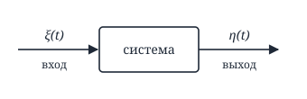
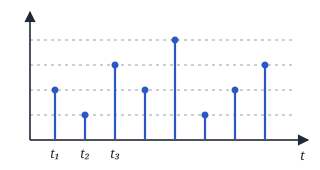
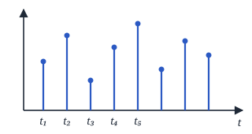
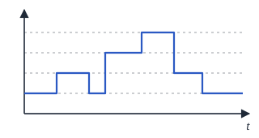
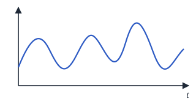
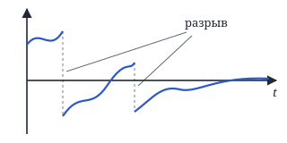
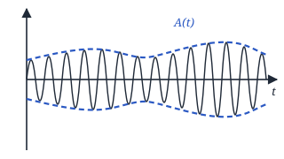
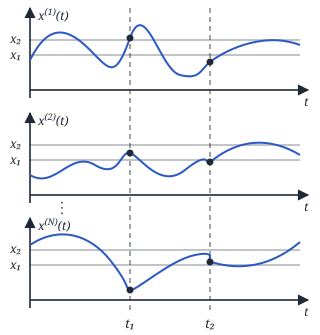
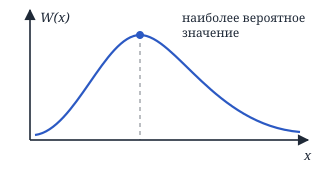
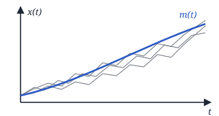

# Основы статистической теории обнаружения сигналов и распознавания образов в искусственном интеллекте

*Лектор: Нефёдова Юлия Сергеевна*

## Лекция 1. Начала статистической радиотехники

Статистическая радиотехника решает 2 задачи: **анализа** и **синтеза**.

**1) Задача анализа** — анализ *системы*: знаем, с какой системой работаем, что это за система, знаем её характеристики.

Мы знаем вход (что подаётся и его характеристики) и что делает система. Задача — найти, что будет на выходе $\eta(t)$.

**2) Задача синтеза** — мы создаём систему, изначально она «чёрный ящик». Для оценки качества созданной системы необходимо применить задачу анализа (1).

---

На любой сигнал всегда действует **шум (помеха)** — мешающее воздействие. Любая система и внутри себя содержит шум, например тепловой шум от тока.

**Шум** — это всегда *случайная величина* (статика) или *случайный процесс* (динамика).

## Случайный процесс

Под **случайным процессом (СП)** понимают любую физическую величину, которая изменяется в некотором *функциональном пространстве*, и это изменение носит случайный характер. В качестве пространства мы рассматриваем **время**.

Любой СП может быть описан случайной функцией:

- $\xi(t)$ — случайная функция (СФ);
- **СФ** — это функция, значения которой при заданном аргументе являются случайными величинами;
- $\xi^{(i)}(t)$ — $i$-я реализация;
- $\xi(t, x, y)$ — СП, зависящий ещё и от координат.

## Классификация СП

Классифицируем по **области определения** и **области возможных значений**. Для $y(x)$:

- область определения — $x$;
- область возможных значений (ОВЗ) — $y$.

### 1. Дискретная случайная последовательность

СП, у которого и область определения, и ОВЗ являются **дискретными** множествами.

- дискретная область определения — процесс рассматривается в строго определённые моменты времени;
- дискретная ОВЗ — значение обязательно одно из заранее указанных.

### 2. Случайная последовательность

СП, у которого область определения — дискретное множество, а ОВЗ — **непрерывное** множество.

### 3. Дискретный случайный процесс

Область определения — непрерывное множество, а ОВЗ — дискретное.

### 4. Непрерывный СП

И область определения, и ОВЗ — непрерывные множества.

### 5. Непрерывнозначный СП

То же, что (4), но возможны **разрывы 1-го рода**.

### 6. Квазидетерминированный СП

$$
\xi(t) = A(t)\cos[\omega_0 t + \varphi],
$$

где $\varphi$ — случайная величина.

## Способы описания СП

Берём $N$ реализаций процесса и смотрим на их значения в моменты $t_1, t_2$.

Пусть $n_1$ — число реализаций, для которых выполняется

$$
x^{(i)}(t_1) < x_1 .
$$

Предел

$$
\lim_{N\to\infty} \frac{n_1}{N}
$$

**статистически устойчив** — он не меняется, если мы повторим ситуацию на других реализациях.

### Одномерные характеристики

Статистический предел

$$
F_1(x_1, t_1) = \lim_{N\to\infty} \frac{n_1}{N} = P\{x(t_1) < x_1\}
$$

— **одномерная функция распределения** СП.

Если существует производная $\dfrac{\partial F_1(x_1, t_1)}{\partial x_1}$, то

$$
W_1(x_1, t_1) = \frac{\partial F_1(x_1, t_1)}{\partial x_1}
$$

— **одномерная плотность вероятности** СП:

$$
W_1(x_1, t_1)\,dx_1 = P\{x_1 \le x(t_1) \le x_1 + dx_1\}.
$$

$$
\begin{aligned}
&Q(ju_1; t_1) = M\{e^{ju_1 x_1}\} = \\
&= \int_{-\infty}^{+\infty} e^{ju_1 x_1}\, W_1(x_1, t_1)\, dx_1
\end{aligned}
$$

— **одномерная характеристическая функция**. Здесь $M\{\cdot\}$ — математическое ожидание (операция усреднения).

> Аналогия — преобразование Фурье: $u(t) \Rightarrow S(\omega)$, сигнал от времени переходит в сигнал от частоты.

Каждая из этих характеристик имеет право описывать СП. **Основная характеристика — $W$ (плотность вероятности).**

### Двумерные характеристики

Пусть $n_2$ — число реализаций, для которых выполняются *одновременно*

$$
\begin{cases}
x^{(i)}(t_1) < x_1, \\
x^{(i)}(t_2) < x_2 .
\end{cases}
$$

$\lim\limits_{N\to\infty} \dfrac{n_2}{N}$ — тоже статистически устойчив.

$$
F_2(x_1, x_2; t_1, t_2) = \lim_{N\to\infty} \frac{n_2}{N}
$$

— **двумерная функция распределения**.

Если существует $\dfrac{\partial^2 F_2(x_1, x_2; t_1, t_2)}{\partial x_1\, \partial x_2}$, то

$$
W_2(x_1, x_2; t_1, t_2) = \frac{\partial^2 F_2(x_1, x_2; t_1, t_2)}{\partial x_1\, \partial x_2}
$$

— **двумерная плотность распределения вероятности**.

$$
\begin{aligned}
&Q_2(ju_1, ju_2; t_1, t_2) = M\{e^{j(u_1 x_1 + u_2 x_2)}\} = \\
&= \iint_{-\infty}^{+\infty} e^{j(u_1 x_1 + u_2 x_2)} \times \\
&\qquad \times W_2(x_1, x_2; t_1, t_2)\, dx_1\, dx_2
\end{aligned}
$$

— **двумерная характеристическая функция** СП.

### n-мерные характеристики

Пусть $n_n$ — число реализаций, для которых одновременно

$$
\begin{cases}
x^{(i)}(t_1) < x_1, \\
x^{(i)}(t_2) < x_2, \\
\quad\vdots \\
x^{(i)}(t_n) < x_n .
\end{cases}
$$

$$
F_n(x_1, \ldots, x_n; t_1, \ldots, t_n) = \lim_{N\to\infty} \frac{n_n}{N}
$$

— **n-мерная функция распределения**.

$$
\begin{aligned}
&W_n(x_1, \ldots, x_n; t_1, \ldots, t_n) = \\
&= \frac{\partial^n F_n(x_1, \ldots, x_n; t_1, \ldots, t_n)}{\partial x_1 \cdots \partial x_n}
\end{aligned}
$$

— **n-мерная плотность распределения вероятности**.

$$
\begin{aligned}
&Q_n(ju_1, \ldots, ju_n; t_1, \ldots, t_n) = \\
&= M\{e^{j(u_1 x_1 + \ldots + u_n x_n)}\} = \\
&= \underbrace{\int \!\cdots\! \int_{-\infty}^{+\infty}}_{n} e^{j(u_1 x_1 + \ldots + u_n x_n)} \times \\
&\qquad \times W_n(x_1, \ldots, x_n; t_1, \ldots, t_n)\, dx_1 \cdots dx_n
\end{aligned}
$$

— **n-мерная характеристическая функция**.

При неограниченном сгущении сечений:

$$
\begin{aligned}
&\lim_{\substack{n\to\infty \\ \Delta t\to 0}} W_n(x_1, \ldots, x_n; t_1, \ldots, t_n) = \\
&= k(\Delta t)\cdot W[x(t)],
\end{aligned}
$$

где $k(\Delta t)$ — коэффициент, $W[x(t)]$ — **функционал плотности вероятности**.

### Совместные характеристики двух процессов

$x(t)$, $y(t)$ — например, вход и выход системы. Процесс $x$ берём в моменты $t_1, \ldots, t_n$, процесс $y$ — в моменты $t'_1, \ldots, t'_m$.

$$
\begin{aligned}
&F_{n+m}(x_1, \ldots, x_n;\, y_1, \ldots, y_m; \\
&\qquad t_1, \ldots, t_n;\, t'_1, \ldots, t'_m)
\end{aligned}
$$

— **(n+m)-мерная совместная функция распределения**.

$$
\begin{aligned}
&W_{n+m}(x_1, \ldots, x_n;\, y_1, \ldots, y_m; \\
&\qquad t_1, \ldots, t_n;\, t'_1, \ldots, t'_m) = \\
&= \frac{\partial^{n+m} F_{n+m}(\ldots)}{\partial x_1 \cdots \partial x_n\, \partial y_1 \cdots \partial y_m}
\end{aligned}
$$

— **(n+m)-мерная совместная плотность вероятности**.

## Условная плотность вероятности

Пусть известно, что реализация в момент $t_2$ приняла значение $x(t_2) = x_2$. Тогда

$$
W_1(x_1; t_1 \mid x_2; t_2) = \frac{W_2(x_1, x_2; t_1, t_2)}{W_1(x_2; t_2)}
$$

— **условная плотность вероятности**.

Если $x(t_2)$ не зависит от $x(t_1)$, то

$$
W_1(x_1; t_1 \mid x_2; t_2) = W_1(x_1; t_1).
$$

## Свойства плотности вероятности

**1) Неотрицательность**

$$
W_n(x_1, \ldots, x_n; t_1, \ldots, t_n) \ge 0
$$

**2) Нормировка**

$$
\begin{aligned}
&\underbrace{\int \!\cdots\! \int_{-\infty}^{+\infty}}_{n} W_n(x_1, \ldots, x_n; t_1, \ldots, t_n) \\
&\qquad dx_1 \cdots dx_n = 1
\end{aligned}
$$

**3) Симметрия относительно аргументов**

$$
W_2(x_1, x_2; t_1, t_2) = W_2(x_2, x_1; t_2, t_1)
$$

**4) Согласованность** — переход от n-мерной к m-мерной плотности ($m < n$):

$$
\begin{aligned}
&W_m(x_1, \ldots, x_m; t_1, \ldots, t_m) = \\
&= \underbrace{\int \!\cdots\! \int_{-\infty}^{+\infty}}_{n-m} W_n(x_1, \ldots, x_n; t_1, \ldots, t_n) \\
&\qquad dx_{m+1} \cdots dx_n
\end{aligned}
$$

## Моментные функции СП

### Начальные моментные функции

$$
\begin{aligned}
&M_{i_1 i_2 \ldots i_n}(t_1, t_2, \ldots, t_n) = \\
&= M\{x^{i_1}(t_1)\, x^{i_2}(t_2) \cdots x^{i_n}(t_n)\} = \\
&= \underbrace{\int \!\cdots\! \int_{-\infty}^{+\infty}}_{n} x_1^{i_1} x_2^{i_2} \cdots x_n^{i_n} \times \\
&\qquad \times W_n(x_1, \ldots, x_n; t_1, \ldots, t_n)\, dx_1 \cdots dx_n
\end{aligned}
$$

где $x_1 = x(t_1)$, а $i_k$ — степени. Это **n-мерные начальные моментные функции порядка**

$$
\nu = i_1 + i_2 + \ldots + i_n .
$$

*Пример:* $M_{23}(t_1, t_2)$ — двумерная начальная моментная функция 5-го порядка ($2+3$).

**1) Математическое ожидание**

$$
\begin{aligned}
&M_1(t_1) = M\{x(t_1)\} = \\
&= \int_{-\infty}^{+\infty} x\, W_1(x; t_1)\, dx = m_x(t_1)
\end{aligned}
$$

— **математическое ожидание** СП, характеризует среднее значение СП.

**2) Ковариационная функция**

$$
\begin{aligned}
&M_{11}(t_1, t_2) = M\{x(t_1)\, x(t_2)\} = \\
&= \iint_{-\infty}^{+\infty} x_1 x_2\, W_2(x_1, x_2; t_1, t_2)\, dx_1\, dx_2 = \\
&= K_x(t_1, t_2)
\end{aligned}
$$

— **ковариационная функция**.

**3) Средний квадрат**

$$
\begin{aligned}
&M_2(t_1) = M\{x^2(t_1)\} = \\
&= \int_{-\infty}^{+\infty} x_1^2\, W_1(x_1; t_1)\, dx_1
\end{aligned}
$$

— **средний квадрат**.

### Центральные моментные функции

$$
\begin{aligned}
&\mu_{i_1 i_2 \ldots i_n}(t_1, \ldots, t_n) = \\
&= M\{(x_1 - m_1)^{i_1} \cdots (x_n - m_n)^{i_n}\} = \\
&= \underbrace{\int \!\cdots\! \int_{-\infty}^{+\infty}}_{n} (x_1 - m_1)^{i_1} \cdots (x_n - m_n)^{i_n} \times \\
&\qquad \times W_n(x_1, \ldots, x_n; t_1, \ldots, t_n)\, dx_1 \cdots dx_n
\end{aligned}
$$

— **n-мерная центральная моментная функция порядка** $\nu = i_1 + \ldots + i_n$, где $x_1 = x(t_1)$, $m_1 = m_x(t_1)$ — математическое ожидание.

**1) Дисперсия**

$$
\begin{aligned}
&\mu_2(t_1) = M\{(x_1 - m_1)^2\} = \\
&= \int_{-\infty}^{+\infty} (x_1 - m_1)^2\, W_1(x_1; t_1)\, dx_1 = \\
&= D_x(t_1)
\end{aligned}
$$

— **дисперсия** СП: разброс относительно математического ожидания.

**2) Корреляционная функция**

$$
\begin{aligned}
&\mu_{11}(t_1, t_2) = M\{(x_1 - m_1)(x_2 - m_2)\} = \\
&= \iint_{-\infty}^{+\infty} (x_1 - m_1)(x_2 - m_2) \times \\
&\qquad \times W_2(x_1, x_2; t_1, t_2)\, dx_1\, dx_2 = R_x(t_1, t_2)
\end{aligned}
$$

— **корреляционная функция** СП.

> **!** В американских источниках названия «корреляционная» и «ковариационная» функция поменяны местами.

**Физический смысл корреляционной функции:** она характеризует степень **линейной** статистической связи двух значений СП, взятых в произвольные моменты времени.
