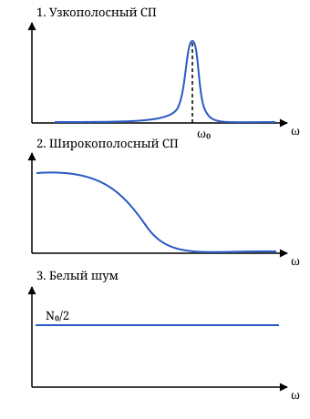

## Лекция 3. Спектральная плотность случайного процесса

### Линейная зависимость процессов

Если модуль нормированной взаимной корреляции равен единице,

$$
|r_{xy}(t_1,t_2)|=1,
$$

то $x(t_1)$ и $y(t_2)$ линейно зависимы. В конспекте рассмотрены два случая.

**1. Линейная зависимость** $y(t_2)=a x(t_1)+b$, где $a,b$ постоянны. Из линейности математического ожидания:

$$
\begin{aligned}
m_y(t_2)&=M\{y(t_2)\}\\
&=aM\{x(t_1)\}+b\\
&=a m_x(t_1)+b.
\end{aligned}
$$

Для дисперсии:

$$
\begin{aligned}
D_y(t_2)&=M\{[y(t_2)-m_y(t_2)]^2\}\\
&=M\{[a x(t_1)+b-a m_x(t_1)-b]^2\}\\
&=M\{a^2[x(t_1)-m_x(t_1)]^2\}\\
&=a^2D_x(t_1).
\end{aligned}
$$

В числителе нормированной корреляции:

$$
\begin{aligned}
R_{xy}(t_1,t_2)&=M\{[x(t_1)-m_x(t_1)]\\
&\quad\times[y(t_2)-m_y(t_2)]\}\\
&=aM\{[x(t_1)-m_x(t_1)]^2\}\\
&=aD_x(t_1).
\end{aligned}
$$

Следовательно, при $a\ne0$ и ненулевой дисперсии:

$$
\begin{aligned}
r_{xy}(t_1,t_2)
&=\frac{R_{xy}(t_1,t_2)}{\sqrt{D_x(t_1)D_y(t_2)}}\\
&=\frac{aD_x(t_1)}{|a|D_x(t_1)}
=\frac{a}{|a|}\\
&=\begin{cases}1,&a>0,\\-1,&a<0.\end{cases}
\end{aligned}
$$

Поэтому $|r_{xy}(t_1,t_2)|=1$.

**2. Обратное рассуждение.** Центрируем и нормируем процессы:

$$
\begin{aligned}
\hat x(t_1)&=\frac{x(t_1)-m_x(t_1)}{\sqrt{D_x(t_1)}},\\
\hat y(t_2)&=\frac{y(t_2)-m_y(t_2)}{\sqrt{D_y(t_2)}}.
\end{aligned}
$$

У них нулевое среднее и единичная дисперсия. Если $r_{xy}=1$, то

$$
\begin{aligned}
0&\le M\{[\hat x(t_1)-\hat y(t_2)]^2\}\\
&=1-2r_{xy}(t_1,t_2)+1=0.
\end{aligned}
$$

Значит, разность нормированных процессов неслучайна и равна нулю: $\hat x(t_1)=\hat y(t_2)$ с вероятностью 1. Поэтому $y(t_2)$ линейно выражается через $x(t_1)$. При $r_{xy}=-1$ аналогично

$$
M\{[\hat x(t_1)+\hat y(t_2)]^2\}=1+2(-1)+1=0,
$$

так что $\hat x(t_1)=-\hat y(t_2)$ с вероятностью 1.

### Сумма сигнала и шума

Пусть $\xi(t)=s(t)+n(t)$, где $s(t)$ и $n(t)$ — центрированные, совместно стационарные случайные процессы (СП). Тогда

$$
\begin{aligned}
R_\xi(\tau)&=M\{\xi(t)\xi(t+\tau)\}\\
&=M\{[s(t)+n(t)][s(t+\tau)+n(t+\tau)]\}\\
&=M\{s(t)s(t+\tau)\}+M\{s(t)n(t+\tau)\}\\
&\quad+M\{n(t)s(t+\tau)\}+M\{n(t)n(t+\tau)\}\\
&=R_s(\tau)+R_n(\tau)\\
&\quad+R_{sn}(\tau)+R_{ns}(\tau).
\end{aligned}
$$

Если сигнал и шум некоррелированы, $R_{sn}(\tau)=R_{ns}(\tau)=0$ и

$$
R_\xi(\tau)=R_s(\tau)+R_n(\tau).
$$

### Спектральная плотность мощности

Далее рассматривается действительный стационарный процесс $x(t)$.

**Спектральная плотность мощности** (СПМ) — прямое преобразование Фурье корреляционной функции стационарного СП:

$$
\begin{aligned}
S(\omega)&=\int_{-\infty}^{+\infty}
K_x(\tau)e^{-j\omega\tau}\,d\tau,\\
K_x(\tau)&=\frac1{2\pi}\int_{-\infty}^{+\infty}
S(\omega)e^{j\omega\tau}\,d\omega.
\end{aligned}
$$

Если процесс центрирован, $K_x(\tau)=R_x(\tau)$, и можно пользоваться $R_x$. Если среднее $m_x\ne0$, то $K_x(\tau)=R_x(\tau)+m_x^2$ и

$$
\begin{aligned}
S(\omega)&=\int_{-\infty}^{+\infty}
[R_x(\tau)+m_x^2]e^{-j\omega\tau}\,d\tau\\
&=\int_{-\infty}^{+\infty}
R_x(\tau)e^{-j\omega\tau}\,d\tau\\
&\quad+2\pi m_x^2\delta(\omega).
\end{aligned}
$$

Здесь использовано интегральное представление дельта-функции:

$$
\delta(\omega)=\frac1{2\pi}\int_{-\infty}^{+\infty}
e^{-j\omega\tau}\,d\tau.
$$

У преобразования Фурье два вида записи: интегральное преобразование и разложение в ряд. Для центрированного стационарного процесса

$$
\begin{aligned}
D_x&=R_x(0),\\
R_x(\tau)&=\frac1{2\pi}\int_{-\infty}^{+\infty}
S(\omega)e^{j\omega\tau}\,d\omega,\\
D_x&=\frac1{2\pi}\int_{-\infty}^{+\infty}
S(\omega)\,d\omega.
\end{aligned}
$$

Размерность СПМ — размерность мощности, делённая на размерность угловой частоты. Распределение мощности процесса по частотам — физический смысл спектральной плотности мощности.

Используем формулу Эйлера $e^{jx}=\cos x+j\sin x$. Поскольку $R_x(\tau)$ — чётная действительная функция, синусная часть интеграла обращается в нуль:

$$
\begin{aligned}
S(\omega)&=\int_{-\infty}^{+\infty}
R_x(\tau)e^{-j\omega\tau}\,d\tau\\
&=\int_{-\infty}^{+\infty}
R_x(\tau)[\cos(\omega\tau)-j\sin(\omega\tau)]\,d\tau\\
&=2\int_0^{+\infty}
R_x(\tau)\cos(\omega\tau)\,d\tau.
\end{aligned}
$$

**Свойства:** $S(\omega)=S(-\omega)$ и $S(\omega)\ge0$. Распределение мощности не может быть мнимым.

### Эффективная ширина спектра

Площадь под спектром приравнивают площади прямоугольника высоты $S_{\max}$:

$$
\begin{aligned}
\int_{-\infty}^{+\infty}S(\omega)\,d\omega
&=S_{\max}\Delta\omega_{\text{эф}},\\
\Delta\omega_{\text{эф}}
&=\frac1{S_{\max}}\int_{-\infty}^{+\infty}
S(\omega)\,d\omega.
\end{aligned}
$$

В конспекте сравниваются три вида СП по форме спектра.

1. **Узкополосный СП**: $\Delta\omega_{\text{эф}}\ll\omega_0$, где $\omega_0$ — центральная (несущая) частота.
2. **Широкополосный СП**: спектр шире, условие узкополосности не выполняется.
3. **Белый шум**: идеализированный СП с постоянной СПМ на всех частотах, $S_n(\omega)=N_0/2$.

Для белого шума обратное преобразование даёт

$$
\begin{aligned}
R_n(\tau)&=\frac1{2\pi}\int_{-\infty}^{+\infty}
\frac{N_0}{2}e^{j\omega\tau}\,d\omega\\
&=\frac{N_0}{2}\delta(\tau).
\end{aligned}
$$

Белый шум имеет равную спектральную плотность на всех частотах, но физическая аппаратура пропускает только ограниченную полосу. В практическом приближении она значительно шире полосы полезного сигнала; в конспекте указана оценка $\Delta\omega_{\text{эф}}\approx(5\ldots10)\Delta\omega_{\text{сиг}}$.

В пределах полосы системы спектральная плотность почти постоянна: на этом участке с процессом можно работать как с белым шумом.

### Взаимная спектральная плотность

Для совместно стационарных процессов $x(t)$ и $y(t)$:

$$
\begin{aligned}
S_{xy}(\omega)&=\int_{-\infty}^{+\infty}
K_{xy}(\tau)e^{-j\omega\tau}\,d\tau,\\
S_{yx}(\omega)&=\int_{-\infty}^{+\infty}
K_{yx}(\tau)e^{-j\omega\tau}\,d\tau.
\end{aligned}
$$

Для центрированных процессов $K_{xy}=R_{xy}$ и $K_{yx}=R_{yx}$. Обратное преобразование в общем случае:

$$
\begin{aligned}
K_{xy}(\tau)&=\frac1{2\pi}\int_{-\infty}^{+\infty}
S_{xy}(\omega)e^{j\omega\tau}\,d\omega,\\
K_{yx}(\tau)&=\frac1{2\pi}\int_{-\infty}^{+\infty}
S_{yx}(\omega)e^{j\omega\tau}\,d\omega.
\end{aligned}
$$

Для действительных процессов $S_{xy}$ и $S_{yx}$ обычно комплексны и удовлетворяют $S_{xy}(\omega)=S_{yx}^{*}(\omega)$. Кроме того,

$$
|S_{xy}(\omega)|^2\le S_x(\omega)S_y(\omega).
$$

### Квадрат частотной когерентности

При ненулевом произведении $S_x(\omega)S_y(\omega)$ он определяется формулой

$$
\gamma^2(\omega)=
\frac{|S_{xy}(\omega)|^2}{S_x(\omega)S_y(\omega)},
\qquad 0\le\gamma^2(\omega)\le1.
$$

Если $\gamma^2=0$, процессы некоррелированы на этой частоте; если $\gamma^2=1$, на этой частоте присутствует полная линейная связь.

Для $\xi(t)=s(t)+n(t)$ спектральная плотность суммы получается преобразованием Фурье каждого слагаемого корреляции:

$$
\begin{aligned}
S_\xi(\omega)&=S_s(\omega)+S_n(\omega)\\
&\quad+S_{sn}(\omega)+S_{ns}(\omega).
\end{aligned}
$$

Когда центрированные сигнал и шум некоррелированы, взаимные СПМ равны нулю:

$$
S_{sn}(\omega)=S_{ns}(\omega)=0,
\qquad S_\xi(\omega)=S_s(\omega)+S_n(\omega).
$$
