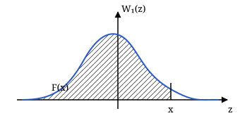
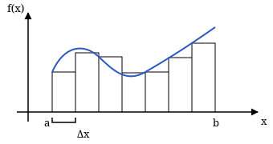

## Лекция 4. Гауссовский процесс и линейные системы

### Гауссовский случайный процесс

**Гауссовский случайный процесс (ГСП)** задаётся многомерными плотностями вероятности гауссовского вида. Обозначим $x_i=x(t_i)$, $m_i=m_x(t_i)$ и $\sigma_i^2=D_x(t_i)$.

$$
\begin{aligned}
&W_n(x_1,\ldots,x_n;t_1,\ldots,t_n)\\
&=\frac{1}{\sqrt{(2\pi)^nD}\,\sigma_1\cdots\sigma_n}\\
&\quad\times\exp\left\{-\frac1{2D}\sum_{i=1}^n\sum_{j=1}^n
D_{ij}\frac{(x_i-m_i)(x_j-m_j)}{\sigma_i\sigma_j}\right\}.
\end{aligned}
$$

Здесь $D$ — определитель матрицы нормированных корреляционных моментов:

$$
D=\begin{vmatrix}
r_{11}&r_{12}&\cdots&r_{1n}\\
r_{21}&r_{22}&\cdots&r_{2n}\\
\vdots&\vdots&\ddots&\vdots\\
r_{n1}&r_{n2}&\cdots&r_{nn}
\end{vmatrix},
$$

$$
\begin{aligned}
m_i&=M\{x(t_i)\},\\
\sigma_i^2&=M\{[x(t_i)-m_x(t_i)]^2\},\\
r_{ij}&=\frac{M\{(x_i-m_i)(x_j-m_j)\}}{\sigma_i\sigma_j},\\
r_{ii}&=1.
\end{aligned}
$$

$D_{ij}$ — алгебраическое дополнение элемента матрицы: вычёркиваем $i$-ю строку и $j$-й столбец и учитываем чередование знаков. В этой формуле $D$ обозначает определитель, а $D_x(t)$ — дисперсию процесса.

Одномерная плотность:

$$
W_1(x;t)=\frac1{\sqrt{2\pi}\,\sigma}
\exp\left\{-\frac{(x-m)^2}{2\sigma^2}\right\}.
$$

Для центрированного стационарного ГСП в конспекте приведено разложение двумерной плотности:

$$
\begin{aligned}
W_2(x_1,x_2;\tau)
&=\frac1{\sigma^2}\sum_{k=0}^{\infty}\frac{r^k(\tau)}{k!}\\
&\quad\times\Phi^{(k+1)}\left(\frac{x_1}{\sigma}\right)
\Phi^{(k+1)}\left(\frac{x_2}{\sigma}\right),
\end{aligned}
$$

где $r(\tau)$ — нормированная корреляционная функция,

$$
\Phi(x)=\frac1{\sqrt{2\pi}}\int_{-\infty}^x e^{-t^2/2}\,dt
$$

— интеграл вероятности, а $\Phi^{(k+1)}$ — его производная порядка $k+1$.

### Функция распределения и свойства ГСП

Функция распределения — интеграл плотности:

$$
\begin{aligned}
F(x;t)&=\int_{-\infty}^x W_1(z;t)\,dz\\
&=\int_{-\infty}^x\frac1{\sqrt{2\pi}\,\sigma}
e^{-(z-m)^2/(2\sigma^2)}\,dz.
\end{aligned}
$$

При $m=0$, $\sigma^2=1$ получаем $F(x)=\Phi(x)$. Значения этого интеграла можно находить численно; в тетради отмечено, что он не выражается через элементарные функции.

Свойства гауссовского процесса:

1. Стационарность в широком и строгом смысле для ГСП совпадает.
2. Линейное преобразование ГСП даёт ГСП. При нелинейном преобразовании распределение, вообще говоря, меняется.
3. Некоррелированные отсчёты совместно гауссовского процесса статистически независимы.
4. Линейным преобразованием можно перейти от коррелированных отсчётов к некоррелированным и обратно.
5. Условная плотность вероятности гауссовского распределения также гауссовская.

### Преобразование случайного процесса системой

На вход системы подаётся $\xi(t)$, на выходе получаем $\eta(t)$. Задача анализа — определить характеристики выходного процесса по входному и свойствам системы.

### Классификация систем

**Линейная система** подчиняется суперпозиции: разложению входа на сумму соответствует сумма выходов:

$$
\begin{aligned}
\xi(t)&=\sum_{i=1}^n\xi_i(t),\\
\eta(t)&=\sum_{i=1}^n\eta_i(t),
\end{aligned}
$$

где $\eta_i$ — выход при подаче $\xi_i$.

**Безынерционная система:** значение выхода определяется значением входа в тот же момент времени:

$$
\eta(t)=\varphi[\xi(t)].
$$

$\varphi$ — характеристика системы. **Инерционная система** учитывает предысторию входа: выход в данный момент зависит и от предыдущих значений входного процесса.

> Реальные системы обладают нелинейностью и инерционностью. В конспекте эти свойства рассматриваются по отдельности.

### Анализ линейной инерционной системы

Линейную инерционную систему (ЛИС) можно описать:

1. Дифференциальным уравнением — для переходного или установившегося режима, с нулевыми или ненулевыми начальными условиями.
2. Импульсной характеристикой — для переходного режима при нулевых начальных условиях.
3. Комплексной частотной характеристикой — для установившегося режима при нулевых начальных условиях.

**Импульсная характеристика** $h(t)$ — реакция системы на входную дельта-функцию.

В конспекте указаны условия физической реализуемости: $h(t)=0$ при $t<0$ и $h(t)\to0$ при $t\to\infty$.

Выход выражается **интегралом Дюамеля**:

$$
\begin{aligned}
\eta(t)&=\int_0^t\xi(\tau)h(t-\tau)\,d\tau\\
&=\int_0^t\xi(t-\tau)h(\tau)\,d\tau.
\end{aligned}
$$

### Комплексная частотная характеристика

На вход ЛИС подаётся комплексная гармоника:

$$
\begin{aligned}
U_1(t)&=A_1e^{j(\omega t+\varphi_1)},\\
U_2(t)&=A_2e^{j(\omega t+\varphi_2)}.
\end{aligned}
$$

Отношение выхода к входу — комплексная частотная характеристика (КЧХ):

$$
\begin{aligned}
K(j\omega)&=\frac{U_2(t)}{U_1(t)}\\
&=|K(j\omega)|e^{j\psi(\omega)}.
\end{aligned}
$$

$|K(j\omega)|$ — амплитудно-частотная характеристика (АЧХ), $\psi(\omega)$ — фазочастотная характеристика (ФЧХ).

Для детерминированных сигналов спектры связаны соотношением

$$
S_2(j\omega)=S_1(j\omega)K(j\omega).
$$

КЧХ и импульсная характеристика связаны преобразованием Фурье:

$$
\begin{aligned}
K(j\omega)&=\int_{-\infty}^{+\infty}h(t)e^{-j\omega t}\,dt\\
&=\int_0^{+\infty}h(t)e^{-j\omega t}\,dt,\\
h(t)&=\frac1{2\pi}\int_{-\infty}^{+\infty}
K(j\omega)e^{j\omega t}\,d\omega.
\end{aligned}
$$

### Плотность вероятности на выходе ЛИС

Чтобы найти $W(\eta;t)$, в конспекте предложена последовательность:

1. Найти начальные моментные функции входного СП.
2. Найти начальные моментные функции выходного СП.
3. Найти характеристическую функцию выходного СП.
4. Восстановить плотность вероятности.

Разложим экспоненту в ряд и усредним:

$$
\begin{aligned}
Q_\eta(ju;t)&=M\{e^{ju\eta(t)}\}\\
&=M\left\{1+ju\eta+\frac{(ju)^2}{2!}\eta^2+\cdots\right\}\\
&=1+juM_{\eta1}(t)\\
&\quad+\frac{(ju)^2}{2!}M_{\eta2}(t)+\cdots\\
&\quad+\frac{(ju)^k}{k!}M_{\eta k}(t)+\cdots,
\end{aligned}
$$

где $M_{\eta k}(t)=M\{\eta^k(t)\}$. Обратное преобразование:

$$
W(\eta;t)=\frac1{2\pi}\int_{-\infty}^{+\infty}
Q_\eta(ju;t)e^{-ju\eta}\,du.
$$

### Нормализация случайного процесса

Если вход $\xi(t)$ — ГСП, выход линейной системы также ГСП. В конспекте затем рассматривается **явление нормализации**: при определённых условиях ЛИС может приблизить распределение негауссовского входа к гауссовскому.

Вход имеет произвольное распределение, а его эффективная ширина спектра значительно больше полосы системы:

$$
\Delta\omega_{\text{эф}}\gg\Delta\omega_{\text{сист}}.
$$

Интеграл Дюамеля представляют как сумму многих слагаемых. Напоминание о сумме прямоугольников:

$$
\int_a^b f(x)\,dx\approx
\Delta x\sum_{k=0}^{N-1}f(a+k\Delta x).
$$

Аналогично

$$
\eta(t)\approx\Delta\tau\sum_{k=0}^{N-1}
\xi(k\Delta\tau)h(t-k\Delta\tau).
$$

Здесь $T$ — длительность импульсной характеристики, $\tau_{\text{сист}}$ — постоянная времени системы. В конспекте используются оценки

$$
\begin{aligned}
N&=\frac{\tau_{\text{сист}}}{\Delta t}\gg1,\\
\tau_{\text{сист}}&\sim\frac1{\Delta\omega_{\text{сист}}},\\
\Delta t&\approx\tau_{\text{к}}
\sim\frac1{\Delta\omega_{\text{эф}}}.
\end{aligned}
$$

По центральной предельной теореме распределение суммы приближается к гауссовскому. Указанное в тетради сравнение полос объясняет, почему в сумму входит много отсчётов; предпосылки применения теоремы в скане отдельно не расписаны.

### Математическое ожидание на выходе ЛИС

Для переходного режима:

$$
\begin{aligned}
m_\eta(t)&=M\{\eta(t)\}\\
&=M\left\{\int_0^t\xi(t-\tau)h(\tau)\,d\tau\right\}\\
&=\int_0^t M\{\xi(t-\tau)\}h(\tau)\,d\tau\\
&=\int_0^t m_\xi(t-\tau)h(\tau)\,d\tau.
\end{aligned}
$$

Даже при стационарном входе и постоянном $m_\xi$ в переходном режиме среднее зависит от времени:

$$
m_\eta(t)=m_\xi\int_0^t h(\tau)\,d\tau.
$$

После завершения переходного процесса верхний предел заменяется на бесконечность:

$$
m_\eta=m_\xi\int_0^{+\infty}h(\tau)\,d\tau.
$$

В установившемся режиме выход при стационарном входе также стационарен. Поскольку

$$
\begin{aligned}
K(j\omega)&=\int_0^{+\infty}h(t)e^{-j\omega t}\,dt,\\
K(0)&=\int_0^{+\infty}h(t)\,dt,
\end{aligned}
$$

получаем

$$
m_\eta=m_\xi K(0).
$$
