## Лекция 1. Помехи и случайные процессы

<u>Шум — случайный процесс.</u> Смысл — работа сигналов, которые находятся в связке с шумами.

Выделяют 2 задачи:

**I) Задача анализа.**

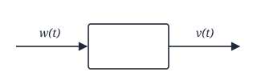

При известных статистических характеристиках входного воздействия по известному описанию системы необходимо определить статистические характеристики процесса на выходе. (1 модуль)

**II) Задача синтеза** — при известных статистических характеристиках полезного сигнала и помехи, при известном способе взаимодействия полезного сигнала и помехи необходимо обеспечить синтез оптимального устройства и оптимальной системы сигналов.

**Информация** — любые сведения о процессах, событиях, явлениях, которые являются неизвестными для нас. Если эта информация выражена в математической форме — это **сообщение**. **Сигнал** — физическая величина, которая отображает сообщение.

<!-- p003 -->

### Помехи

**1) По месту возникновения**

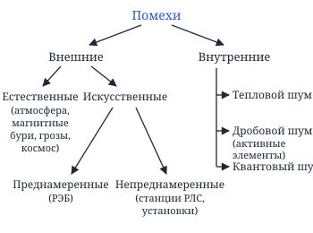

**2) По способу взаимодействия помехи и полезного сигнала**

$S(t)$ — полезный сигнал, $n(t)$ — помеха сигнала.

1) Аддитивные помехи:
$$
S(t) + n(t)
$$

2) Мультипликативные помехи:
$$
S(t) \cdot n(t)
$$

3) Смешанные помехи:
$$
S(t) \cdot n_1(t) + n_2(t)
$$

**3) По характеру протекания помехи во времени**

1) **Флуктуационные помехи** — это такие импульсные помехи, которые имеют разную длительность, интенсивность…

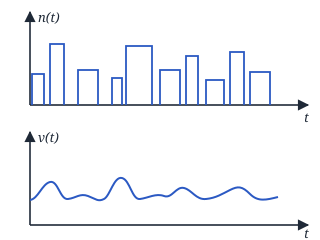

2) **Импульсные помехи**

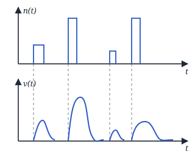

<!-- p004 -->

3) **Узкополосная помеха** — сосредоточена по спектру. (Пример: помеха от соседней станции.)

### Случайные процессы

**СП (случайным процессом)** называется любая физическая величина, которая изменяется в некотором пространстве по случайному закону. СП описывается **случайной функцией** — при одном и том же аргументе получаем разные значения.

$\xi(t)$, $\eta(t)$ — обозначение СП;

$x^{(i)}(t)$ — $i$-я реализация СП.

### Классификация СП

**1) Дискретная случайная последовательность** — это такой СП, у которого область определения и область значений являются дискретными.

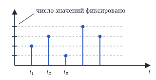

**2) Случайная последовательность.** Область значений непрерывна.

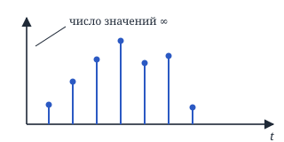

**3) Дискретный СП.** Область определения стала непрерывной.

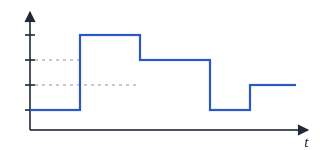

**4) Непрерывный СП.** Область определения и область значений — непрерывные множества.

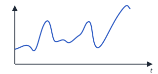

<!-- p005 -->

**5) Непрерывнозначные СП.** Всё непрерывно, но могут быть разрывы 1-го рода.

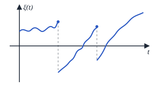

**6) Квазидетерминированные СП.** В них $\xi(t) = F(\varphi)$, где $F(\varphi)$ — случайная функция со случайной величиной $\varphi$.

Например:
$$
\xi(t) = A_0 \cos(\omega_0 t + \varphi),
$$
где $\varphi$ — СВ (случайная величина).

### Способы описания СП

Возьмём $N$ реализаций СП:

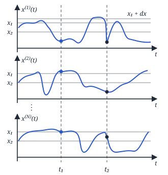

$n_1$ — число реализаций, где выполняется условие $x^{(i)}(t_1) < x_1$.

$$
\lim_{N\to\infty} \frac{n_1}{N} = F_1(x_1, t_1)
$$

— статистически устойчивый предел — <u>функция распределения СП</u>.

Иначе:
$$
\boxed{F_1(x_1, t_1) = P\{\xi(t_1) < x_1\}}
$$

где $P$ — вероятность.

Если $\exists\ \dfrac{\partial F_1(x_1, t_1)}{\partial x_1}$, то введём

$$
\boxed{W_1(x_1, t_1) = \frac{\partial F_1(x_1, t_1)}{\partial x_1}}
$$

— <u>плотность распределения вероятности СП</u>.

$$
W_1(x_1, t_1)\, dx_1 = P\{x_1 \le \xi(t_1) < x_1 + dx_1\}
$$

$Q_1(ju_1, t_1)$ — характеристическая функция:

$$
\begin{aligned}
&\boxed{Q_1(ju_1, t_1)} = M\{e^{j\xi_1 u_1}\} = \\
&= \int_{-\infty}^{\infty} e^{jx_1 u_1}\, W_1(x_1, t_1)\, dx_1,
\end{aligned}
$$

где $\xi_1 = \xi(t_1)$, $M$ — математическое ожидание.

Теперь добавим ещё один момент времени $t_2$ и значение $x_2$. Должны выполняться оба условия, такое только в 1 случае. Функции будут двумерными.

<!-- p006 -->

$$
\lim_{N\to\infty} \frac{n_2}{N} = \boxed{F_2(x_1, x_2; t_1, t_2)}
$$

— двумерная функция распределения:

$$
\begin{aligned}
&F_2(x_1, x_2; t_1, t_2) = \\
&= P\{\xi(t_1) < x_1,\ \xi(t_2) < x_2\}.
\end{aligned}
$$

Если $\exists\ \dfrac{\partial F_2}{\partial x_1}$ и $\dfrac{\partial F_2}{\partial x_2}$, то

$$
\boxed{W_2(x_1, x_2; t_1, t_2) = \frac{\partial^2 F_2(x_1, x_2; t_1, t_2)}{\partial x_1\, \partial x_2}}
$$

$$
\begin{aligned}
&\boxed{Q_2(ju_1, ju_2; t_1, t_2)} = \\
&= M\{e^{j\xi_1 u_1 + j\xi_2 u_2}\} = \\
&= \int_{-\infty}^{\infty}\!\!\int_{-\infty}^{\infty} e^{jx_1 u_1 + jx_2 u_2} \times \\
&\qquad \times W_2(x_1, x_2; t_1, t_2)\, dx_1\, dx_2
\end{aligned}
$$

Многомерные функции будут нести ещё больше информации о сигнале ($n$-мерные):

$$
\lim_{N\to\infty} \frac{n_n}{N} = F_n(x_1 \ldots x_n; t_1 \ldots t_n)
$$

$$
\begin{aligned}
&W_n(x_1 \ldots x_n; t_1 \ldots t_n) = \\
&= \frac{\partial^n F_n(x_1 \ldots x_n; t_1 \ldots t_n)}{\partial x_1 \ldots \partial x_n}
\end{aligned}
$$

$$
\begin{aligned}
&Q_n(ju_1 \ldots ju_n; t_1 \ldots t_n) = \\
&= M\{e^{j\xi_1 u_1 + \ldots + j\xi_n u_n}\} = \ldots
\end{aligned}
$$

В идеале $n \to \infty$, тогда $\Delta t \to 0$ $\Rightarrow$

$$
\begin{aligned}
&\lim_{\substack{n\to\infty \\ (\Delta t \to 0)}} W_n(x_1 \ldots x_n; t_1 \ldots t_n) = \\
&= \underbrace{K(\Delta t)}_{\text{множитель}} \cdot \underbrace{W[x(t)]}_{\substack{\text{функционал} \\ \text{плотности вероятности}}}
\end{aligned}
$$

Все эти характеристики несут одинаковую информацию, так как они переходят друг в друга.

### Свойства плотности вероятности

**1.** $W_n(x_1 \ldots x_n; t_1 \ldots t_n) \ge 0$

**2.**
$$
\begin{aligned}
&\underbrace{\int_{-\infty}^{\infty}\!\!\ldots\!\int_{-\infty}^{\infty}}_{n} W_n(x_1 \ldots x_n; t_1 \ldots t_n) \times \\
&\qquad \times dx_1 \ldots dx_n = 1
\end{aligned}
$$

**3.**
$$
\begin{aligned}
&W_k(x_1 \ldots x_k; t_1 \ldots t_k) = \\
&= \underbrace{\int_{-\infty}^{\infty}\!\!\ldots\!\int_{-\infty}^{\infty}}_{n-k} W_n(x_1 \ldots x_n; t_1 \ldots t_n) \times \\
&\qquad \times dx_{k+1} \ldots dx_n
\end{aligned}
$$

<!-- p007 -->

**4.** Симметричность.

#### Совместные функции распределения

Пусть заданы $\xi(t)$ и $\eta(t)$. Тогда

$$
\begin{aligned}
&F_{m+n}(\underbrace{x_1 \ldots x_m, t_1 \ldots t_m}_{\xi(t)};\ \underbrace{y_1 \ldots y_n, t'_1 \ldots t'_n}_{\eta(t)}) = \\
&= \lim_{N\to\infty} \frac{n_{n+m}}{N}
\end{aligned}
$$

— он тоже будет статистически устойчивым.

Также можно определить

$$
\begin{aligned}
&W_{m+n}(x_1 \ldots x_m, t_1 \ldots t_m; \\
&\qquad y_1 \ldots y_n, t'_1 \ldots t'_n) = \\
&= \frac{\partial^{n+m} F_{m+n}(\ldots)}{\partial x_1 \ldots \partial x_m\, \partial y_1 \ldots \partial y_n}.
\end{aligned}
$$

#### Условная плотность вероятности

Пусть $\xi(t_2) = x_2$. Тогда

$$
W_1(x_1, t_1 / x_2, t_2) = \frac{W_2(x_1, x_2; t_1, t_2)}{W_1(x_2, t_2)}.
$$

Если 2 события независимы друг от друга, то

$$
\begin{cases}
W_1(x_1, t_1 / x_2, t_2) = W_1(x_1, t_1) \\
W_2(x_1, x_2; t_1, t_2) = \\
\quad = W_1(x_1, t_1) \cdot W_1(x_2, t_2)
\end{cases}
$$

— $x_1$ не зависит от $x_2$.

### Моментные функции СП

#### Начальные моментные функции

$$
\begin{aligned}
&M_{i_1 i_2 \ldots i_n}(t_1 \ldots t_n) = \\
&= M\{\xi_1^{i_1} \cdot \xi_2^{i_2} \cdot \ldots \cdot \xi_n^{i_n}\} = \\
&= \underbrace{\int_{-\infty}^{\infty}\!\!\ldots\!\int_{-\infty}^{\infty}}_{n} x_1^{i_1} \cdot x_2^{i_2} \cdot \ldots \cdot x_n^{i_n} \times \\
&\qquad \times W_n(x_1 \ldots x_n; t_1 \ldots t_n)\, dx_1 \ldots dx_n
\end{aligned}
$$

($\xi_1 = \xi(t_1)$) — определение начальной моментной функции, где $\nu = i_1 + i_2 + \ldots + i_n$ — порядок функции.

**1)** $M_1(t_1)$ — одномерная начальная моментная функция 1-го порядка:

$$
\begin{aligned}
&M_1(t_1) = M\{\xi_1^1\} = \\
&= \int_{-\infty}^{\infty} x_1 W_1(x_1, t_1)\, dx_1 = m_\xi(t_1)
\end{aligned}
$$

— <u>математическое ожидание</u>. Оно характеризует среднее значение.

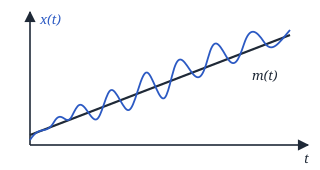

<!-- p008 -->

**2)** $M_{11}(t_1, t_2)$ — двумерная начальная моментная функция 2-го порядка:

$$
\begin{aligned}
&M_{11}(t_1, t_2) = M\{\xi_1^1 \cdot \xi_2^1\} = \\
&= \int_{-\infty}^{\infty}\!\!\int_{-\infty}^{\infty} x_1 x_2 \cdot W_2(x_1, x_2; t_1, t_2) \times \\
&\qquad \times dx_1\, dx_2 = K_\xi(t_1, t_2)
\end{aligned}
$$

— <u>ковариационная функция СП</u>.

### Центральные моментные функции СП

$$
\begin{aligned}
&\mu_{i_1 i_2 \ldots i_n}(t_1, \ldots, t_n) = \\
&= M\{[\xi_1 - m_1]^{i_1} \cdot [\xi_2 - m_2]^{i_2} \cdot \ldots \\
&\qquad \ldots \cdot [\xi_n - m_n]^{i_n}\} = \\
&= \underbrace{\int_{-\infty}^{\infty}\!\!\ldots\!\int_{-\infty}^{\infty}}_{n} (x_1 - m_1)^{i_1} (x_2 - m_2)^{i_2} \ldots \\
&\qquad \ldots (x_n - m_n)^{i_n} \times \\
&\qquad \times W_n(x_1 \ldots x_n; t_1 \ldots t_n)\, dx_1 \ldots dx_n
\end{aligned}
$$

— $n$-мерная центральная моментная функция, где $\nu = i_1 + i_2 + \ldots + i_n$.

**1)** $\mu_2(t_1)$ — одномерная центральная моментная функция 2-го порядка:

$$
\begin{aligned}
&\mu_2(t_1) = M\{[\xi_1 - m_1]^2\} = \\
&= \int_{-\infty}^{\infty} (x_1 - m_1)^2 W_1(x_1, t_1)\, dx_1 = \\
&= D_\xi(t_1)
\end{aligned}
$$

— <u>дисперсия СП</u> — характеризует разброс значений относительно среднего. В электрических процессах она характеризуется мощностью флуктуаций процесса, выделяемой на сопротивлении 1 Ом.

**2)** $\mu_{11}(t_1, t_2)$ — двумерная центральная моментная функция 2-го порядка:

$$
\begin{aligned}
&\mu_{11}(t_1, t_2) = M\{[\xi_1 - m_1][\xi_2 - m_2]\} = \\
&= \int_{-\infty}^{\infty}\!\!\int_{-\infty}^{\infty} (x_1 - m_1)(x_2 - m_2) \times \\
&\qquad \times W_2(x_1, x_2; t_1, t_2)\, dx_1\, dx_2 = \\
&= R_\xi(t_1, t_2)
\end{aligned}
$$

— <u>корреляционная функция СП</u> — она характеризует степень *линейной* статистической связи значений СП, взятых в двух произвольных моментах времени.

Корреляционная функция за счёт $m$ несёт бо́льшую информацию, нежели ковариационная.

<!-- p009 -->

$$
\begin{aligned}
&R_\xi(t_1, t_2) = M\{(\xi_1 - m_1)(\xi_2 - m_2)\} = \\
&= M\{\xi_1 \xi_2 - \xi_1 m_2 - \xi_2 m_1 + m_1 m_2\} = \ldots
\end{aligned}
$$

$$
L\{\alpha x + \beta y\} = \alpha L\{x\} + \beta L\{y\}
$$

— принцип суперпозиции.

$$
\begin{aligned}
&\ldots = \underbrace{M\{\xi_1 \xi_2\}}_{K_\xi(t_1, t_2)} - m_2 \underbrace{M\{\xi_1\}}_{m(t_1)} - m_1 \underbrace{M\{\xi_2\}}_{m(t_2)} + \\
&\qquad + m_1 m_2 = \\
&= K_\xi(t_1, t_2) - m_2 m_1 - m_1 m_2 + m_1 m_2 = \\
&= K_\xi(t_1, t_2) - m(t_2)\, m(t_1) \Rightarrow
\end{aligned}
$$

$$
\Rightarrow R_\xi(t_1, t_2) = K_\xi(t_1, t_2) - m(t_1)\, m(t_2)
$$

### Стационарные и нестационарные СП

СП называется <u>стационарным в узком смысле</u>, если выполняется:

$$
\begin{aligned}
&W_n(x_1 \ldots x_n; t_1 \ldots t_n) = \\
&= W_n(x_1 \ldots x_n; t_1 - \tau, t_2 - \tau, \ldots, t_n - \tau)
\end{aligned}
$$

$$
\begin{aligned}
&m(t) = \mathrm{const} = m \\
&D(t) = \mathrm{const} = D \\
&R_\xi(t_1, t_2) = R_\xi(\tau), \quad \tau = t_2 - t_1 \\
&K_\xi(t_1, t_2) = K_\xi(\tau)
\end{aligned}
$$

Если $W_1(x_1, t_1)$ стационарна в узком смысле, то $W_1(x_1, t_1) = W_1(x_1)$.

СП <u>стационарен в широком смысле</u>, если:

$$
\begin{cases}
m(t) = m = \mathrm{const} \\
D(t) = D = \mathrm{const} \\
R_\xi(t_1, t_2) = R_\xi(\tau) \\
K_\xi(t_1, t_2) = K_\xi(\tau)
\end{cases}
$$

### Эргодические СП

**Эргодические СП** — процессы, для которых все характеристики, полученные путём статистического усреднения, с вероятностью, сколь угодно близкой к 1, совпадают с характеристиками, полученными из одной достаточно длинной реализации СП путём усреднения по времени.

<!-- p010 -->

$$
m = \lim_{T\to\infty} \frac{1}{2T} \int_{-T}^{T} x_k(t)\, dt
$$

$$
D = \lim_{T\to\infty} \frac{1}{2T} \int_{-T}^{T} [x_k(t) - m]^2\, dt
$$

$$
\begin{aligned}
&R(\tau) = \lim_{T\to\infty} \frac{1}{2T} \int_{-T}^{T} [x_k(t) - m] \times \\
&\qquad \times [x_k(t - \tau) - m]\, dt
\end{aligned}
$$

Любой эргодический процесс является стационарным, но не наоборот.

СП <u>эргодичен относительно математического ожидания</u>, если:

$$
\lim_{T\to\infty} \frac{1}{T} \int_0^T \left(1 - \frac{\tau}{T}\right) R_\xi(\tau)\, d\tau = 0.
$$

Тогда $m$ можно найти через усреднение.

СП <u>эргодичный относительно дисперсии</u>, если:

$$
\lim_{T\to\infty} \frac{1}{T} \int_0^T \left(1 - \frac{\tau}{T}\right)^2 R_\xi(\tau)\, d\tau = 0.
$$

Находим $D$ путём усреднения по времени.

СП <u>эргодичен относительно корреляционной функции</u>, если:

$$
\lim_{T\to\infty} \frac{1}{T} \int_0^T \left(1 - \frac{\tau'}{T}\right) R_\eta(\tau')\, d\tau' = 0,
$$

где $\eta(t) = \xi(t + \tau) \cdot \xi(t)$.

<!-- p011 -->
