## Лекция 2. Корреляционная функция и спектральная плотность мощности

### Корреляционная функция СП и её свойства

**1.** Для нестационарных СП:

$$
\begin{aligned}
&R_\xi(t_1, t_2) = \int_{-\infty}^{\infty}\!\!\int_{-\infty}^{\infty} (x_1 - m_1)(x_2 - m_2) \times \\
&\qquad \times W_2(x_1, x_2; t_1, t_2)\, dx_1\, dx_2
\end{aligned}
$$

**2.** Для стационарных СП:

$$
\begin{aligned}
&R_\xi(\tau) = \int_{-\infty}^{\infty}\!\!\int_{-\infty}^{\infty} (x_1 - m)(x_2 - m) \times \\
&\qquad \times W_2(x_1, x_2; \tau)\, dx_1\, dx_2
\end{aligned}
$$

**3.** Для эргодических СП:

$$
\begin{aligned}
&R_\xi(\tau) = \lim_{T\to\infty} \frac{1}{2T} \int_{-T}^{T} [x_k(t) - m] \times \\
&\qquad \times [x_k(t + \tau) - m]\, dt
\end{aligned}
$$

**4.** Для комплексных СП:

$$
\xi(t) = \xi_1(t) + j\xi_2(t),
$$

тогда

$$
\begin{aligned}
&R_\xi(t_1, t_2) = \\
&= M\{[\xi(t_1) - m(t_1)][\xi^*(t_2) - m^*(t_2)]\}
\end{aligned}
$$

#### Свойства (стационарный и центрированный СП)

**1)**
$$
\lim_{\tau\to\infty} R_\xi(\tau) = \lim_{\tau\to\infty} M\{\xi(t) \cdot \xi(t + \tau)\} = 0,
$$

т. е. $R(\infty) = 0$.

Исключения: $\xi(t) = A\cos(\omega_0 t + \varphi)$, где $\varphi$ — СВ.

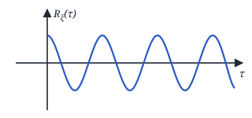

**2)**
$$
R_\xi(0) = M\{\xi(t) \cdot \xi(t + 0)\} = M\{\xi^2(t)\} = D_\xi
$$

**3)** $R_\xi(\tau) = R_\xi(-\tau)$ — чётность, так как

$$
W_2(x_1, x_2; t_1, t_2) = W_2(x_2, x_1; t_2, t_1)
$$

**4)** $R_\xi(0) = D_\xi \ge R_\xi(\tau)$.

Доказательство:

$$
\begin{aligned}
&M\{[\xi(t) - \xi(t + \tau)]^2\} \ge 0, \\
&M\{\xi^2(t) - 2\xi(t)\xi(t + \tau) + \xi^2(t + \tau)\} \ge 0, \\
&M\{\xi^2(t)\} - 2M\{\xi(t)\xi(t + \tau)\} + \\
&\qquad + M\{\xi^2(t + \tau)\} \ge 0, \\
&D_\xi - 2R_\xi(\tau) + D_\xi \ge 0 \Rightarrow D_\xi \ge R_\xi(\tau)
\end{aligned}
$$

<!-- p012 -->

**5)**
$$
\int_{-\infty}^{\infty} R_\xi(\tau)\, e^{-j\omega\tau}\, d\tau \ge 0
$$

**6)** Свойство неотрицательной определённости:

$$
\sum_{i}^{n} \sum_{j}^{n} R_\xi(t_i; t_j) \cdot z_i \cdot z_j^* \ge 0,
$$

где $z_i$ и $z_j$ — любые произвольные комплексные числа.

Доказательство:

$$
\begin{aligned}
&\sum_{i=1}^{n} \sum_{j=1}^{n} M\{\xi(t_i) \cdot \xi^*(t_j)\} \cdot z_i \cdot z_j^* = \\
&= M\Big\{\sum_{i=1}^{n} \sum_{j=1}^{n} \underbrace{\xi(t_i) \cdot z_i}_{} \cdot \underbrace{\xi^*(t_j) \cdot z_j^*}_{}\Big\} = \\
&= M\Big\{\Big|\sum_{i=1}^{n} \xi(t_i) \cdot z_i\Big|^2\Big\} \ge 0
\end{aligned}
$$

#### Нормированная корреляционная функция $r_\xi(\tau)$

$$
\boxed{r_\xi(\tau) = \frac{R_\xi(\tau)}{D_\xi} = \frac{R_\xi(\tau)}{R_\xi(0)}}
$$

$$
\begin{cases}
1)\ r_\xi(\infty) = 0 \\
2)\ r_\xi(0) = 1 \\
3)\ r_\xi(\tau) = r_\xi(-\tau) \\
4)\ r_\xi(\tau) \le 1
\end{cases}
$$

#### Примеры корреляционных функций СП

**1. НЧ-шум** (низкочастотный шум)

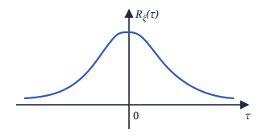

**2. Полосовой шум**

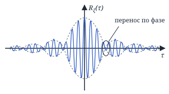

**3. Белый шум**

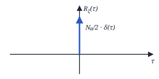

$$
R_\xi(\tau) = \frac{N_0}{2}\, \delta(\tau)
$$

<!-- p013 -->

**Интервал корреляции $\tau_\text{к}$** — такой промежуток времени $\tau_\text{к}$, при котором для всех $\tau > \tau_\text{к}$ значением корреляционных связей можно пренебречь.

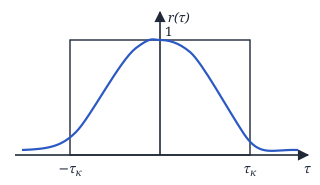

$$
\boxed{\tau_\text{к} = \frac{1}{2} \int_{-\infty}^{\infty} |\rho(\tau)|\, d\tau}
$$

$\rho(\tau)$ — огибающая корреляционной функции.

### Взаимные корреляционные функции и их свойства

$\xi(t)$, $\eta(t)$.

$$
\begin{aligned}
&R_{\xi\eta}(t_1, t_2) = \\
&= M\{[\xi(t_1) - m_\xi(t_1)][\eta(t_2) - m_\eta(t_2)]\} = \\
&= \int_{-\infty}^{\infty}\!\!\int_{-\infty}^{\infty} (x_1 - m_{\xi 1})(y_2 - m_{\eta 2}) \times \\
&\qquad \times W_2(x_1, y_2; t_1, t_2)\, dx_1\, dy_2
\end{aligned}
$$

$$
\begin{aligned}
&R_{\eta\xi}(t_1, t_2) = \\
&= M\{[\eta(t_1) - m_\eta(t_1)][\xi(t_2) - m_\xi(t_2)]\} = \\
&= \int_{-\infty}^{\infty}\!\!\int_{-\infty}^{\infty} (y_1 - m_{\eta 1})(x_2 - m_{\xi 2}) \times \\
&\qquad \times W_2(y_1, x_2; t_1, t_2)\, dy_1\, dx_2
\end{aligned}
$$

<u>Для комплексных СП:</u>

$$
\begin{aligned}
&R_{\xi\eta}(t_1, t_2) = \\
&= M\{[\xi(t_1) - m_\xi(t_1)][\eta^*(t_2) - m_\eta^*(t_2)]\}.
\end{aligned}
$$

#### Свойства

**1)** Эрмитово свойство:

$$
R_{\xi\eta}(t_1, t_2) = R_{\eta\xi}^*(t_2, t_1),
$$

$\xi(t)$, $\eta(t)$ — комплексные СП.

**2)**
$$
R_{\xi\eta}(t_1, t_2) = R_{\eta\xi}(t_2, t_1),
$$

$\xi(t)$ и $\eta(t)$ — действительные СП.

$$
R_{\xi\eta}(t_1, t_2) = R_{\xi\eta}(\tau)
$$

— тогда $\xi(t)$ и $\eta(t)$ — стационарно связанные СП.

$$
R_{\xi\eta}(\tau) = R_{\eta\xi}(-\tau),
$$

$\xi(t)$ и $\eta(t)$ — стационарно связанные СП.

**3)**
$$
|R_{\xi\eta}(t_1, t_2)|^2 \le D_\xi(t_1)\, D_\eta(t_2)
$$

<!-- p014 -->

Доказательство:

$$
M\{|\xi(t_1) + \lambda R_{\xi\eta}(t_1, t_2) \cdot \eta(t_2)|^2\} \ge 0,
$$

$$
\begin{aligned}
&M\{[\xi(t_1) + \lambda R_{\xi\eta}(t_1, t_2) \cdot \eta(t_2)] \times \\
&\qquad \times [\xi^*(t_1) + \lambda R_{\xi\eta}^*(t_1, t_2)\, \eta^*(t_2)]\} \ge 0,
\end{aligned}
$$

$$
\begin{aligned}
&\underbrace{M\{\xi(t_1)\, \xi^*(t_1)\}}_{\text{дисперсия}} + \\
&+ \underbrace{M\{\xi(t_1) \cdot \eta^*(t_2)\}}_{\text{КФ}} \cdot \lambda R_{\xi\eta}^*(t_1, t_2) + \\
&+ \underbrace{M\{\eta(t_2) \cdot \xi^*(t_1)\}}_{\text{КФ}} \cdot \lambda R_{\xi\eta}(t_1, t_2) + \\
&+ \lambda^2 R_{\xi\eta}(t_1, t_2) \cdot R_{\xi\eta}^*(t_1, t_2) \times \\
&\qquad \times \underbrace{M\{\eta(t_2) \cdot \eta^*(t_2)\}}_{\text{дисперсия}} \ge 0 \Rightarrow
\end{aligned}
$$

(КФ — корреляционная функция.)

$$
\begin{aligned}
&\Rightarrow D_\xi(t_1) + \lambda R_{\xi\eta}^*(t_1, t_2) \cdot R_{\xi\eta}(t_1, t_2) + \\
&+ \lambda R_{\xi\eta}^*(t_1, t_2) \cdot R_{\xi\eta}(t_1, t_2) + \\
&+ \lambda^2 R_{\xi\eta}(t_1, t_2) \cdot R_{\xi\eta}^*(t_1, t_2) \cdot D_\eta(t_2) \ge 0,
\end{aligned}
$$

$$
\begin{aligned}
&D_\xi(t_1) + \lambda |R_{\xi\eta}(t_1, t_2)|^2 + \lambda |R_{\xi\eta}(t_1, t_2)|^2 + \\
&+ \lambda^2 |R_{\xi\eta}(t_1, t_2)|^2 D_\eta(t_2) \ge 0 \Rightarrow
\end{aligned}
$$

$$
\begin{aligned}
&\Rightarrow D_\xi(t_1) + 2\lambda |R_{\xi\eta}(t_1, t_2)|^2 + \\
&+ \lambda^2 |R_{\xi\eta}(t_1, t_2)|^2 D_\eta(t_2) \ge 0.
\end{aligned}
$$

Решаем задачу с параметрами через дискриминант:

$$
D = b^2 - 4ac, \quad D \le 0.
$$

$$
\begin{aligned}
&D = 4|R_{\xi\eta}(t_1, t_2)|^4 - \\
&- 4|R_{\xi\eta}(t_1, t_2)|^2 D_\xi(t_1)\, D_\eta(t_2) \le 0
\end{aligned}
$$

$$
\begin{aligned}
&|R_{\xi\eta}(t_1, t_2)|^2 - D_\xi(t_1)\, D_\eta(t_2) \le 0, \\
&|R_{\xi\eta}(t_1, t_2)|^2 \le D_\xi(t_1)\, D_\eta(t_2).
\end{aligned}
$$

#### Следствие (для нормированной КФ)

**4)**
$$
r_{\xi\eta}(t_1, t_2) = \frac{R_{\xi\eta}(t_1, t_2)}{\sqrt{D_\xi(t_1)} \cdot \sqrt{D_\eta(t_2)}}
$$

Тогда $|r_{\xi\eta}(t_1, t_2)| \le 1$, так как

$$
|r_{\xi\eta}(t_1, t_2)|^2 = \frac{\overbrace{|R_{\xi\eta}(t_1, t_2)|^2}^{\le\, D_\xi(t_1) D_\eta(t_2)}}{D_\xi(t_1) \cdot D_\eta(t_2)}
$$

**5)** $|r_{\xi\eta}(t_1, t_2)| = 1$ $\Rightarrow$ $\xi(t_1)$ и $\eta(t_2)$ связаны линейной зависимостью:

$$
\xi(t_1) = a\eta(t_2) + b
$$

Доказательство:

$$
\begin{aligned}
&r_{\xi\eta}(t_1, t_2) = \\
&= \frac{M\{[\xi(t_1) - m_\xi(t_1)][\eta(t_2) - m_\eta(t_2)]\}}{\sqrt{D_\xi(t_1)} \cdot \sqrt{D_\eta(t_2)}}
\end{aligned}
$$

<!-- p015 -->

$$
\begin{aligned}
&m_\xi(t_1) = M\{\xi(t_1)\} = M\{a\eta(t_2) + b\} = \\
&= a \cdot M\{\eta(t_2)\} + b = a m_\eta(t_2) + b
\end{aligned}
$$

$$
\begin{aligned}
&D_\xi(t_1) = M\{[\xi(t_1) - m_\xi(t_1)]^2\} = \\
&= M\{[a\eta(t_2) + b - a m_\eta(t_2) - b]^2\} = \\
&= a^2 M\{[\eta(t_2) - m_\eta(t_2)]^2\} = a^2 D_\eta(t_2)
\end{aligned}
$$

$$
\begin{aligned}
&r_{\xi\eta}(t_1, t_2) = \\
&= \frac{1}{\sqrt{a^2 D_\eta(t_2)} \cdot \sqrt{D_\eta(t_2)}} \times \\
&\qquad \times M\{[a\eta(t_2) + b - a m_\eta(t_2) - b] \times \\
&\qquad \times [\eta(t_2) - m_\eta(t_2)]\} = \\
&= \frac{a \overbrace{M\{[\eta(t_2) - m_\eta(t_2)]^2\}}^{D_\eta(t_2)}}{|a| \cdot D_\eta(t_2)} = \frac{a}{|a|} = \\
&= \begin{cases} 1, & a > 0 \\ -1, & a < 0 \end{cases}
\end{aligned}
$$

Возьмём 2 СП, центрируем их и разделим на $\sqrt{D}$:

$$
\begin{aligned}
&\hat\xi(t_1) = \frac{\xi(t_1) - m_\xi(t_1)}{\sqrt{D_\xi(t_1)}}, \\
&\hat\eta(t_2) = \frac{\eta(t_2) - m_\eta(t_2)}{\sqrt{D_\eta(t_2)}}
\end{aligned}
$$

$$
M\{[\hat\xi(t_1) - \hat\eta(t_2)]^2\} \ge 0
$$

(аналогично и со знаком «+»),

$$
\begin{aligned}
&M\{\hat\xi^2(t_1)\} - 2M\{\hat\xi(t_1) \cdot \hat\eta(t_2)\} + \\
&+ M\{\hat\eta^2(t_2)\} \ge 0,
\end{aligned}
$$

$$
D_{\hat\xi}(t_1) - 2R_{\hat\xi\hat\eta}(t_1, t_2) + D_{\hat\eta}(t_2) \ge 0.
$$

$$
\begin{aligned}
&D_{\hat\xi}(t_1) = M\left\{\left[\frac{\xi(t_1) - m_\xi(t_1)}{\sqrt{D_\xi(t_1)}}\right]^2\right\} = \\
&= \frac{D_\xi(t_1)}{D_\xi(t_1)} = 1
\end{aligned}
$$

$D_{\hat\eta}(t_2) = 1$ аналогично.

$$
\begin{aligned}
&R_{\hat\xi\hat\eta}(t_1, t_2) = \\
&= M\left\{\frac{[\xi(t_1) - m_\xi(t_1)][\eta(t_2) - m_\eta(t_2)]}{\sqrt{D_\xi(t_1)} \cdot \sqrt{D_\eta(t_2)}}\right\} = \\
&= r_{\xi\eta}(t_1, t_2) \Rightarrow
\end{aligned}
$$

$$
\Rightarrow 2 - 2r_{\xi\eta}(t_1, t_2) \ge 0,
$$

при $r_{\xi\eta}(t_1, t_2) = 1$ $\Rightarrow$ $0 = 0$ $\Rightarrow$

<!-- p016 -->

$\Rightarrow$ в таком случае $\hat\xi(t_1) - \hat\eta(t_2) = \mathrm{const}$ $\Rightarrow$ <u>$\xi(t_1)$ и $\eta(t_2)$ — линейно зависимы</u>.

$$
M\{[\hat\xi(t_1) + \hat\eta(t_2)]^2\} \ge 0
$$

$$
\begin{aligned}
&M\{\hat\xi^2(t_1)\} + 2M\{\hat\xi(t_1) \cdot \hat\eta(t_2)\} + \\
&+ M\{\hat\eta^2(t_2)\} \ge 0
\end{aligned}
$$

$$
D_{\hat\xi}(t_1) + 2R_{\hat\xi\hat\eta}(t_1, t_2) + D_{\hat\eta}(t_2) \ge 0.
$$

$$
2 + 2r_{\xi\eta}(t_1, t_2) \ge 0,
$$

при $r_{\xi\eta}(t_1, t_2) = -1$ $\Rightarrow$ $0 = 0$ $\Rightarrow$ <u>$\xi(t_1)$ и $\eta(t_2)$ — линейно зависимы</u>.

#### Рассмотрим радиотехническое звено

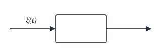

$S(t)$, $n(t)$ — центрированные стационарные СП, $\xi(t) = S(t) + n(t)$.

$$
\begin{aligned}
&R_\xi(\tau) = M\{\xi(t) \cdot \xi(t + \tau)\} = \\
&= M\{[S(t) + n(t)][S(t + \tau) + n(t + \tau)]\} = \\
&= M\{S(t) \cdot S(t + \tau)\} + M\{S(t) \cdot n(t + \tau)\} + \\
&+ M\{n(t) \cdot S(t + \tau)\} + M\{n(t) \cdot n(t + \tau)\} = \\
&= R_s(\tau) + R_{sn}(\tau) + R_{ns}(\tau) + R_n(\tau)
\end{aligned}
$$

Если $S(t)$ и $n(t)$ не зависят друг от друга, то

$$
R_\xi(\tau) = R_s(\tau) + R_n(\tau).
$$

### Спектральная плотность мощности (СПМ)

**Спектральной плотностью мощности** стационарного СП $\xi(t)$ называется прямое преобразование Фурье от его ковариационной функции:

$$
S_\xi(\omega) = \int_{-\infty}^{\infty} K_\xi(\tau)\, e^{-j\omega\tau}\, d\tau
$$

$$
K_\xi(\tau) = \frac{1}{2\pi} \int_{-\infty}^{\infty} S_\xi(\omega)\, e^{j\omega\tau}\, d\omega
$$

<!-- p017 -->

Если $\xi(t)$ центрированный, то

$$
S_\xi(\omega) = \int_{-\infty}^{\infty} R_\xi(\tau)\, e^{-j\omega\tau}\, d\tau
$$

$$
\begin{aligned}
&K_\xi(\tau) = R_\xi(\tau) + m^2 \Rightarrow \\
&\Rightarrow S_\xi(\omega) = \int_{-\infty}^{\infty} [R_\xi(\tau) + m^2]\, e^{-j\omega\tau}\, d\tau = \\
&= \int_{-\infty}^{\infty} R_\xi(\tau)\, e^{-j\omega\tau}\, d\tau + \\
&+ m^2 \frac{2\pi}{2\pi} \int_{-\infty}^{\infty} e^{-j\omega\tau}\, d\tau = \ldots
\end{aligned}
$$

$$
\delta(\omega) = \frac{1}{2\pi} \int_{-\infty}^{\infty} e^{-j\omega\tau}\, d\tau
$$

— интегральное представление $\delta$-функции.

$$
\ldots = \int_{-\infty}^{\infty} R_\xi(\tau)\, e^{-j\omega\tau}\, d\tau + 2\pi m^2 \delta(\omega).
$$

Пусть $\xi(t)$ центрирован, тогда

$$
R_\xi(\tau) = \frac{1}{2\pi} \int_{-\infty}^{\infty} S(\omega)\, e^{j\omega\tau}\, d\omega.
$$

Определим $D_\xi$ через $S_\xi$:

$$
D_\xi = R_\xi(0) = \frac{1}{2\pi} \int_{-\infty}^{\infty} S(\omega)\, d\omega
$$

$$
\begin{aligned}
&[\text{ед. мощности}] = \frac{1}{2\pi} S(\omega) \Rightarrow \\
&\Rightarrow S(\omega) = 2\pi \cdot [\text{ед. мощности}] = \\
&= \frac{[\text{ед. мощности}]}{[\text{ед. частоты}]}
\end{aligned}
$$

— характеризует распределение мощности СП по частотам.

$$
P_{\omega_1 - \omega_2} = \frac{1}{2\pi} \int_{\omega_1}^{\omega_2} S(\omega)\, d\omega
$$

— мощность СП в полосе частот от $\omega_1$ до $\omega_2$.

Формула (1.19): $\xi(t)$ — центрированный,

$$
\begin{aligned}
&S(\omega) = \int_{-\infty}^{\infty} R_\xi(\tau)\, e^{-j\omega\tau}\, d\tau = \\
&= 2 \int_0^{\infty} R_\xi(\tau) \cos\omega\tau\, d\tau
\end{aligned}
$$

Аналогично, формула (1.20):

$$
R_\xi(\tau) = \frac{1}{\pi} \int_0^{\infty} S(\omega) \cos\omega\tau\, d\omega
$$

<!-- p018 -->

#### Свойства спектральной плотности мощности

**1)** $S(\omega) \ge 0$

**2)** $S(\omega) = S(-\omega)$

**3)** Эффективная ширина спектра $\Delta\omega_\text{эфф}$:

$$
\Delta\omega_\text{эфф} = \frac{1}{S_{max}} \int_{-\infty}^{\infty} S(\omega)\, d\omega
$$

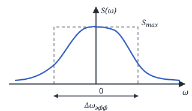

$S^0(\omega)$ — односторонняя спектральная плотность мощности (только в области положительных частот).

$$
\Delta\omega_\text{эфф} = \frac{1}{S_{max}} \cdot \int_0^{\infty} S^0(\omega)\, d\omega
$$

### Классификация СП по частотам

**1) Узкополосный СП** — если $\Delta\omega_\text{эфф} \ll \omega_0$.

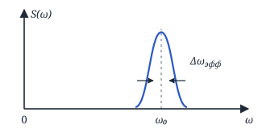

**2) Широкополосный СП** — если $\Delta\omega_\text{эфф} \not\ll \omega_0$.

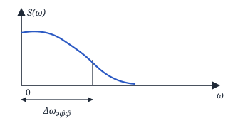

**3) Белый шум**

$$
S(\omega) = \frac{N_0}{2}
$$

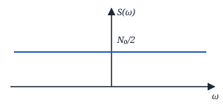

Такого СП не бывает в реальности, однако в некоторой полосе частот СПМ может быть постоянной:

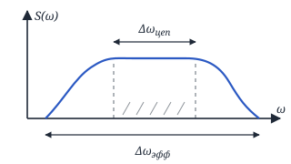

$$
\Delta\omega_\text{эфф} \approx (5 \ldots 10) \cdot \Delta\omega_\text{цеп}
$$

<!-- p019 -->

### Взаимная спектральная плотность мощности

$\xi(t)$, $\eta(t)$ — стационарно связанные.

$K_{\xi\eta}(\tau)$, $K_{\eta\xi}(\tau)$.

$$
\begin{cases}
S_{\xi\eta}(\omega) = \displaystyle\int_{-\infty}^{\infty} K_{\xi\eta}(\tau)\, e^{-j\omega\tau}\, d\tau \\[2ex]
S_{\eta\xi}(\omega) = \displaystyle\int_{-\infty}^{\infty} K_{\eta\xi}(\tau)\, e^{-j\omega\tau}\, d\tau
\end{cases}
$$

— взаимная спектральная плотность мощности.

#### Свойства

**1)** Пусть $\xi(t)$ и $\eta(t)$ — центрированные,

$$
R_{\xi\eta}(\tau) = R_{\eta\xi}(-\tau),
$$

тогда

$$
S_{\xi\eta}(\omega) = S_{\eta\xi}^*(\omega).
$$

**2)** $S_{\xi\eta}(\omega)$ и $S_{\eta\xi}(\omega)$ — комплексные.

**3)** $|S_{\xi\eta}(\omega)|^2 \le S_\xi(\omega) \cdot S_\eta(\omega)$. Иначе:

$$
\gamma^2 = \frac{|S_{\xi\eta}(\omega)|^2}{S_\xi(\omega) \cdot S_\eta(\omega)}
$$

— функция частотной когерентности, $0 \le \gamma^2 \le 1$.

Если $\gamma^2 = 0$, значит $\xi(t)$ и $\eta(t)$ — независимые СП.

Если $\gamma^2 = 1$, значит $\xi(t)$ и $\eta(t)$ — линейно зависимы.

<!-- p020 -->
