## Лекция 3. Гауссовский и марковский СП. Преобразование СП в радиотехнических системах

### Гауссовский СП и его свойства

Это процесс со следующей $n$-мерной плотностью вероятности:

$$
\boxed{
\begin{aligned}
&W_n(x_1 \ldots x_n, t_1 \ldots t_n) = \\
&= \frac{1}{\sqrt{(2\pi)^n D} \cdot \sigma_1 \ldots \sigma_n} \times \\
&\qquad \times e^{-\frac{1}{2D} \sum\limits_{i=1}^{n} \sum\limits_{j=1}^{n} D_{ij} \frac{(x_i - m_i)(x_j - m_j)}{\sigma_i \sigma_j}}
\end{aligned}
}
$$

$$
m_i = M\{\xi(t_i)\}, \quad m_j = M\{\xi(t_j)\}
$$

$$
\sigma_{i,j}^2 = M\{[\xi(t_i) - m(t_i)]^2\}
$$

$$
D = \begin{vmatrix}
r_{11} & r_{12} & \ldots & r_{1n} \\
r_{21} & r_{22} & \ldots & r_{2n} \\
\vdots & & \ddots & \\
r_{n1} & r_{n2} & \ldots & r_{nn}
\end{vmatrix},
$$

$$
r_{ij} = \frac{M\{[\xi(t_i) - m(t_i)][\xi(t_j) - m(t_j)]\}}{\sigma_i \sigma_j},
$$

$r_{ii} = 1$ (диагональ).

$D_{ij}$ — алгебраическое дополнение: вычёркиваем $i$-ю строку и $j$-й столбец, получаем матрицу $(n-1)$ на $(n-1)$ и определитель, знак $(-1)^{i+j}$ — знаки чередуются.

$$
\boxed{W(x) = \frac{1}{\sqrt{2\pi}\, \sigma}\, e^{-\frac{(x - m)^2}{2\sigma^2}}}
$$

— одномерная плотность вероятности.

#### Свойства

**1)** Если ГСП (гауссовский случайный процесс) стационарен в *широком* смысле, то он стационарен и в *узком* смысле.

**2)** Если ГСВ (гауссовские случайные величины) некоррелированы, то они будут статистически независимыми:

$$
D = \begin{vmatrix}
1 & 0 & 0 & \ldots \\
0 & 1 & 0 & \ldots \\
\vdots & & 1 & \ddots \\
0 & 0 & \ldots & 1
\end{vmatrix}, \quad
D_{ij} = \begin{cases} 1, & i = j \\ 0, & i \ne j \end{cases}
$$

<!-- p021 -->

Тогда

$$
\begin{aligned}
&W_n(x_1 \ldots x_n, t_1 \ldots t_n) = \\
&= \frac{1}{\sqrt{(2\pi)^n \cdot 1}\, \sigma_1 \ldots \sigma_n} \times \\
&\qquad \times e^{-\frac{1}{2 \cdot 1} \sum\limits_{i=1}^{n} \sum\limits_{j=1}^{n} D_{ij} \frac{(x_i - m_i)(x_j - m_j)}{\sigma_i \sigma_j}} = \\
&= \frac{1}{\sqrt{(2\pi)^n}\, \sigma_1 \ldots \sigma_n}\, e^{-\frac{1}{2} \sum\limits_{i=1}^{n} \frac{(x_i - m_i)^2}{\sigma_i^2}} = \\
&= \prod_{i=1}^{n} \frac{1}{\sqrt{2\pi}\, \sigma_i}\, e^{-\frac{(x_i - m_i)^2}{2\sigma_i^2}} = \prod_{i=1}^{n} W_1(x_i, t_i)
\end{aligned}
$$

**3)** При любом <u>линейном преобразовании гауссовская плотность остаётся гауссовской</u>, а при нелинейном преобразовании гауссовская плотность не сохраняется.

**4)** Гауссовские *коррелированные* СВ путём соответствующего линейного преобразования всегда можно сделать *некоррелированными*.

**5)** Любая условная плотность вероятности ГСП является гауссовской.

Доказательство: пусть

$$
\begin{aligned}
&W_m(x_1 \ldots x_m, t_1 \ldots t_m / x_{m+1} \ldots x_n) = \\
&= \frac{W_n(x_1 \ldots x_n, t_1 \ldots t_n)}{W_{n-m}(x_{m+1} \ldots x_n)} = \\
&= \frac{\mathrm{const} \cdot e^{-Q(x_1 \ldots x_n)}}{\mathrm{const} \cdot e^{-Q(x_{m+1} \ldots x_n)}} = \\
&= \mathrm{const} \cdot e^{-Q(x_1 \ldots x_m)}
\end{aligned}
$$

### Марковский СП

$\xi(t)$ в разные $t_1, t_2 \ldots t_n$.

СП называется <u>марковским</u>, если

$$
\begin{aligned}
&p\{\xi(t_n) < x_n \,|\, \xi(t_1) = x_1, \xi(t_2) = x_2, \\
&\qquad \ldots, \xi(t_{n-1}) = x_{n-1}\} = \\
&= p\{\xi(t_n) < x_n \,|\, \xi(t_{n-1}) = x_{n-1}\}
\end{aligned}
$$

$$
\begin{aligned}
&p\{\xi(t_i) < x_i,\ \xi(t_k) < x_k \,|\, \xi(t_j) = x_j\} = \\
&= p\{\xi(t_i) < x_i \,|\, \xi(t_j) = x_j\} \times \\
&\qquad \times p\{\xi(t_k) < x_k \,|\, \xi(t_j) = x_j\}
\end{aligned}
$$

$$
\begin{aligned}
&W_n(x_1 \ldots x_n, t_1 \ldots t_n) = \\
&= W(x_1)\, W_{n-1}(x_2 \ldots x_n / x_1) = \\
&= W(x_1) \cdot W(x_2 / x_1) \times \\
&\qquad \times W_{n-2}(x_3 \ldots x_n / x_1, x_2) = \\
&= W(x_1) \cdot W(x_2 / x_1) \cdot W(x_3 / x_2) \times \\
&\qquad \times W_{n-3}(x_4 \ldots x_n / x_1, x_2, x_3) = \\
&= W(x_1) \cdot W(x_2 / x_1) \cdot W(x_3 / x_2) \times \\
&\qquad \times W(x_4 / x_3) \times \\
&\qquad \times W_{n-4}(x_5 \ldots x_n / x_1, x_2, x_3, x_4) = \\
&= W(x_1) \cdot \prod_{j=1}^{n-1} W(x_{j+1} / x_j)
\end{aligned}
$$

<!-- p022 -->

### Преобразование СП в радиотехнических системах

Система **линейная**, если она подчиняется принципу суперпозиции, и **нелинейная**, если наоборот.

**Безынерционная система** — значение сигнала на выходе определяется только значением сигнала на входе, а в **инерционной** системе важно не только значение сигнала на входе, но и его предыстория.

Рассмотрим линейную инерционную систему:

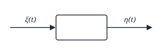

Способы описания линейных систем:

1) С помощью дифференциальных уравнений.
2) Импульсная характеристика (начальные условия должны быть $= 0$).
3) Комплексно-частотная характеристика (начальные условия $= 0$, режим установившийся).

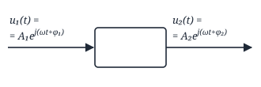

$$
K(j\omega) = \frac{u_2(t)}{u_1(t)}
$$

— **комплексно-частотная характеристика**, где $u_1(t) = A_1 e^{j(\omega t + \varphi_1)}$, $u_2(t) = A_2 e^{j(\omega t + \varphi_2)}$.

$$
K(j\omega) = \int_0^{\infty\,(T)} h(t)\, e^{-j\omega t}\, dt,
$$

где $h(t)$ — импульсная характеристика;

$$
h(t) = \frac{1}{2\pi} \int_{-\infty}^{\infty} K(j\omega)\, e^{j\omega t}\, d\omega
$$

Спектр сигнала на выходе:

$$
S_{\text{вых}}(j\omega) = S_{\text{вх}}(j\omega) \cdot K(j\omega)
$$

$$
\begin{aligned}
&\eta(t) = \int_0^T \xi(\tau)\, h(t - \tau)\, d\tau = \\
&= \int_0^T \xi(t - \tau)\, h(\tau)\, d\tau
\end{aligned}
$$

<!-- p023 -->

### Нахождение плотности вероятности СП на выходе линейной системы

**I.** Нахождение моментных функций входного процесса.

**II.** По известным моментным функциям входного процесса найти моментные функции выходного процесса.

**III.** По моментным функциям выходного СП найти характеристическую функцию выходного СП.

**IV.** Находим плотность вероятности, зная характеристическую функцию.

$$
\begin{aligned}
&Q_1(ju_1, t) = M\{e^{j\xi u}\} = \\
&= M\Big\{1 + j\xi u + \frac{(j\xi u)^2}{2!} + \ldots \\
&\qquad + \frac{(j\xi u)^n}{n!} + \ldots\Big\} = \\
&= 1 + ju M_1(t) + \frac{(ju)^2}{2!} M_2(t) + \ldots \\
&\qquad + \frac{(ju)^n}{n!} M_n(t) + \ldots
\end{aligned}
$$

(использовано разложение $e^x = 1 + \frac{x}{1!} + \frac{x^2}{2!} + \ldots + \frac{x^n}{n!} + \ldots$)

Исключения:

1) Если $\xi(t)$ — ГСП (гауссовский случайный процесс), то $\eta(t)$ — ГСП.
2) Нормализация.

**Нормализация.** Пусть СП имеет произвольное распределение и $\Delta\omega_{\text{эфф}} \gg \Delta\omega_{\text{сист}}$, где $\Delta\omega_{\text{эфф}}$ — эффективная ширина спектра, $\Delta\omega_{\text{сист}}$ — ПП (полоса пропускания) системы. Тогда на выходе будет ГСП.

*Доказательство:*

$$
\eta(t) = \int_0^t \xi(\tau)\, h(t - \tau)\, d\tau .
$$

Проведём дискретизацию:

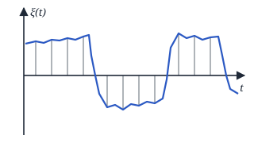

$\Delta\tau$ — шаг дискретизации — выбирается так, чтобы отсчёты были статистически независимы.

$$
\begin{aligned}
&\eta(t) = \int_0^t \xi(\tau)\, h(t - \tau)\, d\tau = \\
&= \sum_{k=1}^{N-1} \xi(k\Delta\tau) \cdot h(t - k\Delta\tau) \cdot \Delta\tau
\end{aligned}
$$

(интеграл Дюамеля)

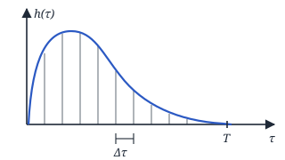

$$
N = \frac{T}{\Delta\tau}
$$

$T \sim \tau_{\text{сист}}$ (постоянная времени системы),

$\Delta\tau \sim \tau_{\text{к}}$ (интервал корреляции),

$N \gg 1$ $\Rightarrow$ можно применить ЦПТ (центральная предельная теорема) $\Rightarrow$

<!-- p024 -->

$$
\Rightarrow \frac{\tau_{\text{сист}}}{\tau_{\text{к}}} \gg 1, \quad \tau_{\text{сист}} \gg \tau_{\text{к}},
$$

$$
\tau_{\text{сист}} \sim \frac{1}{\Delta\omega_{\text{сист}}}, \quad \tau_{\text{к}} \sim \frac{1}{\Delta\omega_{\text{эфф}}}
$$

$$
\Downarrow
$$

$$
\Delta\omega_{\text{эфф}} \gg \Delta\omega_{\text{сист}}
$$

### Нахождение моментных функций на выходе линейной системы

$$
\begin{aligned}
&m_\eta(t) = M\{\eta(t)\} = \\
&= M\Big\{\int_0^t \xi(t - \tau)\, h(\tau)\, d\tau\Big\} = \\
&= \int_0^t \underbrace{M\{\xi(t - \tau)\}}_{m_\xi(t - \tau)}\, h(\tau)\, d\tau = \\
&= \int_0^t m_\xi(t - \tau)\, h(\tau)\, d\tau
\end{aligned}
$$

Пусть $\xi(t)$ — стационарный, тогда:

$$
m_\eta(t) = \int_0^t m_\xi \cdot h(\tau)\, d\tau
$$

$\Rightarrow$ на выходе процесс не стационарный.

Пусть $t \gg \tau_{\text{перех}}$ ($\tau_{\text{перех}}$ — длительность переходного процесса):

$$
\begin{aligned}
&m_\eta = \int_0^\infty m_\xi\, h(\tau)\, d\tau = \\
&= m_\xi \int_0^\infty h(\tau)\, d\tau = \boxed{m_\xi \cdot K(0)}
\end{aligned}
$$

так как

$$
\begin{aligned}
&K(j\omega) = \int_0^\infty h(\tau)\, e^{-j\omega\tau}\, d\tau, \\
&K(j\omega = 0) = \int_0^\infty h(\tau)\, d\tau
\end{aligned}
$$

$\Rightarrow$ процесс стационарный.

$$
\begin{aligned}
&K_\eta(t_1, t_2) = M\{\eta(t_1) \cdot \eta(t_2)\} = \\
&= M\Big\{\int_0^{t_1} \xi(t_1 - u)\, h(u)\, du \times \\
&\qquad \times \int_0^{t_2} \xi(t_2 - v)\, h(v)\, dv\Big\} = \\
&= \int_0^{t_1}\!\!\int_0^{t_2} \underbrace{M\{\xi(t_1 - u) \cdot \xi(t_2 - v)\}}_{K_\xi(t_1 - u,\, t_2 - v)} \times \\
&\qquad \times h(u) \cdot h(v)\, du\, dv = \\
&= \int_0^{t_1}\!\!\int_0^{t_2} K_\xi(t_1 - u, t_2 - v) \times \\
&\qquad \times h(u)\, h(v)\, du\, dv
\end{aligned}
$$

<!-- p025 -->

Пусть $\xi(t)$ — стационарный $\Rightarrow$

$$
\begin{aligned}
&K_\eta(t_1, t_2) = \int_0^{t_1}\!\!\int_0^{t_2} K_\xi(\tau + u - v) \times \\
&\qquad \times h(u)\, h(v)\, du\, dv
\end{aligned}
$$

Пусть $\xi(t)$ — стационарный и режим установившийся ($t > \tau_{\text{перех}}$):

$$
\begin{aligned}
&K_\eta(\tau) = \int_0^\infty\!\!\int_0^\infty K_\xi(\tau + u - v) \times \\
&\qquad \times h(u)\, h(v)\, du\, dv
\end{aligned}
$$

— процесс стационарный.

**Аналогично:**

$$
\begin{aligned}
&R_\eta(t_1, t_2) = \int_0^{t_1}\!\!\int_0^{t_2} R_\xi(t_1 - u, t_2 - v) \times \\
&\qquad \times h(u)\, h(v)\, du\, dv,
\end{aligned}
$$

$$
\begin{aligned}
&R_\eta(\tau) = \int_0^\infty\!\!\int_0^\infty R_\xi(\tau + u - v) \times \\
&\qquad \times h(u)\, h(v)\, du\, dv
\end{aligned}
$$

$D_\eta = R_\eta(0)$ — если процесс на выходе стационарный. Если нет, то $D_\eta(t_1) = R_\eta(t_1, t_1)$.

### Нахождение спектральной плотности мощности

$\xi(t)$ — стационарный и центрированный.

$$
\begin{aligned}
&S_\eta(\omega) = \int_{-\infty}^{\infty} R_\eta(\tau)\, e^{-j\omega\tau}\, d\tau = \\
&= \int_{-\infty}^{\infty}\!\int_0^\infty\!\!\int_0^\infty R_\xi(\tau + u - v) \times \\
&\qquad \times h(u)\, h(v)\, e^{-j\omega\tau}\, du\, dv\, d\tau =
\end{aligned}
$$

Замена:

$$
\begin{aligned}
&z = \tau + u - v, \\
&e^{-j\omega z} = e^{-j\omega\tau} \cdot e^{-j\omega u} \cdot e^{j\omega v}, \\
&dz = d\tau
\end{aligned}
$$

$$
\begin{aligned}
&= \int_{-\infty}^{\infty}\!\int_0^\infty\!\!\int_0^\infty R_\xi(z)\, e^{-j\omega z} \times \\
&\qquad \times h(u)\, h(v) \cdot e^{j\omega u} \cdot e^{-j\omega v}\, du\, dv\, dz = \\
&= \underbrace{\int_{-\infty}^{\infty} R_\xi(z)\, e^{-j\omega z}\, dz}_{S_\xi(\omega)} \times \\
&\qquad \times \underbrace{\int_0^\infty h(u)\, e^{j\omega u}\, du}_{K^*(j\omega)} \times \\
&\qquad \times \underbrace{\int_0^\infty h(v)\, e^{-j\omega v}\, dv}_{K(j\omega)} = \\
&= S_\xi(\omega)\, |K(j\omega)|^2
\end{aligned}
$$

<!-- p026 -->

### Нахождение взаимной ковариационной функции

$$
\begin{aligned}
&K_{\xi\eta}(t_1, t_2) = M\{\xi(t_1) \cdot \eta(t_2)\} = \\
&= M\Big\{\xi(t_1) \cdot \int_0^{t_2} \xi(t_2 - u)\, h(u)\, du\Big\} = \\
&= \int_0^{t_2} \underbrace{M\{\xi(t_1) \cdot \xi(t_2 - u)\}}_{K_\xi(t_1,\, t_2 - u)}\, h(u)\, du = \\
&= \int_0^{t_2} K_\xi(t_1, t_2 - u)\, h(u)\, du .
\end{aligned}
$$

Пусть $\xi$ — стационарный СП, тогда:

$$
K_{\xi\eta}(t_1, t_2) = \int_0^{t_2} K_\xi(\tau - u)\, h(u)\, du
$$

Пусть режим установившийся:

$$
K_{\xi\eta}(\tau) = \int_0^\infty K_\xi(\tau - u)\, h(u)\, du
$$

### Нахождение взаимной спектральной плотности мощности

$\xi(t)$ — стационарный, установившийся режим.

$$
\begin{aligned}
&S_{\xi\eta}(\omega) = \int_{-\infty}^{\infty} K_{\xi\eta}(\tau)\, e^{-j\omega\tau}\, d\tau = \\
&= \int_{-\infty}^{\infty}\!\int_0^\infty K_\xi(\tau - u)\, h(u)\, e^{-j\omega\tau}\, du\, d\tau =
\end{aligned}
$$

Замена:

$$
\begin{aligned}
&z = \tau - u, \\
&e^{-j\omega z} = e^{-j\omega\tau} \cdot e^{j\omega u}, \\
&dz = d\tau
\end{aligned}
$$

$$
\begin{aligned}
&= \int_{-\infty}^{\infty} K_\xi(z)\, e^{-j\omega z}\, dz \times \\
&\qquad \times \int_0^\infty h(u) \cdot e^{-j\omega u}\, du = \\
&= S_\xi(\omega) \cdot K(j\omega)
\end{aligned}
$$

$$
\gamma^2 = \frac{|S_{\xi\eta}(\omega)|^2}{S_\xi(\omega)\, S_\eta(\omega)},
$$

$\xi(t)$ и $\eta(t)$ — линейно связаны $\Rightarrow$

$$
\begin{aligned}
&\Rightarrow \gamma^2 = \frac{S_\xi^2(\omega) \cdot |K(j\omega)|^2}{S_\xi(\omega) \cdot S_\xi(\omega) \cdot |K(j\omega)|^2} = \\
&= 1
\end{aligned}
$$

<!-- p027 -->

### Дифференцирование СП

Случайная функция $\eta(t)$ называется **производной** случайной функции $\xi(t)$ в среднеквадратичном смысле, если:

$$
\boxed{\lim_{\Delta t \to 0} M\Big\{\Big[\eta(t) - \frac{\xi(t + \Delta t) - \xi(t)}{\Delta t}\Big]^2\Big\} = 0}
$$

$$
\Rightarrow \eta(t) = \frac{d\xi(t)}{dt}
$$

Устройство, позволяющее это получить, — **идеальный дифференциатор**.

$$
\begin{aligned}
&m_\eta(t) = M\{\eta(t)\} = M\Big\{\frac{d\xi(t)}{dt}\Big\} = \\
&= \frac{d}{dt} M\{\xi(t)\} = \frac{dm_\xi(t)}{dt}
\end{aligned}
$$

Если $\xi(t)$ — стационарный, то $m_\eta(t) = 0$.

$$
\begin{aligned}
&K_\eta(t_1, t_2) = M\{\eta(t_1)\, \eta(t_2)\} = \\
&= M\Big\{\frac{d\xi(t_1)}{dt_1} \cdot \frac{d\xi(t_2)}{dt_2}\Big\} = \\
&= \frac{\partial^2}{\partial t_1 \partial t_2} \underbrace{M\{\xi(t_1) \cdot \xi(t_2)\}}_{K_\xi(t_1,\, t_2)} = \\
&= \frac{\partial^2 K_\xi(t_1, t_2)}{\partial t_1\, \partial t_2}
\end{aligned}
$$

Если $\xi(t)$ — стационарный, то

$$
K_\eta(\tau) = \frac{\partial^2 K_\xi(\tau)}{\partial t_1\, \partial t_2}, \quad \tau = t_2 - t_1,
$$

$t_2 = \tau + t_1 \Rightarrow \partial t_2 = d\tau$, $\quad t_1 = t_2 - \tau \Rightarrow \partial t_1 = -d\tau$ $\Rightarrow$

$$
\Rightarrow K_\eta(\tau) = -\frac{d^2 K_\xi(\tau)}{d\tau^2}
$$

$K(j\omega) = j\omega$, тогда

$$
S_\eta(\omega) = S_\xi(\omega) \cdot |K(j\omega)|^2 = \omega^2 \cdot S_\xi(\omega)
$$

$$
\begin{aligned}
&D_\eta = \frac{1}{2\pi} \int_{-\infty}^{\infty} S_\eta(\omega)\, d\omega = \\
&= \frac{1}{2\pi} \int_{-\infty}^{\infty} \omega^2 \cdot S_\xi(\omega)\, d\omega
\end{aligned}
$$

> **Выводы:** чтобы процесс был дифференцируемым, должна существовать 2-ая производная его ковариационной функции в нуле. $S_\xi(\omega)$ должна спадать быстрее $\frac{1}{\omega^3}$, иначе будет бесконечная мощность $P$.

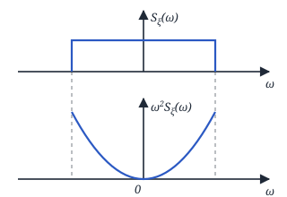

То есть при дифференцировании происходит усиление ВЧ (высокочастотных) составляющих.

<!-- p028 -->

### Интегрирование СП

СФ (случайная функция) $\eta(t)$ называется **интегралом** СФ $\xi(t)$ в среднеквадратичном смысле, если:

$$
\lim_{\Delta t \to 0} M\Big\{\Big[\eta(t) - \sum_{k=1}^{t/\Delta t} \xi(k\Delta t)\, \Delta t\Big]^2\Big\} = 0,
$$

тогда

$$
\eta(t) = \int_0^t \xi(\tau)\, d\tau
$$

— **идеальный интегратор**.

$$
\begin{aligned}
&m_\eta(t) = M\{\eta(t)\} = M\Big\{\int_0^t \xi(\tau)\, d\tau\Big\} = \\
&= \int_0^t M\{\xi(\tau)\}\, d\tau = \int_0^t m_\xi(\tau)\, d\tau
\end{aligned}
$$

Если $\xi(t)$ — стационарный:

$$
m_\eta(t) = \int_0^t m_\xi\, d\tau = m_\xi \cdot t
$$

— не стационарный.

$$
\begin{aligned}
&K_\eta(t_1, t_2) = M\{\eta(t_1) \cdot \eta(t_2)\} = \\
&= M\Big\{\int_0^{t_1} \xi(\tau_1)\, d\tau_1 \cdot \int_0^{t_2} \xi(\tau_2)\, d\tau_2\Big\} = \\
&= \int_0^{t_1}\!\!\int_0^{t_2} \underbrace{M\{\xi(\tau_1)\, \xi(\tau_2)\}}_{K_\xi(\tau_1,\, \tau_2)}\, d\tau_1\, d\tau_2 = \\
&= \int_0^{t_1}\!\!\int_0^{t_2} K_\xi(\tau_1, \tau_2)\, d\tau_1\, d\tau_2
\end{aligned}
$$

Если $\xi(t)$ — стационарный:

$$
\begin{aligned}
&K_\eta(t_1, t_2) = \\
&= \int_0^{t_1}\!\!\int_0^{t_2} K_\xi(\tau_2 - \tau_1)\, d\tau_1\, d\tau_2
\end{aligned}
$$

$$
D_\eta(t_1) = \int_0^{t_1}\!\!\int_0^{t_1} R_\xi(\tau_1, \tau_2)\, d\tau_1\, d\tau_2
$$

$$
K(j\omega) = \frac{1}{j\omega} \Rightarrow S_\eta(\omega) = \frac{S_\xi(\omega)}{\omega^2}
$$

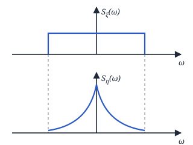

Усиление НЧ (низкочастотных) составляющих.

<!-- p029 -->

### Преобразование СП в нелинейных безынерционных системах

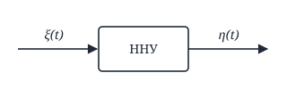

$$
\eta(t) = \varphi[\xi(t)], \qquad \xi(t) = \psi[\eta(t)]
$$

**1) $\psi$ — однозначная.**

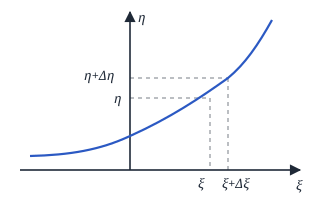

$$
W(\eta)\, d\eta = W(\xi)\, d\xi
$$

$$
W(\eta) = W(\xi) \left|\frac{d\xi}{d\eta}\right|
$$

— **формула преобразования плотностей вероятности**.

$$
\boxed{W(\eta) = W(\psi(\eta)) \cdot \left|\frac{d\psi(\eta)}{d\eta}\right|}
$$

Пусть характеристика нелинейного элемента: решим пример.

$$
\eta = \begin{cases} \alpha\xi^2, & \xi \ge 0, \\ 0, & \xi < 0, \end{cases}
$$

$W(\xi)$ — ГСП $(0, 1)$: $m_\xi = 0$, $D_\xi = 1$. $\quad W(\eta)$ — ?

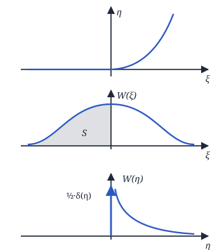

$$
W(\xi) = \frac{1}{\sqrt{2\pi}}\, e^{-\frac{\xi^2}{2}}.
$$

При $\xi \ge 0$: $\xi = \sqrt{\frac{\eta}{\alpha}} \Rightarrow$

$$
\Rightarrow \frac{d\xi}{d\eta} = \frac{1}{2\sqrt{\alpha\eta}} \Rightarrow
$$

$$
\Rightarrow W(\eta) = \frac{1}{\sqrt{2\pi}}\, e^{-\frac{\eta}{2\alpha}} \cdot \frac{1}{2\sqrt{\alpha\eta}} .
$$

При $\xi < 0$: $\eta = 0$, поэтому используем $\delta$-функцию:

$$
W(\eta) = \frac{1}{2} \cdot \delta(\eta),
$$

где $\frac{1}{2}$ — вероятность попадания в $S$.

$\Rightarrow$ В общем виде:

$$
\begin{aligned}
&W(\eta) = \frac{1}{\sqrt{2\pi} \cdot 2\sqrt{\alpha\eta}} \cdot e^{-\frac{\eta}{2\alpha}} + \\
&\qquad + \frac{1}{2} \cdot \delta(\eta)
\end{aligned}
$$

<!-- p030 -->

**Пример 2.**

$$
\eta = \begin{cases} -a, & \xi \le -\alpha, \\ k\xi, & -\alpha \le \xi < \beta, \\ b, & \xi \ge \beta \end{cases}
$$

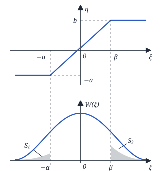

$$
W(\xi) = \frac{1}{\sqrt{2\pi}} \cdot e^{-\frac{\xi^2}{2}}
$$

1) $\xi \le -\alpha$: $\quad W(\eta) = S_1 \cdot \delta(\eta + a)$.

2) $-\alpha \le \xi < \beta$: $\quad \xi = \frac{\eta}{k}$, $\quad \left|\frac{d\xi}{d\eta}\right| = \frac{1}{k}$,

$$
W(\eta) = \frac{1}{\sqrt{2\pi}}\, e^{-\frac{\eta^2}{2k^2}} \cdot \frac{1}{k}
$$

3) $\xi \ge \beta$: $\quad W(\eta) = S_2 \cdot \delta(\eta - b)$.

$$
\begin{aligned}
&W(\eta) = \frac{1}{\sqrt{2\pi}\, k}\, e^{-\frac{\eta^2}{2k^2}} + \\
&\qquad + S_1\, \delta(\eta + a) + S_2 \cdot \delta(\eta - b) =
\end{aligned}
$$

где

$$
\begin{aligned}
&S_1 = \int_{-\infty}^{-\alpha} \frac{1}{\sqrt{2\pi}}\, e^{-\frac{\xi^2}{2}}\, d\xi = 1 - \Phi(\alpha), \\
&S_2 = \int_\beta^\infty \frac{1}{\sqrt{2\pi}}\, e^{-\frac{\xi^2}{2}}\, d\xi = 1 - \Phi(\beta)
\end{aligned}
$$

$$
\begin{aligned}
&= \frac{1}{\sqrt{2\pi}\, k}\, e^{-\frac{\eta^2}{2k^2}} + \\
&\qquad + (1 - \Phi(\alpha)) \cdot \delta(\eta + a) + \\
&\qquad + (1 - \Phi(\beta)) \cdot \delta(\eta - b)
\end{aligned}
$$

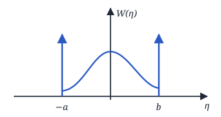

<!-- p031 -->

**2) $\psi$ — двузначная** (фото доски):

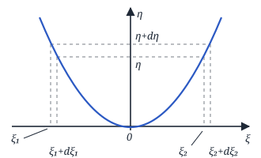

$$
W(\eta)\, d\eta = W(\xi_1)\, d\xi_1 + W(\xi_2)\, d\xi_2
$$

$$
W(\eta) = W(\xi_1) \left|\frac{d\xi_1}{d\eta}\right| + W(\xi_2) \left|\frac{d\xi_2}{d\eta}\right|
$$

$$
\begin{aligned}
&\eta(t) = \varphi(\xi(t)), \\
&\xi_1(t) = \psi_1[\eta(t)], \\
&\xi_2(t) = \psi_2[\eta(t)],
\end{aligned}
$$

тогда:

$$
\begin{aligned}
&W(\eta) = W(\psi_1(\eta)) \cdot \left|\frac{d\psi_1(\eta)}{d\eta}\right| + \\
&\qquad + W(\psi_2(\eta)) \cdot \left|\frac{d\psi_2(\eta)}{d\eta}\right| .
\end{aligned}
$$

Если $\psi$ — $k$-значная, то

$$
W(\eta) = \sum_k W(\psi_k(\eta)) \cdot \left|\frac{d\psi_k(\eta)}{d\eta}\right|
$$

**Пример 3.**

$$
\begin{aligned}
&\eta(t) = \alpha \cdot \xi^2(t), \\
&W(\xi) = \frac{1}{\sqrt{2\pi}}\, e^{-\frac{\xi^2}{2}}, \quad W(\eta) \text{ — ?}
\end{aligned}
$$

$$
\xi_1 = \sqrt{\frac{\eta}{\alpha}}, \quad \xi_2 = -\sqrt{\frac{\eta}{\alpha}} .
$$

$$
\left|\frac{d\xi_1}{d\eta}\right| = \frac{1}{2\sqrt{\alpha\eta}}; \quad \left|\frac{d\xi_2}{d\eta}\right| = \frac{1}{2\sqrt{\alpha\eta}}
$$

$$
\begin{aligned}
&W(\eta) = \frac{1}{\sqrt{2\pi}}\, e^{-\frac{\eta}{2\alpha}} \cdot \frac{1}{2\sqrt{\alpha\eta}} + \\
&\qquad + \frac{1}{\sqrt{2\pi}}\, e^{-\frac{\eta}{2\alpha}} \cdot \frac{1}{2\sqrt{\alpha\eta}} = \\
&= \frac{1}{\sqrt{2\pi}} \cdot \frac{1}{\sqrt{\alpha\eta}} \cdot e^{-\frac{\eta}{2\alpha}}
\end{aligned}
$$

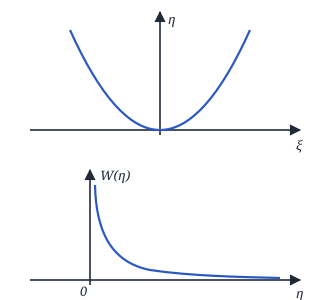

<!-- p032 -->

Пусть:

$$
\begin{cases}
\eta_1 = \varphi_1(\xi_1, \xi_2, \ldots, \xi_n) \\
\eta_2 = \varphi_2(\xi_1, \xi_2, \ldots, \xi_n) \\
\quad \vdots \\
\eta_n = \varphi_n(\xi_1, \xi_2, \ldots, \xi_n)
\end{cases}
$$

$W_n(\xi_1 \ldots \xi_n)$ — известна.

Тогда:

$$
\begin{cases}
\xi_1 = \psi_1(\eta_1, \eta_2, \ldots, \eta_n) \\
\xi_2 = \psi_2(\eta_1, \eta_2, \ldots, \eta_n) \\
\quad \vdots \\
\xi_n = \psi_n(\eta_1, \eta_2, \ldots, \eta_n)
\end{cases}
$$

$W_n(\eta_1 \ldots \eta_n)$ — ?

$$
\begin{aligned}
&W_n(\eta_1 \ldots \eta_n) = W_n(\xi_1 \ldots \xi_n) \cdot |D| = \\
&= W_n\big(\psi_1(\eta_1 \ldots \eta_n) \ldots \\
&\qquad \ldots \psi_n(\eta_1 \ldots \eta_n)\big) \cdot |D|,
\end{aligned}
$$

где $D$ — **якобиан преобразования**:

$$
D = \begin{vmatrix}
\frac{\partial \psi_1}{\partial \eta_1} & \frac{\partial \psi_1}{\partial \eta_2} & \cdots & \frac{\partial \psi_1}{\partial \eta_n} \\[4pt]
\frac{\partial \psi_2}{\partial \eta_1} & \frac{\partial \psi_2}{\partial \eta_2} & \cdots & \frac{\partial \psi_2}{\partial \eta_n} \\[4pt]
\vdots & & \ddots & \vdots \\[4pt]
\frac{\partial \psi_n}{\partial \eta_1} & \frac{\partial \psi_n}{\partial \eta_2} & \cdots & \frac{\partial \psi_n}{\partial \eta_n}
\end{vmatrix}
$$

### Нахождение плотности вероятности функции 2 СВ

(СВ — случайные величины)

$$
\begin{aligned}
&\eta_1 = \xi_1, && \xi_1 = \eta_1 = \psi_1, \\
&\eta_2 = \varphi_2(\xi_1, \xi_2), && \xi_2 = \psi_2(\eta_1, \eta_2)
\end{aligned}
$$

$W(\eta_2)$ — ?

$$
D = \begin{vmatrix} 1 & 0 \\[2pt] \frac{\partial \psi_2}{\partial \eta_1} & \frac{\partial \psi_2}{\partial \eta_2} \end{vmatrix} = \frac{\partial \psi_2}{\partial \eta_2}
$$

$$
\begin{aligned}
&W(\eta_1, \eta_2) = W(\xi_1, \xi_2) \cdot \left|\frac{\partial \psi_2}{\partial \eta_2}\right| = \\
&= W(\eta_1, \psi_2(\eta_1, \eta_2)) \cdot \left|\frac{\partial \psi_2}{\partial \eta_2}\right|
\end{aligned}
$$

$$
\begin{aligned}
&W(\eta_2) = \int_{-\infty}^{\infty} W(\eta_1, \eta_2)\, d\eta_1 = \\
&= \int_{-\infty}^{\infty} W(\eta_1, \psi_2(\eta_1, \eta_2)) \cdot \left|\frac{\partial \psi_2}{\partial \eta_2}\right| d\eta_1
\end{aligned}
$$

<!-- p033 -->

Частные случаи:

**1)** Сумма:

$$
\begin{aligned}
&\eta_1 = \xi_1, && \xi_1 = \eta_1 = \psi_1, \\
&\eta_2 = \xi_1 + \xi_2, && \xi_2 = \eta_2 - \xi_1 = \eta_2 - \eta_1 = \psi_2
\end{aligned}
$$

$$
\left|\frac{\partial \psi_2}{\partial \eta_2}\right| = 1, \quad W(\eta_2) = \int_{-\infty}^{\infty} W(\eta_1, \eta_2 - \eta_1)\, d\eta_1 .
$$

Пусть $\xi_1$ и $\xi_2$ — независимые, тогда:

$$
W(\eta_2) = \int_{-\infty}^{\infty} W(\eta_1) \cdot W(\eta_2 - \eta_1)\, d\eta_1 .
$$

**2)** Разность:

$$
\begin{aligned}
&\eta_1 = \xi_1, && \xi_1 = \eta_1, \\
&\eta_2 = \xi_2 - \xi_1, && \xi_2 = \eta_2 + \xi_1
\end{aligned}
$$

$$
\left|\frac{\partial \psi_2}{\partial \eta_2}\right| = 1, \quad W(\eta_2) = \int_{-\infty}^{\infty} W(\eta_1, \eta_2 + \eta_1)\, d\eta_1 .
$$

**3)** Произведение:

$$
\begin{aligned}
&\eta_1 = \xi_1, && \xi_1 = \eta_1, \\
&\eta_2 = \xi_1 \cdot \xi_2, && \xi_2 = \frac{\eta_2}{\eta_1}
\end{aligned}
$$

$$
\left|\frac{\partial \psi_2}{\partial \eta_2}\right| = \left|\frac{1}{\eta_1}\right|,
$$

$$
W(\eta_2) = \int_{-\infty}^{\infty} W\Big(\eta_1, \frac{\eta_2}{\eta_1}\Big) \cdot \left|\frac{1}{\eta_1}\right| d\eta_1
$$

**4)** Частное:

$$
\begin{aligned}
&\eta_1 = \xi_1, && \xi_1 = \eta_1, \\
&\eta_2 = \xi_2 / \xi_1, && \xi_2 = \eta_2 \cdot \eta_1
\end{aligned}
$$

$$
\left|\frac{\partial \psi_2}{\partial \eta_2}\right| = |\eta_1|,
$$

$$
W(\eta_2) = \int_{-\infty}^{\infty} W(\eta_1, \eta_2 \cdot \eta_1) \cdot |\eta_1| \cdot d\eta_1
$$

<!-- p034 -->
