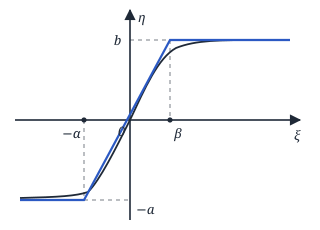
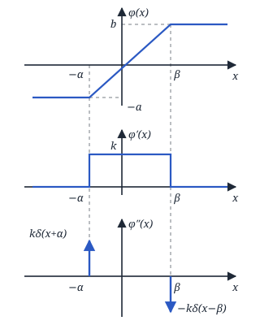
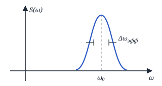
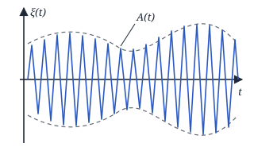
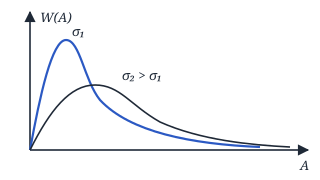
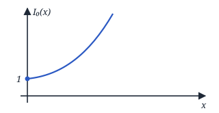
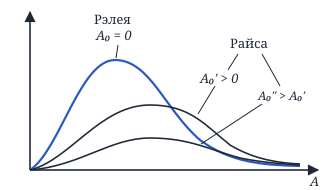

## Лекция 5. Кусочно-линейная аппроксимация. Огибающая и фаза узкополосного ГСП

### Нахождение основных моментных функций СП на выходе ННУ при использовании кусочно-линейной аппроксимации характеристики этого устройства

$$
\eta = \begin{cases} -a, & \xi < -\alpha, \\ k\xi, & -\alpha \le \xi \le \beta, \\ b, & \xi > \beta \end{cases}
$$

$$
\begin{aligned}
&m_\eta(t) = \int_{-\infty}^{\infty} \varphi(x) \cdot W(x, t)\, dx = \\
&= \int_{-\infty}^{-\alpha} (-a) \cdot W(x, t)\, dx + \\
&\qquad + \int_{-\alpha}^{\beta} k \cdot x \cdot W(x, t)\, dx + \\
&\qquad + \int_\beta^{\infty} b \cdot W(x, t)\, dx
\end{aligned}
$$

Пусть $\xi(t)$ — центрированный ГСП:

$$
\begin{aligned}
&m_\eta(t) = \int_{-\infty}^{-\alpha} (-a) \cdot \frac{1}{\sqrt{2\pi}\,\sigma} \cdot e^{-\frac{x^2}{2\sigma^2}}\, dx + \\
&\qquad + \int_{-\alpha}^{\beta} kx \cdot \frac{\sigma}{\sqrt{2\pi}\,\sigma^2} \cdot e^{-\frac{x^2}{2\sigma^2}}\, dx + \\
&\qquad + \int_\beta^{+\infty} b \cdot \frac{1}{\sqrt{2\pi}\,\sigma} \cdot e^{-\frac{x^2}{2\sigma^2}}\, dx =
\end{aligned}
$$

Замена: $z = \dfrac{x}{\sigma}$.

$$
\begin{aligned}
&= -a \int_{-\infty}^{-\alpha/\sigma} \frac{1}{\sqrt{2\pi}} \cdot e^{-\frac{z^2}{2}}\, dz + \\
&\qquad + b \int_{\beta/\sigma}^{\infty} \frac{1}{\sqrt{2\pi}}\, e^{-\frac{z^2}{2}}\, dz + \\
&\qquad + \frac{k\sigma}{\sqrt{2\pi}} \int_{-\alpha}^{\beta} e^{-\frac{x^2}{2\sigma^2}}\, d\Big(\frac{x^2}{2\sigma^2}\Big) = \\
&= (-a)\, \Phi\Big(-\frac{\alpha}{\sigma}\Big) + b\Big(1 - \Phi\Big(\frac{\beta}{\sigma}\Big)\Big) - \\
&\qquad - \frac{k\sigma}{\sqrt{2\pi}}\, e^{-\frac{x^2}{2\sigma^2}} \Big|_{-\alpha}^{\beta} = \\
&= a\,\Phi\Big(\frac{\alpha}{\sigma}\Big) - a + b\Big(1 - \Phi\Big(\frac{\beta}{\sigma}\Big)\Big) - \\
&\qquad - \frac{k\sigma}{\sqrt{2\pi}} \Big(e^{-\frac{\beta^2}{2\sigma^2}} - e^{-\frac{\alpha^2}{2\sigma^2}}\Big)
\end{aligned}
$$

<!-- p038 -->

$$
\begin{aligned}
&K_\eta(t_1, t_2) = M\{\eta(t_1) \cdot \eta(t_2)\} = \\
&= \iint_{-\infty}^{\infty} \varphi(x_1) \cdot \varphi(x_2) \times \\
&\qquad \times W_2(x_1, x_2; t_1, t_2)\, dx_1\, dx_2 = \\
&= \int_{-\infty}^{-\alpha}\!\!\int_{-\infty}^{-\alpha} (-a) \cdot (-a) \times \\
&\qquad \times W_2(x_1, x_2; t_1, t_2)\, dx_1\, dx_2 + \\
&+ \int_{-\infty}^{-\alpha}\!\!\int_{-\alpha}^{\beta} (-a) \cdot k x_2 \times \\
&\qquad \times W_2(x_1, x_2; t_1, t_2)\, dx_1\, dx_2 + \\
&+ \int_{-\infty}^{-\alpha}\!\!\int_{\beta}^{\infty} (-a) \cdot b \times \\
&\qquad \times W_2(x_1, x_2; t_1, t_2)\, dx_1\, dx_2 + \\
&+ \int_{-\alpha}^{\beta}\!\!\int_{-\infty}^{-\alpha} k x_1 (-a) \ldots + \\
&+ \int_{-\alpha}^{\beta}\!\!\int_{-\alpha}^{\beta} k x_1 \cdot k x_2 \ldots + \\
&+ \int_{-\alpha}^{\beta}\!\!\int_{\beta}^{\infty} k x_1 \cdot b \ldots + \\
&+ \int_{\beta}^{\infty}\!\!\int_{-\infty}^{-\alpha} \ldots + \int_{\beta}^{\infty}\!\!\int_{-\alpha}^{\beta} \ldots + \\
&+ \int_{\beta}^{\infty}\!\!\int_{\beta}^{\infty} \ldots
\end{aligned}
$$

Пусть на входе центрированный ГСП. **Метод $\delta$-функций.**

$$
\begin{aligned}
&K_\eta(t_1, t_2) = \iint_{-\infty}^{\infty} \varphi(x_1) \cdot \varphi(x_2) \times \\
&\qquad \times \sigma^{-2} \sum_{k=0}^{\infty} \frac{r_\xi^k(\tau)}{k!} \times \\
&\qquad \times \Phi^{(k+1)}\Big(\frac{x_1}{\sigma}\Big) \Phi^{(k+1)}\Big(\frac{x_2}{\sigma}\Big) dx_1\, dx_2 =
\end{aligned}
$$

(здесь $\sigma^{-2} \sum_{k=0}^{\infty} \ldots$ — это $W_2(x_1, x_2; t_1, t_2)$)

$$
\begin{aligned}
&= \iint_{-\infty}^{\infty} \varphi(x_1) \cdot \varphi(x_2) \times \\
&\qquad \times \frac{e^{-\frac{x_1^2}{2\sigma^2}}}{\sqrt{2\pi}\,\sigma} \cdot \frac{e^{-\frac{x_2^2}{2\sigma^2}}}{\sqrt{2\pi}\,\sigma}\, dx_1\, dx_2 + \\
&+ \iint_{-\infty}^{\infty} \varphi(x_1)\, \varphi(x_2) \times \\
&\qquad \times \sigma^{-2} \sum_{k=1}^{\infty} \frac{r_\xi^k(\tau)}{k!} \times \\
&\qquad \times \Phi^{(k+1)}\Big(\frac{x_1}{\sigma}\Big) \Phi^{(k+1)}\Big(\frac{x_2}{\sigma}\Big) dx_1\, dx_2 = \\
&= m_\eta^2 + R_\eta(t_1, t_2)
\end{aligned}
$$

(первое слагаемое, $k = 0$, равно $m_\eta^2$)

$$
\begin{aligned}
&R_\eta(\tau) = \sigma^{-2} \sum_{k=1}^{\infty} \frac{r_\xi^k(\tau)}{k!} \times \\
&\qquad \times \Big[\underbrace{\int_{-\infty}^{\infty} \varphi(x)\, \Phi^{(k+1)}\Big(\frac{x}{\sigma}\Big) dx}_{I}\Big]^2
\end{aligned}
$$

Интегрируем по частям:

$$
\begin{aligned}
&I = \Big\{u = \varphi(x),\ dv = \Phi^{(k+1)}\Big(\frac{x}{\sigma}\Big) dx, \\
&\qquad v = \Phi^{(k)}\Big(\frac{x}{\sigma}\Big) \sigma,\ du = \varphi'(x)\, dx\Big\} = \\
&= \underbrace{\varphi(x) \cdot \sigma\, \Phi^{(k)}\Big(\frac{x}{\sigma}\Big)\Big|_{-\infty}^{\infty}}_{=\,0} - \\
&\qquad - \sigma \int_{-\infty}^{\infty} \varphi'(x) \cdot \Phi^{(k)}\Big(\frac{x}{\sigma}\Big) dx = \\
&= +\sigma^2 \int_{-\infty}^{\infty} \varphi''(x)\, \Phi^{(k-1)}\Big(\frac{x}{\sigma}\Big) dx = \ldots = \\
&= (-1)^\nu \sigma^\nu \times \\
&\qquad \times \int_{-\infty}^{\infty} \varphi^{(\nu)}(x)\, \Phi^{(k+1-\nu)}\Big(\frac{x}{\sigma}\Big) dx =
\end{aligned}
$$

где $\nu$ — число интегрирований по частям ($\nu$ раз).

<!-- p039 -->

$\varphi''(x)$, $\nu = 2$:

$$
\begin{aligned}
&I = (-1)^2 \sigma^2 \int_{-\infty}^{\infty} \underbrace{\big(k\delta(x + \alpha) - k\delta(x - \beta)\big)}_{\varphi''(x)} \times \\
&\qquad \times \Phi^{(k-1)}\Big(\frac{x}{\sigma}\Big) dx = \\
&= k\sigma^2 \Big(\Phi^{(k-1)}\Big(-\frac{\alpha}{\sigma}\Big) - \Phi^{(k-1)}\Big(\frac{\beta}{\sigma}\Big)\Big) \Rightarrow
\end{aligned}
$$

$$
\begin{aligned}
&\Rightarrow R_\eta(\tau) = \sigma^2 \sum_{k=1}^{\infty} \frac{r_\xi^k(\tau)}{k!} \cdot k^2 \times \\
&\qquad \times \Big[\Phi^{(k-1)}\Big(-\frac{\alpha}{\sigma}\Big) - \Phi^{(k-1)}\Big(\frac{\beta}{\sigma}\Big)\Big]^2
\end{aligned}
$$

$$
S_\eta(\omega) = \int_{-\infty}^{\infty} K_\eta(\tau)\, e^{-j\omega\tau}\, d\tau
$$

<!-- p040 -->

### Нахождение плотности вероятности огибающей и фазы стационарного узкополосного ГСП с нулевым $m$

$\Delta\omega_{\text{эфф}} \ll \omega_0$

$$
\xi(t) = A(t) \cos(\omega_0 t - \varphi(t))
$$

$A(t)$ и $\varphi(t)$ — медленно меняющиеся функции по сравнению с $\cos(\omega_0 t)$.

Нужно найти $W(A)$ и $W(\varphi)$.

$$
\begin{aligned}
&\xi(t) = \underbrace{A(t) \cos\varphi(t)}_{A_c(t)} \cdot \cos\omega_0 t + \\
&\qquad + \underbrace{A(t) \cdot \sin\varphi(t)}_{A_s(t)} \cdot \sin\omega_0 t = \\
&= A_c \cdot \cos\omega_0 t + A_s(t) \cdot \sin\omega_0 t
\end{aligned}
$$

$$
\begin{aligned}
&W(A_c),\ W(A_s) \Rightarrow W(A_c, A_s) \Rightarrow \\
&\Rightarrow W(A, \varphi) \Rightarrow W(A),\ W(\varphi)
\end{aligned}
$$

$$
\begin{cases}
\xi(t) = A_c(t) \cos\omega_0 t + A_s(t) \sin\omega_0 t \\[4pt]
\dfrac{\dot\xi(t)}{\omega_0} = -A_c(t) \sin\omega_0 t + A_s(t) \cos\omega_0 t
\end{cases}
$$

Первое уравнение $\cdot \cos\omega_0 t$, второе $\cdot (-\sin\omega_0 t)$, складываем:

$$
\begin{aligned}
&\xi(t) \cdot \cos\omega_0 t - \frac{\dot\xi(t)}{\omega_0} \sin\omega_0 t = \\
&= A_c(t) \cos^2\omega_0 t + A_c(t) \sin^2\omega_0 t + \\
&\qquad + A_s(t) \sin\omega_0 t \cos\omega_0 t - \\
&\qquad - A_s(t) \sin\omega_0 t \cos\omega_0 t = A_c(t)
\end{aligned}
$$

(слагаемые с $A_s$ сокращаются)

$$
A_c(t) = \xi(t) \cdot \cos\omega_0 t - \frac{\dot\xi(t)}{\omega_0} \sin\omega_0 t
$$

$$
\begin{cases}
\xi(t) = A_c(t) \cos\omega_0 t + A_s(t) \sin\omega_0 t \\[4pt]
\dfrac{\dot\xi(t)}{\omega_0} = -A_c(t) \sin\omega_0 t + A_s(t) \cos\omega_0 t
\end{cases}
$$

Первое уравнение $\cdot \sin\omega_0 t$, второе $\cdot \cos\omega_0 t$, складываем:

$$
\begin{aligned}
&\xi(t) \cdot \sin\omega_0 t + \frac{\dot\xi(t)}{\omega_0} \cdot \cos\omega_0 t = \\
&= A_c(t) \cos\omega_0 t \sin\omega_0 t + A_s(t) \sin^2\omega_0 t - \\
&\qquad - A_c(t) \sin\omega_0 t \cos\omega_0 t + A_s(t) \cos^2\omega_0 t
\end{aligned}
$$

(слагаемые с $A_c$ сокращаются)

<!-- p041 -->

$$
A_s(t) = \xi(t) \cdot \sin\omega_0 t + \frac{\dot\xi(t)}{\omega_0} \cdot \cos\omega_0 t
$$

$$
\Downarrow
$$

$A_c(t)$ и $A_s(t)$ — ГСП.

Найдём $m_{A_c}$, $D_{A_c}$, $m_{A_s}$, $D_{A_s}$.

$$
\begin{aligned}
&m_{A_c}(t) = M\{A_c(t)\} = \\
&= M\Big\{\xi(t) \cos\omega_0 t - \frac{\dot\xi(t)}{\omega_0} \sin\omega_0 t\Big\} = \\
&= \underbrace{M\{\xi(t)\}}_{m_\xi = 0} \cos\omega_0 t - \frac{\sin\omega_0 t}{\omega_0} \underbrace{M\{\dot\xi(t)\}}_{m_{\dot\xi} = 0} = 0
\end{aligned}
$$

$$
\begin{aligned}
&m_{A_s}(t) = \\
&= M\Big\{\xi(t) \sin\omega_0 t + \frac{\dot\xi(t)}{\omega_0} \cos\omega_0 t\Big\} = 0
\end{aligned}
$$

$$
\begin{aligned}
&D_{A_c}(t) = M\{A_c^2(t)\} = M\Big\{\xi^2(t) \cos^2\omega_0 t + \\
&\qquad + \frac{\dot\xi^2(t)}{\omega_0^2} \sin^2\omega_0 t - \\
&\qquad - \xi(t) \cdot \dot\xi(t) \cdot \frac{2}{\omega_0} \cos\omega_0 t \sin\omega_0 t\Big\} = \\
&= \cos^2\omega_0 t \cdot \underbrace{D_\xi}_{=\,\sigma^2} - \\
&\qquad - \frac{2}{\omega_0} \cos\omega_0 t \sin\omega_0 t \cdot M\{\xi(t) \cdot \dot\xi(t)\} + \\
&\qquad + \frac{\sin^2\omega_0 t}{\omega_0^2} \cdot M\{\dot\xi^2(t)\}
\end{aligned}
$$

$$
\begin{aligned}
&M\{\xi(t) \cdot \dot\xi(t)\} = M\Big\{\xi(t) \cdot \frac{d}{dt} \xi(t)\Big\} = \\
&= \frac{1}{2} \frac{d}{dt} M\{\xi^2(t)\} = \frac{1}{2} \frac{dD_\xi}{dt} = 0,
\end{aligned}
$$

$$
\begin{aligned}
&M\{\dot\xi^2(t)\} = M\Big\{\Big(\frac{d\xi(t)}{dt}\Big)^2\Big\} = \ldots = \omega_0^2 \sigma^2 \Rightarrow \\
&\Rightarrow D_{A_c} = \sigma^2 \cos^2\omega_0 t + \sigma^2 \sin^2\omega_0 t = \sigma^2
\end{aligned}
$$

$D_{A_s} = \sigma^2$ — аналогично.

$$
\begin{aligned}
&W(A_c) = \frac{1}{\sqrt{2\pi}\,\sigma}\, e^{-\frac{A_c^2}{2\sigma^2}}, \\
&W(A_s) = \frac{1}{\sqrt{2\pi}\,\sigma}\, e^{-\frac{A_s^2}{2\sigma^2}} .
\end{aligned}
$$

$$
\begin{aligned}
&M\{A_c \cdot A_s\} = M\Big\{\xi^2(t) \sin\omega_0 t \cos\omega_0 t + \\
&\qquad + \frac{\xi(t) \cdot \dot\xi(t)}{\omega_0} \cos^2\omega_0 t - \\
&\qquad - \frac{\xi(t) \cdot \dot\xi(t)}{\omega_0} \sin^2\omega_0 t - \\
&\qquad - \frac{\dot\xi^2(t)}{\omega_0^2} \sin\omega_0 t \cos\omega_0 t\Big\} = \\
&= \sin\omega_0 t \cos\omega_0 t \cdot \sigma^2 + 0 - 0 - \\
&\qquad - \sin\omega_0 t \cos\omega_0 t \cdot \frac{1}{\omega_0^2} \cdot \sigma^2 \omega_0^2 = 0
\end{aligned}
$$

$\Rightarrow A_c(t)$ и $A_s(t)$ — некоррелированы $\Rightarrow$ (т. к. ГСП) статистически независимы $\Rightarrow$

$$
\begin{aligned}
&\Rightarrow W(A_c, A_s) = W(A_c) \cdot W(A_s) = \\
&= \frac{1}{2\pi\sigma^2}\, e^{-\frac{A_c^2 + A_s^2}{2\sigma^2}}
\end{aligned}
$$

$$
\begin{aligned}
&A_c(t) = A(t) \cos\varphi(t) = \psi_2, \\
&A_s(t) = A(t) \sin\varphi(t) = \psi_1
\end{aligned}
$$

<!-- p042 -->

$$
\begin{aligned}
&A(t) = \sqrt{A_c^2(t) + A_s^2(t)} = \varphi_1, \\
&\varphi(t) = \operatorname{arctg}\frac{A_s}{A_c} = \varphi_2
\end{aligned}
$$

$$
W(A, \varphi) = W(A_c, A_s)\cdot|D|,
$$

$$
D = \begin{vmatrix} \cos\varphi & -A\sin\varphi \\ \sin\varphi & A\cos\varphi \end{vmatrix} = A
$$

$$
W(A, \varphi) = \frac{A}{2\pi\sigma^2}\, e^{-\frac{A^2}{2\sigma^2}}
$$

$$
\begin{aligned}
&W(A) = \int_{-\pi}^{\pi} W(A, \varphi)\, d\varphi = \\
&= \int_{-\pi}^{\pi} \frac{A}{2\pi\sigma^2}\, e^{-\frac{A^2}{2\sigma^2}}\, d\varphi = \\
&= \frac{A}{2\pi\sigma^2}\, e^{-\frac{A^2}{2\sigma^2}} \int_{-\pi}^{\pi} d\varphi
\end{aligned}
$$

$$
\boxed{W(A) = \frac{A}{\sigma^2}\, e^{-\frac{A^2}{2\sigma^2}}}, \quad A \ge 0
$$

— закон Рэлея.

$v = \dfrac{A}{\sigma}$ — нормированная огибающая.

$$
W(v) = W(A)\cdot\left|\frac{dA}{dv}\right|
$$

$$
A = \sigma v \;\Rightarrow\; \frac{dA}{dv} = \sigma
$$

$$
\begin{aligned}
&W(v) = \frac{A}{\sigma^2}\, e^{-\frac{A^2}{2\sigma^2}}\cdot\sigma = \\
&= \boxed{v\, e^{-\frac{v^2}{2}}}
\end{aligned}
$$

$$
\begin{aligned}
&W(\varphi) = \int_0^{\infty} W(A, \varphi)\, dA = \\
&= \int_0^{\infty} \frac{A}{2\pi\sigma^2}\, e^{-\frac{A^2}{2\sigma^2}}\, dA = \\
&= \frac{1}{2\pi} \int_0^{\infty} e^{-\frac{A^2}{2\sigma^2}}\, d\frac{A^2}{2\sigma^2} = \\
&= -\frac{1}{2\pi}\, e^{-\frac{A^2}{2\sigma^2}}\Big|_0^{\infty} = \frac{1}{2\pi}
\end{aligned}
$$

$$
\boxed{W(\varphi) = \frac{1}{2\pi}}; \quad -\pi \le \varphi \le \pi
$$

<!-- p043 -->

### Нахождение плотности вероятности огибающей и фазы смеси гармонического колебания и узкополосного стационарного ГСП с $m = 0$

$$
\begin{aligned}
&\xi(t) = A_0\cos(\omega_0 t - \theta_0) + \\
&\quad + B(t)\cos(\omega_0 t - \psi(t)) = \\
&= \underbrace{A_0\cos\theta_0}_{m_c}\cdot\cos\omega_0 t + \\
&\quad + \underbrace{A_0\sin\theta_0}_{m_s}\cdot\sin\omega_0 t + \\
&\quad + \underbrace{B(t)\cos\psi(t)}_{B_c(t)}\cos\omega_0 t + \\
&\quad + \underbrace{B(t)\sin\psi(t)}_{B_s(t)}\sin\omega_0 t = \\
&= \underbrace{(m_c + B_c(t))}_{A_c(t)}\cos\omega_0 t + \\
&\quad + \underbrace{(m_s + B_s(t))}_{A_s(t)}\sin\omega_0 t = \\
&= \boxed{A_c(t)\cos\omega_0 t + A_s(t)\sin\omega_0 t}
\end{aligned}
$$

$$
\begin{aligned}
&W(A_c),\, W(A_s) \Rightarrow W(A_c, A_s) \Rightarrow \\
&\Rightarrow W(A, \varphi) \Rightarrow W(A),\, W(\varphi).
\end{aligned}
$$

$A_c(t)$, $A_s(t)$ — ГСП (гауссовские случайные процессы).

$$
\begin{aligned}
&m_{A_c} = M\{A_c(t)\} = \\
&= M\{m_c + B_c(t)\} = m_c
\end{aligned}
$$

$$
m_{A_s} = m_s
$$

$$
D_{A_c} = \sigma^2, \quad D_{A_s} = \sigma^2
$$

$$
W(A_c) = \frac{1}{\sqrt{2\pi}\,\sigma}\, e^{-\frac{(A_c - m_c)^2}{2\sigma^2}},
$$

$$
W(A_s) = \frac{1}{\sqrt{2\pi}\,\sigma}\, e^{-\frac{(A_s - m_s)^2}{2\sigma^2}}
$$

$M(A_c\cdot A_s) = 0 \Rightarrow A_c$ и $A_s$ некоррелированы $\Rightarrow$ статистически независимы.

$$
\begin{aligned}
&W(A_c, A_s) = W(A_c)\cdot W(A_s) = \\
&= \frac{1}{2\pi\sigma^2}\, e^{-\frac{(A_c - m_c)^2 + (A_s - m_s)^2}{2\sigma^2}} = \\
&= \frac{1}{2\pi\sigma^2}\, e^{-\frac{A_c^2 + A_s^2 + m_c^2 + m_s^2}{2\sigma^2}} \times \\
&\qquad \times e^{\frac{A_c m_c + A_s m_s}{\sigma^2}}
\end{aligned}
$$

$$
m_c = A_0\cos\theta_0, \quad m_s = A_0\sin\theta_0
$$

$$
W(A, \varphi) = W(A_c, A_s)\cdot|D| =
$$

$$
D = \begin{vmatrix} \cos\varphi & -A\sin\varphi \\ \sin\varphi & A\cos\varphi \end{vmatrix} = A
$$

$$
\begin{aligned}
&= \frac{A}{2\pi\sigma^2}\, e^{-\frac{A^2 + A_0^2}{2\sigma^2}} \times \\
&\qquad \times \exp\Big[\frac{AA_0}{\sigma^2}\Big(\underbrace{\tfrac{A_c}{A}}_{\cos\varphi}\cdot\underbrace{\tfrac{m_c}{A_0}}_{\cos\theta_0} + \\
&\qquad + \underbrace{\tfrac{A_s}{A}}_{\sin\varphi}\cdot\underbrace{\tfrac{m_s}{A_0}}_{\sin\theta_0}\Big)\Big] = \\
&= \frac{A}{2\pi\sigma^2}\, e^{-\frac{A^2 + A_0^2}{2\sigma^2}} \times \\
&\qquad \times e^{\frac{AA_0}{\sigma^2}\cos(\varphi - \theta_0)}
\end{aligned}
$$

$v = \dfrac{A}{\sigma}$ — нормировка, $a_0 = \dfrac{A_0}{\sigma}$.

$$
A = v\sigma
$$

<!-- p044 -->

$$
\begin{aligned}
&W(v, \varphi) = W(A, \varphi)\cdot\left|\frac{dA}{dv}\right| = \\
&= \frac{1}{2\pi}\, v\, e^{-\frac{v^2 + a_0^2}{2}}\, e^{v a_0\cos(\varphi - \theta_0)}
\end{aligned}
$$

$$
\begin{aligned}
&W(A) = \int_{-\pi}^{\pi} W(A, \varphi)\, d\varphi = \\
&= \int_{-\pi}^{\pi} \frac{A}{2\pi\sigma^2}\, e^{-\frac{A^2 + A_0^2}{2\sigma^2}} \times \\
&\qquad \times e^{\frac{AA_0}{\sigma^2}\cos(\varphi - \theta_0)}\, d\varphi = \\
&= \frac{A}{\sigma^2}\, e^{-\frac{A^2 + A_0^2}{2\sigma^2}} \times \\
&\qquad \times \underbrace{\int_{-\pi}^{\pi} \frac{1}{2\pi}\, e^{\frac{AA_0}{\sigma^2}\cos(\varphi - \theta_0)}\, d\varphi}_{I_0\left(\frac{AA_0}{\sigma^2}\right)}
\end{aligned}
$$

$I_0\left(\dfrac{AA_0}{\sigma^2}\right)$ — модифицированная функция Бесселя 1-го рода 0-го порядка.

$$
I_0(x) = \sum_{k=0}^{\infty} \frac{x^{2k}}{2^{2k}\cdot k!\cdot k!}
$$

— представление функции через ряд.

$I_0(0) = 1$, функция монотонная, $x \ge 0$.

$$
\boxed{W(A) = \frac{A}{\sigma^2}\, e^{-\frac{A^2 + A_0^2}{2\sigma^2}}\cdot I_0\!\left(\frac{AA_0}{\sigma^2}\right)},
$$

$A \ge 0$ — **закон Райса** — обобщённый закон Рэлея.

Пусть $A_0 = 0$ ($A_0$ — детерминированная составляющая, амплитуда гармонического колебания):

$$
\Rightarrow W(A) = \frac{A}{\sigma^2}\, e^{-\frac{A^2}{2\sigma^2}}
$$

— закон Рэлея.

$$
\begin{aligned}
&W(v) = W(A)\cdot\left|\frac{dA}{dv}\right| = \\
&= v\, e^{-\frac{v^2 + a_0^2}{2}}\, I_0(a_0 v), \quad v \ge 0
\end{aligned}
$$

<!-- p045 -->
