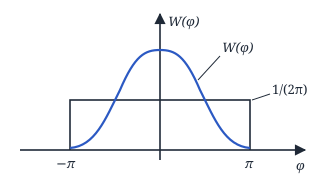
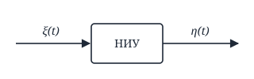
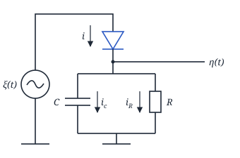
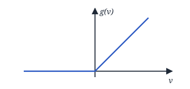
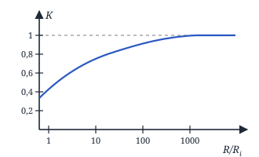

## Лекция 6. Преобразование СП в нелинейных инерционных системах

Найдём теперь распределение фазы:

$$
\begin{aligned}
&W(\varphi) = \int_0^{\infty} W(v, \varphi)\, dv = \\
&= \int_0^{\infty} \frac{v}{2\pi}\, e^{-\frac{v^2 + a_0^2}{2}}\, e^{v a_0\cos\varphi}\, dv = \\
&= \frac{1}{2\pi}\, e^{-\frac{a_0^2}{2}} \int_0^{\infty} v\cdot e^{-\frac{v^2 - 2va_0\cos\varphi}{2}}\, dv = \\
&= \frac{1}{2\pi}\, e^{-\frac{a_0^2}{2}} \int_0^{\infty} (v - a_0\cos\varphi + a_0\cos\varphi) \times \\
&\qquad \times e^{-\frac{v^2 - 2va_0\cos\varphi}{2}}\, dv = \\
&= \frac{1}{2\pi}\, e^{-\frac{a_0^2}{2}} \Bigg[ \\
&\underbrace{\int_0^{\infty} (v - a_0\cos\varphi)\, e^{-\frac{(v - a_0\cos\varphi)^2}{2}}}_{\text{I}} \times \\
&\qquad \times e^{-\frac{-a_0^2\cos^2\varphi}{2}}\, dv + \\
&+ a_0\cos\varphi \underbrace{\int_0^{\infty} e^{-\frac{(v - a_0\cos\varphi)^2}{2}}}_{\text{II}} \times \\
&\qquad \times e^{\frac{a_0^2\cos^2\varphi}{2}}\, dv \Bigg] =
\end{aligned}
$$

I:

$$
\begin{aligned}
&e^{\frac{a_0^2\cos^2\varphi}{2}} \int_0^{\infty} (v - a_0\cos\varphi) \times \\
&\qquad \times e^{-\frac{(v - a_0\cos\varphi)^2}{2}}\, dv = \\
&= \{v - a_0\cos\varphi = z\} = \\
&= e^{\frac{a_0^2\cos^2\varphi}{2}} \int_{-a_0\cos\varphi}^{\infty} z\, e^{-\frac{z^2}{2}}\, dz = \\
&= -e^{\frac{a_0^2\cos^2\varphi}{2}}\, e^{-\frac{z^2}{2}}\Big|_{-a_0\cos\varphi}^{\infty} = \underline{1}
\end{aligned}
$$

II:

$$
\begin{aligned}
&a_0\cos\varphi\, e^{\frac{a_0^2\cos^2\varphi}{2}} \times \\
&\qquad \times \underbrace{\int_0^{\infty} e^{-\frac{(v - a_0\cos\varphi)^2}{2}}\, dv\cdot\frac{1}{\sqrt{2\pi}}}_{1/2} \times \\
&\qquad \times \sqrt{2\pi} = \\
&= \frac{a_0\cos\varphi\cdot\sqrt{2\pi}}{\sqrt{2}}\, e^{\frac{a_0^2\cos^2\varphi}{2}} \times \\
&\qquad \times \Phi(a_0\cos\varphi)
\end{aligned}
$$

$$
\begin{aligned}
&= \frac{1}{2\pi}\, e^{-\frac{a_0^2}{2}} \Bigg(1 + \frac{a_0\cos\varphi\cdot\sqrt{2\pi}}{\sqrt{2}} \times \\
&\qquad \times e^{\frac{a_0^2\cos^2\varphi}{2}}\, \Phi(a_0\cos\varphi)\Bigg)
\end{aligned}
$$

Пусть $a_0 = 0 \Rightarrow \boxed{W(\varphi) = \dfrac{1}{2\pi}}$

<!-- p046 -->

### Преобразование СП в НИС

$$
\dot\eta = g(\eta) + f(\xi, \eta, t)
$$

$g(\,)$, $f(\,)$ — детерминированные функции. Хотя бы одна из них (или обе) нелинейная — нелинейное дифференциальное стохастическое уравнение.

Считается, что внешние воздействия имеют малую интенсивность, если $\sigma_\eta \ll \eta_0$, $\eta_0$ — стационарное значение реакции системы.

**1.** При малой интенсивности внешних воздействий:

- 1.1. Метод линеаризации.

**2.** Большая интенсивность внешних воздействий:

- 2.1. $\tau_\text{сист} \gg \tau_\text{к}$ — Марковский СП;
- 2.2. $\tau_\text{сист} \ll \tau_\text{к}$ — квазистатический метод;
- 2.3. $\tau_\text{сист} \approx \tau_\text{к}$ — ?

#### Метод линеаризации

$$
\dot\eta = g(\eta) + f(\xi, \eta, t) \qquad (1)
$$

**1)** $L[\eta] = f(\xi) \qquad (2)$

**2)** Уравнение стационарности (в нём нет производной):

$$
L_0[\eta] = M\{f(\xi)\} \qquad (3)
$$

**3)** $\eta_0$ — стационарное значение реакции:

$$
L_0[\eta_0] = M\{f(\xi)\} \qquad (4)
$$

$\eta_0$ — решение уравнения (4).

**4)** 

$$
L[\eta] - L_0[\eta_0] = f(\xi) - M\{f(\xi)\} \quad (5)
$$

**5)** Раскладываем в ряд Тейлора в окрестности точки $\eta_0$ и отбрасываем члены в степени больше 1.

$$
\Delta\eta = \eta - \eta_0 \qquad (6)
$$

<!-- p047 -->

**6)** $\Delta\eta = F(\xi)$ — решение уравнения (6).

**7)** По известным характеристикам $\xi$ находим характеристики $\Delta\eta$ через ННП (нелинейное неинерционное преобразование).

**8)** $\eta = \Delta\eta + \eta_0$. Находим характеристики $\eta$ по характеристикам $\Delta\eta$.

**9)** $\sigma_\eta \ll \eta_0$.

#### Пример метода линеаризации

$\xi(t)$ — ГСП, центрированный.

$$
i = i_c + i_R
$$

$$
i_R = \frac{\eta}{R}, \quad i_c = \dot\eta\cdot C
$$

$$
i = g(v) = I_0\, e^{\alpha v}, \quad v = \xi - \eta
$$

$$
\boxed{I_0\, e^{\alpha(\xi - \eta)} = \dot\eta\cdot C + \frac{\eta}{R}}
$$

**1)**

$$
\dot\eta\cdot C + \frac{\eta}{R} = I_0\, e^{\alpha\xi}\cdot e^{-\alpha\eta}
$$

$$
\dot\eta + \frac{\eta}{RC} = \frac{I_0}{C}\, e^{\alpha\xi}\cdot e^{-\alpha\eta}
$$

$$
\dot\eta\cdot e^{\alpha\eta} + \frac{\eta}{RC}\, e^{\alpha\eta} = \frac{I_0}{C}\, e^{\alpha\xi},
$$

$$
z = e^{\alpha\eta}, \quad \eta = \frac{1}{\alpha}\ln z, \quad \dot\eta = \frac{1}{\alpha z}\cdot\dot z
$$

$$
\begin{aligned}
&\frac{1}{\alpha z}\cdot\dot z\cdot z + \frac{1}{RC}\cdot\frac{1}{\alpha}\ln z\cdot z = \\
&= \frac{I_0}{C}\, e^{\alpha\xi}
\end{aligned}
$$

$$
\dot z + \frac{z}{RC}\ln z = \frac{\alpha I_0}{C}\, e^{\alpha\xi}
$$

**2)**

$$
\frac{z\cdot\ln z}{RC} = \frac{\alpha I_0}{C}\, \underbrace{M\{e^{\alpha\xi}\}}_{\alpha = ju},
$$

$$
Q(t) = M\{e^{ju\xi}\}
$$

$$
M\{e^{\alpha\xi}\} = e^{-\frac{u^2\sigma^2}{2}} = e^{\frac{(ju)^2\sigma^2}{2}} = e^{\frac{\alpha^2\sigma^2}{2}}
$$

$$
\frac{z\cdot\ln z}{RC} = \frac{\alpha I_0}{C}\cdot e^{\frac{\alpha^2\sigma^2}{2}}
$$

<!-- p048 -->

**3)** $z_0$ — решение:

$$
\frac{z_0\ln z_0}{RC} = \frac{\alpha I_0}{C}\, e^{\frac{\alpha^2\sigma^2}{2}}
$$

**4)**

$$
\begin{aligned}
&\dot z + \frac{z\ln z}{RC} - \frac{z_0\ln z_0}{RC} = \\
&= \frac{\alpha I_0}{C}\left(e^{\alpha\xi} - e^{\frac{\alpha^2\sigma^2}{2}}\right)
\end{aligned}
$$

**5)**

$$
z = z_0 + \Delta z \quad (\Delta z = z - z_0)
$$

$$
\dot z = \Delta\dot z
$$

$$
\begin{aligned}
&\Delta\dot z + \underbrace{\frac{z_0\ln z_0}{RC} + \frac{\ln z_0 + 1}{RC}\,\Delta z}_{\text{разложение } \frac{z\ln z}{RC} \text{ в ряд}} - \\
&\qquad - \frac{z_0\ln z_0}{RC} = \\
&= \frac{\alpha I_0}{C}\left(e^{\alpha\xi} - e^{\frac{\alpha^2\sigma^2}{2}}\right)
\end{aligned}
$$

$$
\begin{aligned}
&\Delta\dot z + \frac{\ln z_0 + 1}{RC}\,\Delta z = \\
&= \frac{\alpha I_0}{C}\left(e^{\alpha\xi} - e^{\frac{\alpha^2\sigma^2}{2}}\right)
\end{aligned}
$$

**6)** $\Delta z = F(\xi)$

**7)** Характеристики $\Delta z$.

**8)** $z = z_0 + \Delta z$, характеристики $z$.

**9)** $\eta = \dfrac{1}{\alpha}\ln z \Rightarrow$ характеристики $\eta$.

**10)** $\sigma_\eta \ll \eta_0$ — ?, $\quad \eta_0 = \dfrac{1}{\alpha}\ln z_0$

<!-- p049 -->

#### Квазистатический метод

$\xi(t)$ — любой СП.

$\xi(t) = A(t)\cos(\omega_0 t - \varphi(t))$ — узкополосный СП.

$$
\eta(t) \approx A(t)
$$

$$
i = i_c + i_R, \quad i_c = \dot\eta\cdot C,
$$

$$
i_R = \frac{\eta}{R}, \quad i = g(\xi - \eta)
$$

$$
\dot\eta\cdot C + \frac{\eta}{R} = g(\xi - \eta)
$$

$$
\begin{aligned}
&\dot\eta + \frac{\eta(t)}{RC} = \\
&= \frac{1}{C}\, g\big(A(t)\cos(\omega_0 t - \varphi(t)) - \eta(t)\big)
\end{aligned}
$$

$\tau_\text{сист} \ll \tau_\text{к}$, т. е. $RC \gg \dfrac{2\pi}{\omega_0} = T_0$

$$
\begin{aligned}
&\int_t^{t+T_0} \dot\eta(t)\, dt + \int_t^{t+T_0} \frac{\eta(t)}{RC}\, dt = \\
&= \int_t^{t+T_0} \frac{1}{C}\, g\big(A\cos(\omega_0 t - \varphi(t)) - \\
&\qquad - \eta(t)\big)\, dt
\end{aligned}
$$

$$
\begin{aligned}
&\overbrace{\eta(t + T_0) - \eta(t)}^{\dot\eta\cdot T_0} + \frac{\eta}{RC}\, T_0 = \\
&= \frac{1}{C}\int_t^{t+T_0} g\big(A\cos(\omega_0 t - \varphi) - \eta\big)\, dt
\end{aligned}
$$

$$
\left\{\omega_0 t - \varphi = \psi,\ t = \frac{\psi + \varphi}{\omega_0},\ dt = \frac{d\psi}{\omega_0}\right\}
$$

$$
\begin{aligned}
&\dot\eta T_0 + \frac{\eta}{RC}\, T_0 = \\
&= \frac{1}{C}\cdot\frac{1}{\omega_0}\int_{-\pi}^{\pi} g(A\cos\psi - \eta)\, d\psi,
\end{aligned}
$$

$$
\omega_0 T_0 = 2\pi
$$

$$
\dot\eta + \frac{\eta}{RC} = \frac{1}{2\pi}\cdot\frac{1}{C}\int_{-\pi}^{\pi} g(A\cos\psi - \eta)\, d\psi.
$$

Пренебрегаем $\dot\eta$, т. к. $\eta(t)$ — медленно меняющееся напряжение:

$$
\frac{\eta}{RC} = \frac{1}{2\pi}\cdot\frac{1}{C}\int_{-\pi}^{\pi} g(A\cos\psi - \eta)\, d\psi
$$

<!-- p050 -->

$$
g(v) = \begin{cases} \dfrac{v}{R_i}, & v \ge 0 \\ 0, & v < 0 \end{cases}
$$

$$
\eta = \frac{R}{2\pi}\int_{-\pi}^{\pi} \frac{A\cos\psi - \eta}{R_i}\, d\psi,
$$

$$
A\cos\psi - \eta \ge 0 \Rightarrow \cos\psi \ge \underbrace{\frac{\eta}{A}}_{k}
$$

$k$ — коэффициент воспроизведения огибающей.

$-\arccos k \le \psi \le \arccos k$. Тогда:

$$
\eta = \frac{R}{2\pi}\int_{-\arccos k}^{\arccos k} \frac{A\cos\psi - \eta}{R_i}\, d\psi
$$

$$
\eta = \frac{R}{2\pi R_i}\int_{-\arccos k}^{\arccos k} (A\cos\psi - \eta)\, d\psi
$$

$$
\begin{aligned}
&\eta = \frac{R}{2\pi R_i}\Big[A\sin\psi\Big|_{-\arccos k}^{\arccos k} - \\
&\qquad - \eta\psi\Big|_{-\arccos k}^{\arccos k}\Big] = \\
&= \frac{R}{2\pi R_i}\Big[2A\sqrt{1 - k^2} - 2\eta\arccos k\Big]
\end{aligned}
$$

$$
\eta = \frac{R}{\pi R_i}\Big[A\sqrt{1 - k^2} - \eta\arccos k\Big],
$$

$$
k = \frac{\eta}{A}
$$

$$
K = \frac{R}{\pi R_i}\Big[\sqrt{1 - k^2} - k\arccos k\Big]
$$

$$
\frac{R}{R_i} = \frac{\pi\cdot k}{\sqrt{1 - k^2} - k\arccos k}
$$

Находим $K \Rightarrow$ находим $\eta = KA$.

<!-- p051 -->
