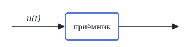
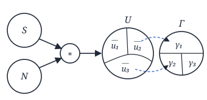

## Лекция 7. Теория оптимальных методов радиоприёма

### Теория оптимальных методов радиоприёма

Способность системы противостоять вредному воздействию помех — **помехоустойчивость**.

**Потенциальная помехоустойчивость** — максимально достижимая помехоустойчивость.

Приёмник, обладающий потенциальной помехоустойчивостью, — **оптимальный**.

Задачи ТОМП:

**1)** Задача обнаружения сигнала (РЛС — радиолокационная станция).

$$
u(t) = \theta\cdot S(t) + n(t)
$$

$\theta$ — с. в. (случайная величина), $S(t)$ — полезный сигнал, $n(t)$ — помеха.

— По принятому сигналу $u(t)$ необходимо сказать, есть ли в выборке полезный сигнал?

**2)** Задача различения сигналов (сотовая связь).

$$
u(t) = S_i(t) + n(t), \quad i = 1, 2, \ldots, m.
$$

Существует $m$ полезных сигналов.

— Какой из $m$ сигналов ансамбля содержится в принятой выборке $u(t)$ — ?

**3)** Задача измерения параметров сигнала.

$$
u(t) = S(t, \lambda) + n(t)
$$

(расстояние до цели, высота…)

— По полученной выборке $u(t)$ оценить параметры сигнала $\lambda$ (амплитуда, частота, фаза…), $\lambda = \mathrm{const}$.

**4)** Задача фильтрации сигнала.

$$
u(t) = F\big(S(t, \lambda(t)), n(t)\big)
$$

— По принятой выборке необходимо наилучшим образом выбрать $\lambda(t)$ или сам сигнал $S(t, \lambda(t))$.

<!-- p052 -->

**5)** Задача разрешения сигнала.

— Позволяет выделить в принятом сигнале отличия от нескольких целей по каким-либо параметрам.

**6)** Задача распознавания образов.

### Модели полезных сигналов и помех в задачах ТОМП

**1.** Модель детерминированного сигнала:

$$
S(t) = A_0\cos(\omega_0 t + \theta_0)
$$

**2.** Модель сигнала со случайной начальной фазой:

$$
S(t) = A_0\cos(\omega_0 t + \theta),
$$

$\theta$ — с. в., $W(\theta) = \dfrac{1}{2\pi}$, $-\pi \le \theta \le \pi$.

**3.** Модель сигнала со случайной начальной фазой и амплитудой:

$$
S(t) = A\cos(\omega_0 t + \theta),
$$

$\theta$ — с. в., $W(\theta) = \dfrac{1}{2\pi}$, $-\pi \le \theta \le \pi$.

$A$ — с. в.,

$$
W(A) = \frac{A}{\sigma_A^2}\, e^{-\frac{A^2}{2\sigma_A^2}}, \quad A \ge 0.
$$

**4.** Модель шума:

$n(t)$ — белый гауссовский шум (БГШ).

$$
R_n(\tau) = \frac{N_0}{2}\,\delta(\tau), \quad S_n(\omega) = \frac{N_0}{2},
$$

$$
m_n = 0.
$$

### Основные сведения из теории статистических решений

$$
u(t) = S(t) * n(t),
$$

$*$ — любой способ взаимодействия.

Дискретная обработка: рассматриваем сигнал в моменты $t_1, t_2, \ldots, t_n$. Тогда вводим вектор принятого сигнала:

$$
\bar u = (u_1, u_2, \ldots, u_n),
$$

а также вектор помех и вектор полезного сигнала: $\bar S(S_1, S_2, \ldots, S_n)$ и $\bar n(n_1, n_2, \ldots, n_n)$.

$\bar u = \bar S * \bar n$. Совокупность всех векторов — **пространство**.

Вводим пространства $U$, $S$, $N$.

<!-- p053 -->

$\Gamma$ — пространство решений; $\gamma_1, \gamma_2, \ldots$ — решения в соответствии с требуемой задачей приёма.

Рассмотрим условную плотность вероятности: $W(\bar u / \bar S)$. Она характеризует степень соответствия $\bar u$ вектору $\bar S$ — **функция правдоподобия**.

$\Delta(\gamma(\bar u))$ — **решающее правило**, т. е. то правило, по которому по принятой выборке мы принимаем решение.

Если одной выборке $\bar u$ в соответствие ставится одно решение $\gamma$, то правило **нерандомизированное**. Иначе, если $\bar u$ ставится в соответствие 2 и более решения, то решающее правило **рандомизированное**:

$$
u_i \to \begin{cases} p_1 - \gamma_1 \\ p_2 - \gamma_2 \\ \ \ldots \\ p_k - \gamma_k \end{cases}, \quad \sum_{i=1}^{k} p_i = 1,
$$

т. е. решение всё равно будет выбрано.

$$
\begin{aligned}
&R = \sum_{i=1}^{k}\sum_{j=1}^{k} \Pi(S_i, \gamma_j)\, W(S_i, \gamma_j) = \\
&= \sum_{i=1}^{k}\sum_{j=1}^{k} \Pi(S_i, \gamma_j)\cdot W(S_i) \times \\
&\qquad \times W(\gamma_j / S_i) \to \min
\end{aligned}
$$

$R$ — **средний риск**, $\Pi(S_i, \gamma_j)$ — функция потерь.

**Правило Байеса** — решающее правило, которое обеспечивает минимальное значение среднего риска.

**Условный риск**:

$$
r_{S_i} = \sum_{j=1}^{k} \Pi(S_i, \gamma_j)\cdot W(\gamma_j / S_i)
$$

— характеризует риски при конкретном сигнале $S_i$.

**Минимаксный критерий** — наилучшим считается то решающее правило, которое обеспечивает минимальное значение максимального $r_{S_i}$.

<!-- p054 -->

| | $S_1$ | $S_2$ | $S_3$ | $S_4$ |
|---|---|---|---|---|
| $\Delta_1$: $r_{\Delta_1}$ | 13 | 11 | **14** | 9 |
| $\Delta_2$: $r_{\Delta_2}$ | 2 | 4 | **30** | 3 |

$\Rightarrow \Delta_1$ — оптимальное решающее правило.

#### Критерий минимума полной вероятности ошибки

$$
\Pi(\bar S_i, \bar\gamma_j) = \begin{cases} C, & i \ne j \\ 0, & i = j \end{cases} \Rightarrow
$$

$$
\begin{aligned}
&\Rightarrow R = \sum_{i=1}^{k}\sum_{\substack{j=1 \\ i \ne j}}^{k} C\, W(\bar S_i, \bar\gamma_j) = \\
&= C\sum_{i=1}^{k}\sum_{\substack{j=1 \\ i \ne j}}^{k} W(\bar S_i, \bar\gamma_j) = C\cdot P_\text{ошибки},
\end{aligned}
$$

$P_\text{ошибки}$ — вероятность ошибки.

**Априорная вероятность** — до опыта.

**Апостериорная вероятность** — после опыта.

$$
\begin{aligned}
&W(\bar S / \bar u) = \frac{W(\bar S)\, W(\bar u / \bar S)}{W(\bar u)} = \\
&= \mathrm{const}\, W(\bar S)\cdot W(\bar u / \bar S)
\end{aligned}
$$

— **критерий max апостериорной плотности вероятности**.

$$
W(\bar S / \bar u) = \mathrm{const}\cdot \underbrace{W(\bar u / \bar S)}_{\substack{\text{функция} \\ \text{правдоподобия}}}
$$

— **критерий max функции правдоподобия**.

**Критерий Неймана–Пирсона** — он гарантирует, что вероятность одного типа ошибок не превзойдёт некоторой наперёд заданной величины, а вероятность другого типа ошибок будет минимальной.

**Критерий Вальда** — гарантирует, что при обеспечении заданной вероятности ошибок типа «ложная тревога» или «пропуск цели» средняя продолжительность наблюдения за целью окажется минимальной.

<!-- p055 -->
