## Лекция 8. Задача обнаружения. Оптимальный фильтр

### Задача обнаружения

$u(t)$ — принятая выборка:

- $\gamma_0$ — сигнала нет;
- $\gamma_1$ — сигнал есть.

$H_0$ — гипотеза о том, что сигнала в выборке нет.

$H_1$ — гипотеза о том, что сигнал в выборке есть.

Если распределение принятого сигнала зависит только от типа гипотезы и не зависит от параметров сигнала (и помехи), то гипотезы называются **простыми**, иначе — **сложными**.

$$
u(t) = \theta\cdot S(t) + n(t),
$$

где $\theta$ — дискретная с. в.:

$$
\theta = \begin{cases} 1, & p \\ 0, & 1 - p \end{cases}
$$

$W(\bar u / H_1)$, $W(\bar u / H_0)$ — функции правдоподобия.

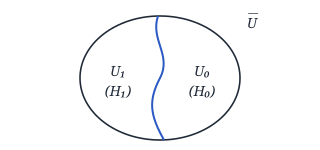

**1)** $H_0$: $\gamma_0$ — **правильное необнаружение**.

$$
p_\text{н} = \int_{U_0} W(u / H_0)\, du
$$

— вероятность правильного необнаружения.

**2)** $H_1$: $\gamma_1$ — **правильное обнаружение**.

$$
D = \int_{U_1} W(u / H_1)\, du
$$

— вероятность правильного обнаружения.

**3)** $H_0$: $\gamma_1$ — **ложная тревога**.

$$
\alpha = \int_{U_1} W(u / H_0)\, du
$$

— вероятность ложной тревоги.

**4)** $H_1$: $\gamma_0$ — **пропуск сигнала**.

$$
\beta = \int_{U_0} W(u / H_1)\, du
$$

— вероятность пропуска сигнала.

$$
\begin{cases} p_\text{н} + \alpha = 1 \\ D + \beta = 1 \end{cases}
$$

<!-- p056 -->

### Алгоритмы работы оптимального обнаружения

#### I. По критерию Байеса

$$
R = \sum_{i=0}^{1}\sum_{j=0}^{1} \Pi(S_i, \gamma_j)\, W(S_i, \gamma_j) =
$$

$$
\left|\begin{aligned}
&\Pi(S_i, \gamma_i) = 0 \\
&\Pi(S_0, \gamma_1) = \Pi_{01} \\
&\Pi(S_1, \gamma_0) = \Pi_{10}
\end{aligned}\right.
$$

$$
\begin{aligned}
&= \Pi_{01}\cdot W(S_0, \gamma_1) + \Pi_{10}\cdot W(S_1, \gamma_0) = \\
&= \Pi_{01}\cdot\underbrace{W(S_0)}_{1-p}\cdot\underbrace{W(\gamma_1 / S_0)}_{\int_{U_1} W(u/H_0)\, du} + \\
&\quad + \Pi_{10}\cdot\underbrace{W(S_1)}_{p}\cdot\underbrace{W(\gamma_0 / S_1)}_{\int_{U_0} W(u/H_1)\, du} = \\
&= \Pi_{01}\cdot(1-p)\int_{U_1} W(u/H_0)\, du + \\
&\quad + \Pi_{10}\cdot p\,\underbrace{\int_{U_0} W(u/H_1)\, du}_{1 - \int_{U_1} W(u/H_1)\, du} = \\
&= \Pi_{10}\cdot p + \int_{U_1}\big[\Pi_{01}(1-p)\, W(u/H_0) - \\
&\qquad - \Pi_{10}\cdot p\cdot W(u/H_1)\big]\, du = \\
&= \Pi_{10}\cdot p - \int_{U_1}\big[\Pi_{10}\cdot p\cdot W(u/H_1) - \\
&\qquad - \Pi_{01}\cdot(1-p)\cdot W(u/H_0)\big]\, du \to \min
\end{aligned}
$$

$$
\begin{aligned}
&\Pi_{10}\cdot p\cdot W(u/H_1) - \\
&\qquad - \Pi_{01}(1-p)\, W(u/H_0) > 0
\end{aligned}
$$

$$
\boxed{\frac{W(u/H_1)}{W(u/H_0)} \underset{H_0}{\overset{H_1}{\gtrless}} \frac{\Pi_{01}}{\Pi_{10}}\cdot\frac{(1-p)}{p} = l_0}
$$

— алгоритм работы оптимального обнаружителя по критерию Байеса.

**Вычисляем отношение правдоподобий и сравниваем его с порогом.**

Структурная схема оптимального обнаружителя:

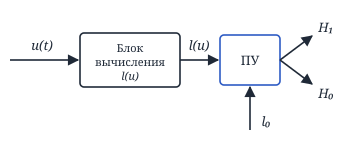

<!-- p057 -->

#### II. По критерию минимума полной вероятности ошибки

$$
\Pi_{00} = \Pi_{11} = 0
$$

$$
\Pi_{10} = \Pi_{01}
$$

$$
\boxed{l(u) = \frac{W(u/H_1)}{W(u/H_0)} \underset{H_0}{\overset{H_1}{\gtrless}} \frac{1-p}{p} = l_0}
$$

— алгоритм оптимального обнаружителя сигнала по критерию минимума полной вероятности ошибки.

Структурная схема оптимального обнаружителя **аналогична**.

#### III. По критерию максимума функции правдоподобия

$$
\Pi_{00} = \Pi_{11} = 0
$$

$$
\Pi_{10} = \Pi_{01}
$$

$$
p = 1 - p = \frac{1}{2}
$$

$$
\boxed{l(u) = \frac{W(u/H_1)}{W(u/H_0)} \underset{H_0}{\overset{H_1}{\gtrless}} 1 = l_0}
$$

— алгоритм оптимального обнаружителя сигнала по критерию максимума функции правдоподобия.

#### IV. По критерию Неймана–Пирсона

$$
\boxed{l(u) = \frac{W(u/H_1)}{W(u/H_0)} \underset{H_0}{\overset{H_1}{\gtrless}} C}
$$

$$
p\{l(u) \ge C / H_0\} \le \alpha
$$

<!-- p058 -->

#### V. По критерию Вальда

Попав в область $U_\text{неопр}$, мы накапливаем сигнал, пока не попадём в $U_1$ или в $U_0$.

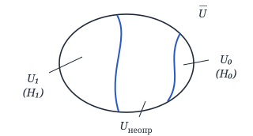

$$
\boxed{\begin{aligned}
&l(u) = \frac{W(u_1, u_2, \ldots, u_k / H_1)}{W(u_1, u_2, \ldots, u_k / H_0)} \ge A \to H_1 \\[4pt]
&l(u) = \frac{W(u_1, \ldots, u_k / H_1)}{W(u_1, \ldots, u_k / H_0)} \le B \to H_0
\end{aligned}}
$$

Если $l(u) < A$, но $> B$, то

$$
l(u) = \frac{W(u_1, \ldots, u_k, u_{k+1} / H_1)}{W(u_1, \ldots, u_k, u_{k+1} / H_0)}
$$

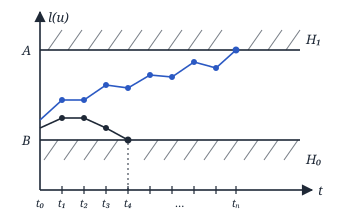

Ограничения для доказательства:

1) $H_0$, $H_1$ — простые;
2) $H_1$ и $H_0$ — близкие гипотезы: $W(u/H_1)$ и $W(u/H_0)$ не имеют больших отличий;
3) выборка отсчётов $u_1, u_2, \ldots, u_n$ — однородная и независимая:

$$
W(u_1, \ldots, u_n / H_1) = \prod_{i=1}^{k} W(u_i / H_1)
$$

<!-- p059 -->

4) плотности вероятности принимаемых сигналов в точности совпадают с плотностями вероятности ожидаемых сигналов.

$$
\frac{W(\bar u / H_1)}{W(\bar u / H_0)} \overset{H_1}{\ge} A
$$

$$
\begin{aligned}
&\underbrace{\int_{U_1} W(\bar u / H_1)\, du}_{D = 1 - \beta} \ge \underbrace{\int_{U_1} A\cdot W(\bar u / H_0)\, du}_{\alpha} \Rightarrow \\
&\Rightarrow 1 - \beta \ge A\alpha \Rightarrow \boxed{A \le \frac{1 - \beta}{\alpha}}
\end{aligned}
$$

$$
\frac{W(\bar u / H_1)}{W(\bar u / H_0)} \overset{H_0}{\le} B
$$

$$
\begin{aligned}
&\underbrace{\int_{U_0} W(\bar u / H_1)\, du}_{\beta} \le \underbrace{\int_{U_0} B\cdot W(\bar u / H_0)\, du}_{p_\text{н} = 1 - \alpha} \Rightarrow \\
&\Rightarrow \beta \le B(1 - \alpha) \Rightarrow \boxed{B \ge \frac{\beta}{1 - \alpha}}
\end{aligned}
$$

$$
\begin{aligned}
&l(u) = \frac{W(u_1, \ldots, u_k / H_1)}{W(u_1, \ldots, u_k / H_0)} = \\
&= \prod_{i=1}^{k} \frac{W(u_i / H_1)}{W(u_i / H_0)}
\end{aligned}
$$

$$
\begin{aligned}
&\ln l(u) = \sum_{i=1}^{k} \ln\underbrace{\frac{W(u_i / H_1)}{W(u_i / H_0)}}_{z_i} = \\
&= \sum_{i=1}^{k} z_i = Z_k
\end{aligned}
$$

$z_i$ — приращение решающей статистики, т. к. на основе отношения плотностей вероятности принимается решение.

$m_1$ — объём выборки для $H_1$:

$$
\ln(l(u)) \ \begin{matrix} \ge \ln A = a \\ \le \ln B = b \end{matrix}
$$

$$
m_1 = \frac{M\{Z_{m_1} / H_1\}}{M\{z_i / H_1\}} = \frac{a(1 - \beta) + b\cdot\beta}{M\{z_i / H_1\}}
$$

$$
\begin{aligned}
&M\{z_i / H_1\} = \int_{-\infty}^{\infty} \ln\frac{W(u_i / H_1)}{W(u_i / H_0)} \times \\
&\qquad \times W(u_i / H_1)\, du_i
\end{aligned}
$$

<!-- p060 -->

$m_0$ — объём выборки для $H_0$:

$$
m_0 = \frac{M\{Z_{m_0} / H_0\}}{M\{z_i / H_0\}} = \frac{b(1 - \alpha) + a\cdot\alpha}{M\{z_i / H_0\}}
$$

$$
\begin{aligned}
&M\{z_i / H_0\} = \int_{-\infty}^{\infty} \ln\frac{W(u_i / H_1)}{W(u_i / H_0)} \times \\
&\qquad \times W(u_i / H_0)\, du_i
\end{aligned}
$$

$$
\boxed{M\{z_i / H_1\} \approx -M\{z_i / H_0\}}
$$

— для малых отношений сигнал/шум.

$$
\frac{m_1}{m_0} \approx -\frac{a(1 - \beta) + b\beta}{b(1 - \alpha) + a\alpha} \approx -\frac{a}{b},
$$

$$
\alpha, \beta \approx 10^{-3} \ldots 10^{-6},
$$

$m_1 \gg m_0$, $m_1 \approx m$ (размер выборки для однопороговых схем).

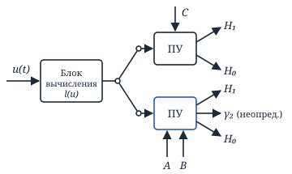

<!-- p061 -->

### Задача обнаружения детерминированного сигнала

**Все задачи мы будем решать для критерия Неймана–Пирсона.**

$$
u(t) = \theta\cdot S(t) + n(t).
$$

$$
\theta = \begin{cases} 1, & p \\ 0, & 1 - p \end{cases}
$$

$S(t)$ — детерминированный сигнал, $n(t)$ — БГШ.

$$
H_0:\ u(t) = n(t)
$$

Дискретная обработка — $t_1, t_2, \ldots, t_n$ с отсчётами $u_1, u_2, \ldots, u_n$ (некоррелированы).

$$
W(u_i / H_0) = \frac{1}{\sqrt{2\pi}\,\sigma}\, e^{-\frac{u_i^2}{2\sigma^2}}, \quad u_i = n_i.
$$

$$
\begin{aligned}
&W(u_1, \ldots, u_n / H_0) = \prod_{i=1}^{n} W(u_i / H_0) = \\
&= \prod_{i=1}^{n} \frac{1}{\sqrt{2\pi}\,\sigma}\, e^{-\frac{u_i^2}{2\sigma^2}} = \\
&= \boxed{\left(\frac{1}{\sqrt{2\pi}\,\sigma}\right)^n e^{-\sum\limits_{i=1}^{n} \frac{u_i^2}{2\sigma^2}}}
\end{aligned}
$$

$$
H_1:\ u(t) = S(t) + n(t), \quad u_i = S_i + n_i.
$$

$$
W(u_i / H_1) = \frac{1}{\sqrt{2\pi}\,\sigma}\, e^{-\frac{(u_i - S_i)^2}{2\sigma^2}}
$$

$$
\begin{aligned}
&W(u_1 \ldots u_n / H_1) = \\
&= \prod_{i=1}^{n} \frac{1}{\sqrt{2\pi}\,\sigma}\, e^{-\frac{(u_i - S_i)^2}{2\sigma^2}} = \\
&= \boxed{\left(\frac{1}{\sqrt{2\pi}\,\sigma}\right)^n e^{-\sum\limits_{i=1}^{n} \frac{(u_i - S_i)^2}{2\sigma^2}}}
\end{aligned}
$$

$$
l(u) = \frac{W(u_1, \ldots, u_n / H_1)}{W(u_1, \ldots, u_n / H_0)} \underset{H_0}{\overset{H_1}{\gtrless}} l_0
$$

$$
e^{-\left[\sum\limits_{i=1}^{n} \frac{(u_i - S_i)^2}{2\sigma^2} - \sum\limits_{i=1}^{n} \frac{u_i^2}{2\sigma^2}\right]} \gtrless l_0
$$

$$
e^{-\sum\limits_{i=1}^{n}\left[\frac{u_i^2 - 2u_iS_i + S_i^2 - u_i^2}{2\sigma^2}\right]} \gtrless l_0
$$

$$
e^{\sum\limits_{i=1}^{n} \frac{u_iS_i}{\sigma^2} - \sum\limits_{i=1}^{n} \frac{S_i^2}{2\sigma^2}} \gtrless l_0
$$

$$
\frac{\sum\limits_{i=1}^{n} u_i\cdot S_i}{\sigma^2} - \frac{\sum\limits_{i=1}^{n} S_i^2}{2\sigma^2} \gtrless \ln l_0
$$

Алгоритм оптимального обнаружителя детерминированного сигнала при дискретной обработке:

$$
\boxed{\frac{\sum\limits_{i=1}^{n} u_i\cdot S_i}{\sigma^2} \gtrless \ln l_0 + \frac{\sum\limits_{i=1}^{n} S_i^2}{2\sigma^2} = z_0}
$$

<!-- p062 -->

Теперь перейдём от дискретной обработки к непрерывной:

$$
\int_0^T f^2(t)\,dt = \Delta t \sum_{i=1}^{T/\Delta t} f_i^2
$$

— теорема Котельникова, где $\Delta t = \dfrac{1}{2F_{\max}}$ — шаг дискретизации, $F_{\max}$ — верхняя частота спектра $f(t)$.

$$
2F_{\max} \int_0^T f^2(t)\,dt = \sum_{i=1}^{T\cdot 2F_{\max}} f_i^2.
$$

$$
\begin{aligned}
&2\,\frac{F_{\max}}{\sigma^2} \int_0^T u(t)s(t)\,dt \gtrless \\
&\gtrless \ln l_0 + \frac{2F_{\max}}{2\sigma^2} \underbrace{\int_0^T s^2(t)\,dt}_{E}
\end{aligned}
$$

$$
\boxed{\frac{\sigma^2}{F_{\max}} = N_0} \Rightarrow
$$

$$
\boxed{
\begin{aligned}
&q = \frac{2}{N_0}\int_0^T u(t)s(t)\,dt \\
&\underset{H_0}{\overset{H_1}{\gtrless}} \ln l_0 + \frac{E}{N_0} = z_0
\end{aligned}
}
$$

— алгоритм оптимального обнаружителя детерминированного сигнала при непрерывной обработке.

Рассмотрим выделенный интеграл с 2 точек зрения:

**1)**

$$
q = \frac{2}{N_0}\int_0^T u(t)s(t)\,dt
$$

— **корреляционный интеграл**.

**Корреляционный приёмник** — устройство, рассчитывающее корреляционный интеграл.

Корреляционная структурная схема оптимального обнаружителя детерминированного сигнала при непрерывной обработке:

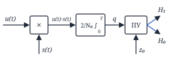

<!-- p063 -->

**2)**

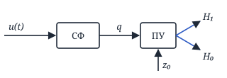

$$
h(t) = C\cdot s(T-t) \quad\text{или}\quad s(t) = h(T-t),
$$

где $h(t)$ — импульсная характеристика фильтра.

**СФ** (согласованный фильтр) — фильтр с $h(t) = C\cdot s(T-t)$.

Это фильтровая структурная схема оптимального обнаружителя детерминированного сигнала при непрерывной обработке.

#### Оценим помехоустойчивость

$$
\alpha = \int_{q>z_0} W(q|H_0)\,dq,\quad D = \int_{q>z_0} W(q|H_1)\,dq
$$

$H_0$: $u(t) = n(t)$ $\Rightarrow$

$$
q = \frac{2}{N_0}\int_0^T n(t)\cdot s(t)\,dt
$$

$W(q|H_0)$ — ГСП (гауссовский случайный процесс).

$$
\begin{aligned}
&m_{q|H_0} = M\{q|H_0\} = \\
&= M\Big\{\frac{2}{N_0}\int_0^T n(t)s(t)\,dt\Big\} = \\
&= \frac{2}{N_0}\int_0^T M\{n(t)\}\cdot s(t)\,dt = 0
\end{aligned}
$$

$$
\begin{aligned}
&\sigma^2_{q|H_0} = M\{(q-m_q)^2\} = \\
&= M\{q^2 - 2qm_q + m_q^2\} = \\
&= M\{q^2\} - 2m_q\cdot\underbrace{M\{q\}}_{m_q} + m_q^2 = \\
&= M\{q^2\} - m_q^2
\end{aligned}
$$

$$
\begin{aligned}
&\sigma^2_{q|H_0} = M\{q^2\} = \\
&= M\Big\{\frac{4}{N_0^2}\Big[\int_0^T n(t)\cdot s(t)\,dt\Big]^2\Big\} = \\
&= \frac{4}{N_0^2}\, M\Big\{\int_0^T n(t_1)s(t_1)\,dt_1 \times \\
&\qquad \times \int_0^T n(t_2)s(t_2)\,dt_2\Big\} = \\
&= \frac{4}{N_0^2}\int_0^T\!\!\int_0^T \underbrace{M\{n(t_1)n(t_2)\}}_{R_n(\tau) = \frac{N_0}{2}\delta(\tau)} \times \\
&\qquad \times s(t_1)s(t_2)\,dt_1\,dt_2 = \\
&= \frac{4}{N_0^2}\int_0^T\!\!\int_0^T \frac{N_0}{2}\,\delta(\tau) \times \\
&\qquad \times s(t_1)s(t_2)\,dt_1\,dt_2 = \\
&= \frac{2}{N_0}\underbrace{\int_0^T s(t_1)s(t_1)\,dt_1}_{E} = \frac{2E}{N_0}
\end{aligned}
$$

Здесь $\delta(\tau) = \delta(t_2 - t_1)$ — используется фильтрующее свойство δ-функции.

<!-- p064 -->

$$
W(q|H_0) = \frac{1}{\sqrt{2\pi}\sqrt{\frac{2E}{N_0}}}\, e^{-\frac{q^2}{2\cdot\frac{2E}{N_0}}}
$$

$H_1$: $u(t) = s(t) + n(t)$

$$
\begin{aligned}
&q = \frac{2}{N_0}\int_0^T (s(t)+n(t))\,s(t)\,dt = \\
&= \frac{2}{N_0}\Big(\int_0^T s^2(t)\,dt + \int_0^T n(t)s(t)\,dt\Big) = \\
&= \frac{2E}{N_0} + \underbrace{\frac{2}{N_0}\int_0^T n(t)\cdot s(t)\,dt}_{q|H_0}
\end{aligned}
$$

$W(q|H_1)$ — ГСП, $m_{q|H_1} = \dfrac{2E}{N_0}$, $\sigma^2_{q|H_1} = \dfrac{2E}{N_0}$.

$$
\begin{aligned}
&\alpha = \int_{z_0}^{\infty} \frac{1}{\sqrt{2\pi}\sqrt{\frac{2E}{N_0}}} \times \\
&\qquad \times e^{-\frac{q^2}{2\cdot\frac{2E}{N_0}}}\,dq = \\
&= \Big\{ z = \frac{q}{\sqrt{\frac{2E}{N_0}}},\ dq = \sqrt{\frac{2E}{N_0}}\,dz \Big\} = \\
&= \int_{z_0/\sqrt{2E/N_0}}^{\infty} \frac{1}{\sqrt{2\pi}}\, e^{-\frac{z^2}{2}}\,dz = \\
&= 1 - \Phi\left(\frac{z_0}{\sqrt{\frac{2E}{N_0}}}\right) = \\
&= 1 - \Phi\left(\frac{\ln l_0 + \frac{E}{N_0}}{\sqrt{\frac{2E}{N_0}}}\right)
\end{aligned}
$$

$$
\begin{aligned}
&D = \int_{z_0}^{\infty} \frac{1}{\sqrt{2\pi}\sqrt{\frac{2E}{N_0}}} \times \\
&\qquad \times e^{-\frac{\left(q-\frac{2E}{N_0}\right)^2}{2\cdot\frac{2E}{N_0}}}\,dq = \\
&= \Big\{ z = \frac{q - \frac{2E}{N_0}}{\sqrt{\frac{2E}{N_0}}},\ dq = \sqrt{\frac{2E}{N_0}}\,dz \Big\} = \\
&= \int_{\frac{z_0 - 2E/N_0}{\sqrt{2E/N_0}}}^{\infty} \frac{1}{\sqrt{2\pi}}\, e^{-\frac{z^2}{2}}\,dz = \\
&= 1 - \Phi\left(\frac{z_0 - \frac{2E}{N_0}}{\sqrt{\frac{2E}{N_0}}}\right) = \\
&= 1 - \Phi\left(\frac{\ln l_0 + \frac{E}{N_0} - \frac{2E}{N_0}}{\sqrt{\frac{2E}{N_0}}}\right) = \\
&= 1 - \Phi\left(\frac{\ln l_0 - \frac{E}{N_0}}{\sqrt{\frac{2E}{N_0}}}\right)
\end{aligned}
$$

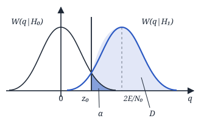

**Характеристики обнаружения:**

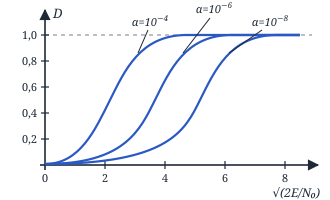

<!-- p065 -->

### Оптимальный фильтр по критерию максимума отношения сигнал/шум

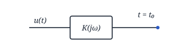

$u(t) = s(t) + n(t)$

$n(t)$ — ГСП, $S_{n\,\text{вх}}(\omega)$

$s(t)$ — $S_{\text{вх}}(j\omega)$ — спектр сигнала

$K(j\omega)$ — ? с max отношением сигнал/шум

Фильтр линейный. Тогда:

$$
s_{\text{вых}}(t) = \frac{1}{2\pi}\int_{-\infty}^{\infty} S_{\text{вых}}(j\omega)\cdot e^{j\omega t}\,d\omega
$$

$$
S_{\text{вых}}(j\omega) = S_{\text{вх}}(j\omega)\cdot K(j\omega)
$$

$$
\begin{aligned}
&s_{\text{вых}}(t) = \frac{1}{2\pi}\int_{-\infty}^{\infty} S_{\text{вх}}(j\omega)K(j\omega) \times \\
&\qquad \times e^{j\omega t}\,d\omega,\quad t = t_0 \Rightarrow
\end{aligned}
$$

$$
\begin{aligned}
&\Rightarrow s_{\text{вых}}(t_0) = \frac{1}{2\pi}\int_{-\infty}^{\infty} S_{\text{вх}}(j\omega) \times \\
&\qquad \times K(j\omega)\,e^{j\omega t_0}\,d\omega
\end{aligned}
$$

$$
\sigma^2_{n\,\text{вых}} = \frac{1}{2\pi}\int_{-\infty}^{\infty} S_{n\,\text{вых}}(\omega)\,d\omega
$$

$$
S_{n\,\text{вых}}(\omega) = S_{n\,\text{вх}}(\omega)\cdot|K(j\omega)|^2 \Rightarrow
$$

$$
\begin{aligned}
&\Rightarrow \sigma^2_{n\,\text{вых}} = \frac{1}{2\pi}\int_{-\infty}^{\infty} S_{n\,\text{вх}}(\omega) \times \\
&\qquad \times |K(j\omega)|^2\,d\omega
\end{aligned}
$$

$$
\begin{aligned}
&\rho_{\text{вых}} = \frac{(s_{\text{вых}}(t_0))^2}{\sigma^2_{n\,\text{вых}}} = \\
&= \frac{\frac{1}{2\pi}\Big[\int_{-\infty}^{\infty} S_{\text{вх}}(j\omega) K(j\omega) e^{j\omega t_0}\,d\omega\Big]^2}{\int_{-\infty}^{\infty} S_{n\,\text{вх}}(\omega)\,|K(j\omega)|^2\,d\omega} \le
\end{aligned}
$$

(Неравенство Коши — Шварца — Буняковского)

$$
\begin{aligned}
&\Big[\int A(\omega)B(\omega)\,d\omega\Big]^2 \le \\
&\le \int |A(\omega)|^2\,d\omega \cdot \int |B(\omega)|^2\,d\omega
\end{aligned}
$$

$A(\omega) = a\cdot B^*(\omega)$ — строгое равенство.

$$
A(\omega) = \sqrt{S_{n\,\text{вх}}(\omega)}\cdot K(j\omega),
$$

$$
B(\omega) = \frac{S_{\text{вх}}(j\omega)\,e^{j\omega t_0}}{\sqrt{S_{n\,\text{вх}}(\omega)}}
$$

$$
\begin{aligned}
&\le \frac{1}{2\pi}\cdot\frac{\cancel{\int_{-\infty}^{\infty} S_{n\,\text{вх}}(\omega)|K(j\omega)|^2 d\omega}}{\cancel{\int_{-\infty}^{\infty} S_{n\,\text{вх}}(\omega)|K(j\omega)|^2 d\omega}} \times \\
&\qquad \times \int_{-\infty}^{\infty} \frac{|S_{\text{вх}}(j\omega)|^2}{S_{n\,\text{вх}}(\omega)}\,d\omega
\end{aligned}
$$

<!-- p066 -->

$$
\rho_{\text{вых}} \le \frac{1}{2\pi}\int_{-\infty}^{\infty} \frac{|S_{\text{вх}}(j\omega)|^2}{S_{n\,\text{вх}}(\omega)}\,d\omega
$$

$$
\sqrt{S_{n\,\text{вх}}(\omega)}\;K(j\omega) = a\cdot\frac{S^*_{\text{вх}}(j\omega)\,e^{-j\omega t_0}}{\sqrt{S_{n\,\text{вх}}(\omega)}}
$$

$$
K(j\omega) = a\cdot\frac{S^*_{\text{вх}}(j\omega)\,e^{-j\omega t_0}}{S_{n\,\text{вх}}(\omega)}
$$

$$
\boxed{\rho_{\text{вых}\,\max} = \frac{1}{2\pi}\int_{-\infty}^{\infty} \frac{|S_{\text{вх}}(j\omega)|^2}{S_{n\,\text{вх}}(\omega)}\,d\omega}
$$

Пусть $n(t)$ — БГШ (белый гауссовский шум), $S_{n\,\text{вх}}(\omega) = N_0/2$.

$$
\begin{aligned}
&K(j\omega) = 2a\,\frac{S^*_{\text{вх}}(j\omega)\,e^{-j\omega t_0}}{N_0} = \\
&= C\cdot S^*_{\text{вх}}(j\omega)\,e^{-j\omega t_0},\quad C = \frac{2a}{N_0}
\end{aligned}
$$

$$
\rho_{\text{вых}} = \underbrace{\frac{1}{2\pi}\int_{-\infty}^{\infty} |S_{\text{вх}}(j\omega)|^2\,d\omega}_{E}\cdot\frac{2}{N_0} = \frac{2E}{N_0}
$$

**Согласованный фильтр (СФ)** — это оптимальный фильтр по критерию максимума отношения сигнал/шум в условиях действия БГШ:

$$
K(j\omega) = C\cdot S^*_{\text{вх}}(j\omega)\,e^{-j\omega t_0}
$$

Корреляционный приём:

$$
\rho_{\text{вых}} = \frac{[m_{q|H_1}]^2}{\sigma_q^2} = \frac{\left[\frac{2E}{N_0}\right]^2}{\frac{2E}{N_0}} = \frac{2E}{N_0}
$$

<!-- p067 -->

$|K(j\omega)| = C\cdot|S_{\text{вх}}(j\omega)|$ — АЧХ (амплитудно-частотная характеристика). С точностью до const $C$ совпадает с амплитудным спектром сигнала.

$\varphi(\omega) = -\varphi_c(\omega) - \omega t_0$ — ФЧХ (фазочастотная характеристика). Внутри фильтра происходит компенсация фазовых различий, чтобы обеспечить max значение сигнала на выходе.

$t_0 \ge T$ (длительность сигнала $s(t)$).

$$
\begin{aligned}
&s_{\text{вых}}(t) = \frac{1}{2\pi}\int_{-\infty}^{\infty} S_{\text{вых}}(j\omega)\,e^{j\omega t}\,d\omega = \\
&= \frac{1}{2\pi}\int_{-\infty}^{\infty} S_{\text{вх}}(j\omega)K(j\omega)\,e^{j\omega t}\,d\omega = \\
&= \frac{1}{2\pi}\cdot C\int_{-\infty}^{\infty} \underbrace{S_{\text{вх}}(j\omega)\,S^*_{\text{вх}}(j\omega)}_{|\cdot|^2} \times \\
&\qquad \times e^{-j\omega t_0}\cdot e^{j\omega t}\,d\omega = \\
&= \frac{C}{2\pi}\int_{-\infty}^{\infty} |S_{\text{вх}}(j\omega)|^2\, e^{j\omega(t-t_0)}\,d\omega.
\end{aligned}
$$

$$
\begin{aligned}
&s_{\text{вых}}(t_0) = \frac{C}{2\pi}\int_{-\infty}^{\infty} |S_{\text{вх}}(j\omega)|^2\,d\omega = \\
&= C\cdot E
\end{aligned}
$$

— $U$ на выходе СФ.

$$
\begin{aligned}
&\sigma^2_{n\,\text{вых}} = \frac{1}{2\pi}\int_{-\infty}^{\infty} S_{n\,\text{вых}}(\omega)\,d\omega = \\
&= \frac{1}{2\pi}\int_{-\infty}^{\infty} \frac{N_0}{2}\underbrace{C^2|S_{\text{вх}}(j\omega)|^2}_{|K(j\omega)|^2}\,d\omega = \\
&= \frac{C^2 N_0}{2}\,E
\end{aligned}
$$

$$
\rho_{\text{вых}} = \frac{C^2E^2\cdot 2}{C^2\cdot N_0\cdot E} = \frac{2E}{N_0}
$$

$$
\begin{aligned}
&h(t) = \frac{1}{2\pi}\int_{-\infty}^{\infty} K(j\omega)\,e^{j\omega t}\,d\omega = \\
&= \frac{1}{2\pi}\int_{-\infty}^{\infty} C\,S^*_{\text{вх}}(j\omega)\,e^{-j\omega t_0}e^{j\omega t}\,d\omega = \\
&= \frac{C}{2\pi}\int_{-\infty}^{\infty} S^*_{\text{вх}}(j\omega)\,e^{j\omega(t-t_0)}\,d\omega = \\
&= \frac{C}{2\pi}\int_{-\infty}^{\infty} S_{\text{вх}}(j\omega)\,e^{-j\omega(t-t_0)}\,d\omega = \\
&= \frac{C}{2\pi}\int_{-\infty}^{\infty} S_{\text{вх}}(j\omega)\,e^{j\omega(t_0-t)}\,d\omega = \\
&= C\cdot s(t_0 - t),
\end{aligned}
$$

где $t_0$ — длительность сигнала.

<!-- p068 -->

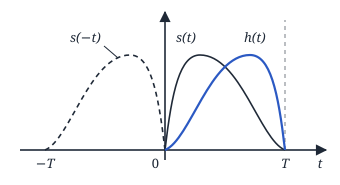

$h(t) = C\cdot s(t_0 - t)$, $t_0 = T$.

### Форма сигнала на выходе СФ

$$
\begin{aligned}
&s_{\text{вых}}(t) = \int_0^t s(\tau)\,h(t-\tau)\,d\tau = \\
&= C\int_0^t s(\tau)\cdot s(t_0 - t + \tau)\,d\tau = \\
&= C\int_{-t_0}^{t'} s(\tau)\cdot s(t'+\tau)\,d\tau
\end{aligned}
$$

— АКФ (автокорреляционная функция).

> **Вывод:** форма сигнала на выходе определяется АКФ.

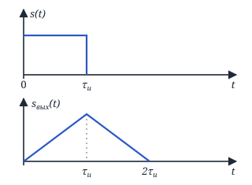

<!-- p069 -->
