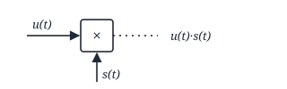
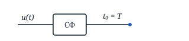
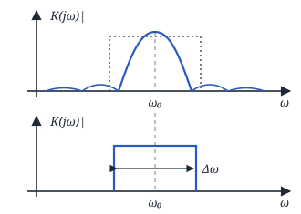
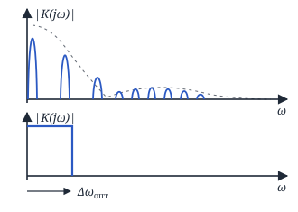
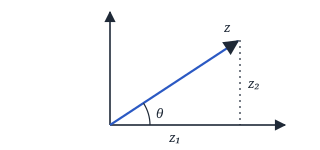
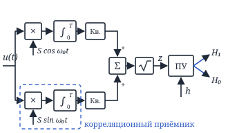
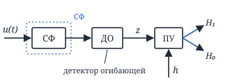
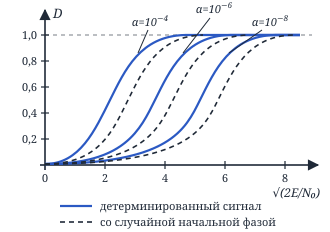
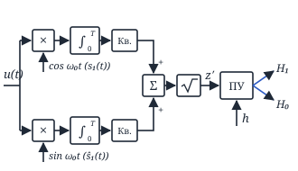
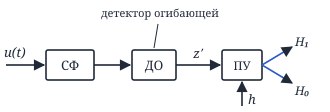

## Лекция 9. Квазиоптимальный фильтр. Обнаружение сигнала со случайными параметрами

### Сравнение корреляционного приёмника и СФ

**1)** Оба эти устройства вычисляют одну и ту же решающую статистику

$$
q = \frac{2}{N_0}\int_0^T u(t)s(t)\,dt
$$

**2)** Это оптимальные устройства по критерию максимума отношения сигнал/шум на выходе.

**3)** $\rho = \dfrac{2E}{N_0}$ — отношение сигнал/шум одинаковое для обоих устройств.

**4)** Они оптимальные только при действии БГШ.

Различие этих устройств заключается в способе синхронизации.

— **Корреляционный приёмник требует синхронизации по входу:**

Чем больше рассинхронизация, тем меньше $\rho$ на выходе.

— **Согласованный фильтр требует синхронизации по выходу:**

Для корреляционного приёмника замена полезного сигнала не принципиальна, а для СФ понадобится другой СФ.

<!-- p070 -->

### Квазиоптимальный фильтр

$|K(j\omega)| \sim$ амплитудному спектру сигнала.

Для одиночного импульса прямоугольная АЧХ подходит (на доске отмечено галочкой):

$$
\Delta f_{\text{опт}} \cong \frac{1{,}37}{\tau_{\text{и}}},\qquad \rho \approx 0{,}82\,\frac{2E}{N_0}
$$

Для пачки импульсов:

Для СФ $\rho = \dfrac{2E}{N_0} \to \infty$ (с ростом энергии пачки $E$), а для фильтра с прямоугольной АЧХ $\rho = \text{const}$ (на доске отмечено крестиком).

Проигрыш в отношении сигнал/шум $\gamma$:

$$
\gamma = \frac{2E/N_0}{\dfrac{\left[\frac{1}{2\pi}\int_{-\infty}^{\infty} S_c(j\omega)\,K(j\omega)\,e^{j\omega t_0}\,d\omega\right]^2}{\frac{1}{2\pi}\int_{-\infty}^{\infty} \frac{N_0}{2}\,|K(j\omega)|^2\,d\omega}}
$$

<!-- p071 -->

### Сложные гипотезы

$W(u|H_0),\ W(u|H_1)$ — простые гипотезы;

$W(u|H_0, \bar\lambda_0),\ W(u|H_1, \bar\lambda_1)$ — сложные гипотезы.

$\bar\lambda$ — вектор неизвестных параметров.

Чтобы записать $l(u) = \dfrac{W(u|H_1)}{W(u|H_0)}$, нужно превратить сложные гипотезы в простые. Существует 2 подхода:

**1. Байесовский:** $\bar\lambda_1$ и $\bar\lambda_0$ — случайные параметры, и мы знаем их распределения $W(\bar\lambda_1)$ и $W(\bar\lambda_0)$. Тогда

$$
l(u) = \frac{\int_{-\infty}^{\infty} W(u|H_1, \bar\lambda_1)\cdot W(\bar\lambda_1)\,d\bar\lambda_1}{\int_{-\infty}^{\infty} W(u|H_0, \bar\lambda_0)\cdot W(\bar\lambda_0)\,d\bar\lambda_0}
$$

> Мы будем использовать его.

**2. Адаптивный.** Мы не знаем $\bar\lambda_1$ и $\bar\lambda_0$, но можем их оценить: $\hat{\bar\lambda}_1$ и $\hat{\bar\lambda}_0$. Тогда:

$$
l(u) = \frac{W(u|H_1, \hat{\bar\lambda}_1)}{W(u|H_0, \hat{\bar\lambda}_0)}
$$

### Задача обнаружения сигнала со случайной начальной фазой

$$
u(t) = \theta\cdot s(t,\varphi) + n(t)
$$

$\theta$ — ДСВ (дискретная случайная величина): $\theta = 1$ с вероятностью $p$, $\theta = 0$ с вероятностью $(1-p)$.

$s(t,\varphi) = S\cos(\omega_0 t - \varphi)$, где $\varphi$ — СВ (случайная величина) с $W(\varphi) = \dfrac{1}{2\pi}$ $(-\pi \le \varphi \le \pi)$;

$n(t)$ — БГШ.

Для всех следующих задач:

1. Вывод алгоритма
2. Структурные схемы
3. Оценка помехоустойчивости

<!-- p072 -->

Если сигнал детерминированный:

$$
l(u) = e^{-\frac{E}{N_0} + \frac{2}{N_0}\int_0^T u(t)s(t)\,dt}
$$

В нашем случае:

$$
l(u,\varphi) = e^{-\frac{E}{N_0} + \frac{2}{N_0}\int_0^T u(t)\cdot S\cos(\omega_0 t - \varphi)\,dt}
$$

$$
\begin{aligned}
&l(u) = \int_{-\pi}^{\pi} l(u,\varphi)\,W(\varphi)\,d\varphi = \\
&= e^{-\frac{E}{N_0}}\int_{-\pi}^{\pi} \frac{1}{2\pi}\cdot e^{\frac{2}{N_0}\int_0^T u(t)\cdot S\cos(\omega_0 t-\varphi)\,dt}\,d\varphi
\end{aligned}
$$

$$
\begin{aligned}
&q = \frac{2}{N_0}\int_0^T u(t)\cdot S\cos(\omega_0 t - \varphi)\,dt = \\
&= \frac{2}{N_0}\Big[\cos\varphi\int_0^T u(t)\cdot S\cos(\omega_0 t)\,dt + \\
&\quad + \sin\varphi\int_0^T u(t)\cdot S\sin(\omega_0 t)\,dt\Big] = \\
&= \Big\{ z_1 = \int_0^T u(t)\cdot S\cos(\omega_0 t)\,dt, \\
&\quad z_2 = \int_0^T u(t)\cdot S\sin(\omega_0 t)\,dt \Big\} = \\
&= \frac{2}{N_0}\,[z_1\cos\varphi + z_2\sin\varphi] = \\
&= \Big| z = \sqrt{z_1^2 + z_2^2} \Big| = \\
&= \frac{2z}{N_0}\Big[\underbrace{\frac{z_1}{z}}_{\cos\theta}\cos\varphi + \underbrace{\frac{z_2}{z}}_{\sin\theta}\sin\varphi\Big] = \\
&= \frac{2z}{N_0}\,(\cos(\varphi - \theta)).
\end{aligned}
$$

$$
l(u) = e^{-\frac{E}{N_0}}\cdot\underbrace{\int_{-\pi}^{\pi} \frac{1}{2\pi}\cdot e^{\frac{2z}{N_0}\cos(\varphi-\theta)}\,d\varphi}_{I_0\left(\frac{2z}{N_0}\right)}
$$

$I_0\left(\dfrac{2z}{N_0}\right)$ — модифицированная функция Бесселя.

$$
l(u) = e^{-\frac{E}{N_0}}\cdot I_0\Big(\frac{2z}{N_0}\Big) \underset{H_0}{\overset{H_1}{\gtrless}} l_0
$$

$$
\begin{aligned}
&\ln l(u) = -\frac{E}{N_0} + \ln I_0\Big(\frac{2z}{N_0}\Big) \underset{H_0}{\overset{H_1}{\gtrless}} \ln l_0 \Rightarrow \\
&\Rightarrow \ln I_0\Big(\frac{2z}{N_0}\Big) \underset{H_0}{\overset{H_1}{\gtrless}} \ln l_0 + \frac{E}{N_0} \Rightarrow
\end{aligned}
$$

$$
\Rightarrow \boxed{z \underset{H_0}{\overset{H_1}{\gtrless}} h}
$$

— алгоритм.

$$
z = \sqrt{\begin{aligned}
&\Big[\int_0^T u(t)\cdot S\cos(\omega_0 t)\,dt\Big]^2 + \\
&+ \Big[\int_0^T u(t)\cdot S\sin(\omega_0 t)\,dt\Big]^2
\end{aligned}}
$$

$$
\ln I_0(x) \approx \begin{cases} \dfrac{x^2}{4}, & x \ll 1 \\[2mm] x, & x \gg 1 \end{cases}
$$

<!-- p073 -->

#### Корреляционная структурная схема оптимального обнаружителя сигнала со случайной начальной фазой

Кв. — квадратор.

$z$ — огибающая на выходе СФ:

Фильтровая схема: СФ и ДО (детектор огибающей).

> КП (корреляционный приёмник) и СФ — базовые структурные элементы для всех задач.

Оценим помехоустойчивость ($\alpha$ — ?, $D$ — ?):

$$
\alpha = \int_{z>h} W(z|H_0)\,dz,\quad D = \int_{z>h} W(z|H_1)\,dz.
$$

$H_0$: $u(t) = n(t)$.

$$
W(z|H_0) = \frac{z}{\sigma^2}\,e^{-\frac{z^2}{2\sigma^2}},
$$

где $\sigma^2 = \dfrac{EN_0}{2}$, $z \ge 0$. Тогда:

$$
\begin{aligned}
&\alpha = \int_h^{\infty} \frac{z}{\sigma^2}\,e^{-\frac{z^2}{2\sigma^2}}\,dz = \\
&= \int_h^{\infty} e^{-\frac{z^2}{2\sigma^2}}\,d\Big(\frac{z^2}{2\sigma^2}\Big) = e^{-\frac{h^2}{2\sigma^2}}
\end{aligned}
$$

$H_1$: $u(t) = s(t) + n(t)$

$$
W(z|H_1) = \frac{z}{\sigma^2}\,e^{-\frac{z^2+E^2}{2\sigma^2}}\,I_0\Big(\frac{zE}{\sigma^2}\Big),
$$

$\sigma^2 = \dfrac{EN_0}{2}$, $z \ge 0$.

<!-- p074 -->

$$
v = \frac{z}{\sigma} \Rightarrow W(v|H_1) = v\,e^{-\frac{v^2+a_0^2}{2}}\,I_0(va_0),
$$

$v \ge 0$.

$$
D = \int_h^{\infty} v\cdot e^{-\frac{v^2+a_0^2}{2}}\,I_0(va_0)\,dv
$$

Сплошные линии — детерминированный сигнал, пунктир — сигнал со случайной начальной фазой.

<!-- p075 -->

### Задача обнаружения сигнала со случайной начальной фазой и амплитудой

$$
u(t) = \theta\cdot s(t, a, \varphi) + n(t)
$$

$\theta = 1$ с вероятностью $p$, $\theta = 0$ с вероятностью $(1-p)$; $n(t)$ — БГШ.

$\varphi$ — СВ, $W(\varphi) = \dfrac{1}{2\pi}$, $-\pi \le \varphi \le \pi$

$a$ — СВ, $W(a) = \dfrac{a}{\sigma_a^2}\,e^{-\frac{a^2}{2\sigma_a^2}}$, $a \ge 0$

$$
l(u|a,\varphi) = e^{-\frac{a^2E_1}{N_0} + \frac{2}{N_0}\int_0^T u(t)\,a\cos(\omega_0 t-\varphi)\,dt}
$$

$E = a^2\cdot E_1$, где $E_1$ — энергия сигнала с единичной амплитудой.

$$
\begin{aligned}
&l(u|a) = \int_{-\pi}^{\pi} l(u|a,\varphi)\cdot W(\varphi)\,d\varphi = \\
&= e^{-\frac{a^2E_1}{N_0}}\cdot I_0\Big(\frac{2a\cdot z'}{N_0}\Big),
\end{aligned}
$$

$z = a\cdot z'$, $z'$ — огибающая сигнала с единичной амплитудой.

$$
\begin{aligned}
&l(u) = \int_0^{\infty} l(u|a)\cdot W(a)\,da = \\
&= \int_0^{\infty} e^{-\frac{a^2E_1}{N_0}}\cdot I_0\Big(\frac{2az'}{N_0}\Big) \times \\
&\qquad \times \frac{a}{\sigma_a^2}\cdot e^{-\frac{a^2}{2\sigma_a^2}}\,da = \\
&= \frac{1}{\sigma_a^2}\int_0^{\infty} a\cdot e^{-a^2\left(\frac{E_1}{N_0} + \frac{1}{2\sigma_a^2}\right)} \times \\
&\qquad \times I_0\Big(a\cdot\frac{2z'}{N_0}\Big)\,da = \\
&= \Big|\ \alpha = \frac{E_1}{N_0} + \frac{1}{2\sigma_a^2},\ \beta = \frac{2z'}{N_0}\ \Big|
\end{aligned}
$$

$$
\begin{aligned}
&\int_0^{\infty} a\cdot e^{-\alpha a^2}\cdot I_0(\beta\cdot a)\,da = \\
&= \Big|\ W(a) = \frac{a}{\sigma^2}\,e^{-\frac{a^2+a_0^2}{2\sigma^2}}\cdot I_0\Big(\frac{aa_0}{\sigma^2}\Big)\ \Big| = \\
&= \frac{1}{2\alpha}\int_0^{\infty} \frac{a}{\frac{1}{2\alpha}}\cdot e^{-\frac{a^2 + \frac{\beta^2}{4\alpha^2}}{2\cdot\frac{1}{2\alpha}}} \times \\
&\qquad \times I_0\left(\frac{a\cdot\frac{\beta}{2\alpha}}{\frac{1}{2\alpha}}\right)da\cdot e^{\frac{\beta^2/4\alpha^2}{1/\alpha}} = \\
&= \frac{1}{2\alpha}\,e^{\frac{\beta^2}{4\alpha}}
\end{aligned}
$$

(под интегралом — распределение Бесселя, его интеграл равен 1)

$$
\begin{aligned}
&l(u) = \frac{1}{\sigma_a^2}\cdot\frac{1}{2\left(\frac{E_1}{N_0} + \frac{1}{2\sigma_a^2}\right)} \times \\
&\qquad \times e^{\frac{4z'^2}{N_0^2\cdot 4\left(\frac{E_1}{N_0} + \frac{1}{2\sigma_a^2}\right)}} =
\end{aligned}
$$

$$
\begin{aligned}
&= \Big|\ \bar E = M\{E\} = M\{a^2E_1\} = \\
&= M\{a^2\}\cdot E_1 = 2\sigma_a^2 E_1\ \Big|
\end{aligned}
$$

$$
\begin{aligned}
&l(u) = \frac{1}{\sigma_a^2}\cdot\frac{2N_0\sigma_a^2}{2(\bar E + N_0)}\cdot e^{\frac{z'^2\cdot 2\sigma_a^2}{N_0(\bar E+N_0)}} = \\
&= \frac{N_0}{\bar E + N_0}\cdot e^{\frac{2\sigma_a^2\cdot z'^2}{N_0(\bar E+N_0)}} \underset{H_0}{\overset{H_1}{\gtrless}} l_0
\end{aligned}
$$

$$
\Rightarrow \boxed{z' \underset{H_0}{\overset{H_1}{\gtrless}} h}
$$

— алгоритм, где $z'$ — огибающая сигнала на выходе СФ с единичной амплитудой.

<!-- p076 -->

$$
z' = \sqrt{\begin{aligned}
&\Big[\int_0^T u(t)\cos(\omega_0 t)\,dt\Big]^2 + \\
&+ \Big[\int_0^T u(t)\sin(\omega_0 t)\,dt\Big]^2
\end{aligned}}
$$

**Преобразование Гильберта:**

$$
\hat s_1(t) = \frac{1}{\pi}\int_{-\infty}^{\infty} \frac{s_1(\tau)}{t-\tau}\,d\tau
$$

$$
s_1(t) = \frac{1}{\pi}\int_{-\infty}^{\infty} \frac{\hat s_1(\tau)}{\tau-t}\,d\tau
$$

#### Корреляционная структурная схема оптимального обнаружителя сигналов со случайной начальной фазой и амплитудой

#### Фильтровая структурная схема оптимального обнаружителя сигналов со случайной начальной фазой и амплитудой

$h(t) = s_1(t_0 - t)$

$$
\begin{aligned}
&\alpha = \int_{z'>h} W(z'|H_0)\,dz' = \Big\{ v = \frac{z'}{\sigma} \Big\} = \\
&= \int_{v>h} W(v|H_0)\,dv
\end{aligned}
$$

($v = z'/\sigma$ — нормировка)

$W(z'|H_0) = \dfrac{z'}{\sigma^2}\,e^{-\frac{z'^2}{2\sigma^2}}$ — распределение Рэлея, $W(v|H_0) = v\cdot e^{-\frac{v^2}{2}}$, $z', v \ge 0$.

$$
\alpha = \int_{h_{\text{н}}}^{\infty} v\cdot e^{-\frac{v^2}{2}}\,dv = e^{-\frac{h_{\text{н}}^2}{2}}
$$

<!-- p077 -->
