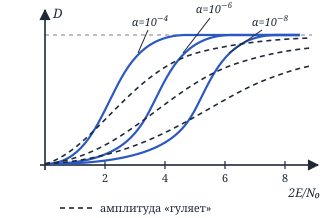
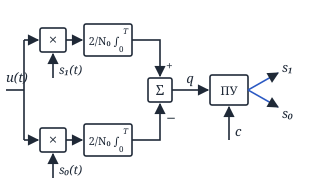
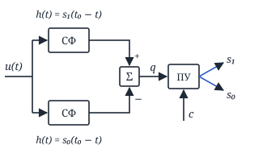
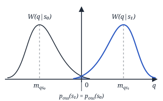
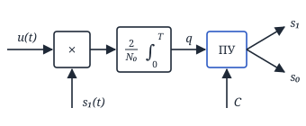
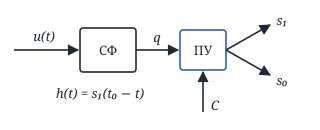
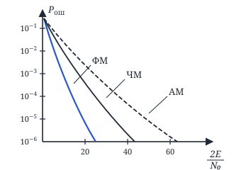

## Лекция 10. Различение двух детерминированных сигналов

$$
D = \int_{v>h_{\text{н}}} W(v|H_1)\,dv.
$$

$$
W(v|H_1, a) = v\cdot e^{-\frac{v^2 + 2\frac{a^2E_1}{N_0}}{2}}\cdot I_0\Big(v\sqrt{\frac{2a^2E_1}{N_0}}\Big)
$$

(здесь $a^2E_1 = E$)

$$
\begin{aligned}
&W(v|H_1) = \int_0^{\infty} W(v|H_1, a)\cdot W(a)\,da = \\
&= \int_0^{\infty} v\,e^{-\frac{v^2 + 2a^2E_1/N_0}{2}}\cdot I_0\Big(va\sqrt{\frac{2E_1}{N_0}}\Big) \times \\
&\qquad \times \frac{a}{\sigma_a^2}\cdot e^{-\frac{a^2}{2\sigma_a^2}}\,da = \\
&= \frac{v}{\sigma_a^2}\,e^{-\frac{v^2}{2}}\int_0^{\infty} a\cdot e^{-a^2\left(\frac{E_1}{N_0} + \frac{1}{2\sigma_a^2}\right)} \times \\
&\qquad \times I_0\Big(va\sqrt{\frac{2E_1}{N_0}}\Big)\,da = \\
&= \frac{v}{\sigma_a^2}\,e^{-\frac{v^2}{2}}\int_0^{\infty} a\cdot e^{-a^2\left(\frac{\bar E + N_0}{2\sigma_a^2 N_0}\right)} \times \\
&\qquad \times I_0\Big(va\sqrt{\frac{2E_1}{N_0}}\Big)\,da = \\
&= \Big\{ \alpha = \frac{\bar E + N_0}{2\sigma_a^2 N_0},\ \beta = v\sqrt{\frac{2E_1}{N_0}} \Big\} = \\
&= \frac{v}{\sigma_a^2}\,e^{-\frac{v^2}{2}}\cdot\frac{1}{2\alpha}\cdot e^{\frac{\beta^2}{4\alpha}} = \\
&\qquad \text{(из прошлой лекции)} \\
&= \frac{v}{\sigma_a^2}\,e^{-\frac{v^2}{2}}\cdot\frac{1}{2}\cdot\frac{N_0\cdot 2\sigma_a^2}{\bar E + N_0} \times \\
&\qquad \times e^{\frac{v^2\cdot 2E_1\cdot 2\sigma_a^2\cdot N_0}{N_0\cdot 4(\bar E + N_0)}} = \\
&= \frac{v}{\left(\frac{\bar E}{N_0} + 1\right)}\,e^{-\frac{v^2}{2}\left(1 - \frac{\bar E}{\bar E + N_0}\right)} = \\
&= \frac{v}{\frac{\bar E}{N_0} + 1}\,e^{-\frac{v^2}{2}\cdot\frac{N_0}{\bar E + N_0}} = \\
&= \frac{v}{\left(\frac{\bar E}{N_0} + 1\right)}\cdot e^{-\frac{v^2}{2\left(\frac{\bar E}{N_0} + 1\right)}}
\end{aligned}
$$

$$
\begin{aligned}
&D = \int_{h_{\text{н}}}^{\infty} \frac{v}{\left(\frac{\bar E}{N_0} + 1\right)}\,e^{-\frac{v^2}{2\left(\frac{\bar E}{N_0} + 1\right)}}\,dv = \\
&= e^{-\frac{h_{\text{н}}^2}{2\left(\frac{\bar E}{N_0} + 1\right)}} = \alpha^{\frac{1}{\left(\frac{\bar E}{N_0} + 1\right)}}
\end{aligned}
$$

Пунктир — амплитуда «гуляет».

<!-- p078 -->

### Задача различения двух детерминированных сигналов

По принятому сигналу $u(t)$ необходимо определить, какой сигнал на входе.

#### Критерий max апостериорной плотности вероятности

$$
u(t) = \theta\cdot s_1(t) + (1-\theta)\,s_0(t) + n(t)
$$

$\theta = 1$ с вероятностью $p_1$, $\theta = 0$ с вероятностью $p_0 = 1 - p_1$; $n(t)$ — БГШ.

$$
l(u) = \frac{W(u|s_1)}{W(u|s_0)} \underset{s_0}{\overset{s_1}{\gtrless}} \frac{p_0}{p_1}.
$$

$$
l(u) = \frac{W(u|s_1)}{W(u|s_0)} \underset{s_0}{\overset{s_1}{\gtrless}} 1,
$$

если $p_1 = p_0$ — критерий идеального наблюдателя:

$$
W(u|s_1) \underset{s_0}{\overset{s_1}{\gtrless}} W(u|s_0)
$$

$$
l(u) = \frac{e^{-\frac{E_1}{N_0} + \int_0^T \frac{2}{N_0}u(t)s_1(t)\,dt}}{e^{-\frac{E_0}{N_0} + \int_0^T \frac{2}{N_0}u(t)s_0(t)\,dt}} \gtrless \frac{p_0}{p_1}
$$

$$
\begin{aligned}
&-\frac{E_1 - E_0}{N_0} + \\
&+ \frac{2}{N_0}\int_0^T u(t)[s_1(t) - s_0(t)]\,dt \gtrless \ln\frac{p_0}{p_1}
\end{aligned}
$$

$$
\boxed{
\begin{aligned}
&q = \frac{2}{N_0}\int_0^T u(t)[s_1(t) - s_0(t)]\,dt \\
&\gtrless \ln\frac{p_0}{p_1} + \frac{E_1 - E_0}{N_0}
\end{aligned}
}
$$

— алгоритм работы оптимального различителя 2 детерминированных сигналов по критерию max апостериорной вероятности.

Алгоритм для симметричного канала ($p_0 = p_1 = \frac{1}{2}$, $E_1 = E_0 = E$):

$$
q = \frac{2}{N_0}\int_0^T u(t)[s_1(t) - s_0(t)]\,dt \underset{s_0}{\overset{s_1}{\gtrless}} 0
$$

<!-- p079 -->

#### Структурные схемы

Корреляционная структурная схема оптимального различителя 2 детерминированных сигналов.

Фильтровая структурная схема оптимального различителя 2 детерминированных сигналов.

$s_1$: $p_{\text{ош}}(s_1)$

$s_0$: $p_{\text{ош}}(s_0)$

$$
p_{\text{ош}} = p_1\cdot p_{\text{ош}}(s_1) + p_0\cdot p_{\text{ош}}(s_0)
$$

$$
\begin{aligned}
&p_0 = p_1 = \frac{1}{2} \Rightarrow \\
&\Rightarrow p_{\text{ош}} = \frac{1}{2}\big(p_{\text{ош}}(s_1) + p_{\text{ош}}(s_0)\big)
\end{aligned}
$$

$$
p_{\text{ош}}(s_1) = \int_{q<c} W(q|s_1)\,dq
$$

— пропуск,

$$
p_{\text{ош}}(s_0) = \int_{q>c} W(q|s_0)\,dq
$$

— ложная тревога.

$s_1$: $u(t) = s_1(t) + n(t)$

$$
\begin{aligned}
&q_{s_1} = \frac{2}{N_0}\int_0^T [s_1(t) + n(t)] \times \\
&\qquad \times [s_1(t) - s_0(t)]\,dt = \\
&= \frac{2}{N_0}\int_0^T s_1(t)[s_1(t) - s_0(t)]\,dt + \\
&+ \frac{2}{N_0}\int_0^T n(t)[s_1(t) - s_0(t)]\,dt
\end{aligned}
$$

$\Rightarrow q_{s_1}$ — ГСП.

<!-- p080 -->

$$
\begin{aligned}
&m_{q_{s_1}} = M\{q_{s_1}\} = \\
&= M\Big\{\frac{2}{N_0}\int_0^T [s_1^2(t) - s_1(t)s_0(t)]\,dt + \\
&+ \frac{2}{N_0}\int_0^T \overbrace{n(t)}^{M\{n(t)\}=0}[s_1(t) - s_0(t)]\,dt\Big\} = \\
&= \frac{2}{N_0}\underbrace{\int_0^T s_1^2(t)\,dt}_{E_1 = E_0 = E} - \\
&- \frac{2}{N_0}\int_0^T s_1(t)s_0(t)\,dt + 0 = \\
&= \frac{2E}{N_0}\Big(1 - \frac{1}{E}\int_0^T s_1(t)s_0(t)\,dt\Big)
\end{aligned}
$$

$$
r_s = \frac{1}{E}\int_0^T s_1(t)s_0(t)\,dt
$$

— коэффициент взаимной корреляции.

$$
m_{q_{s_1}} = \frac{2E}{N_0}(1 - r_s)
$$

$$
\begin{aligned}
&\sigma^2_{q_{s_1}} = M\{[q_{s_1} - m_{q_{s_1}}]^2\} = \\
&= M\{q_{s_1}^2\} - m_{q_{s_1}}^2
\end{aligned}
$$

$$
\begin{aligned}
&M\{q_{s_1}^2\} = M\Big\{\frac{4}{N_0^2}\Big[E(1-r_s) + \\
&\quad + \int_0^T n(t)[s_1(t) - s_0(t)]\,dt\Big]^2\Big\} = \\
&= \frac{4E^2(1-r_s)^2}{N_0^2} + 2\cdot\frac{4E}{N_0^2}(1-r_s) \times \\
&\qquad \times \int_0^T \underbrace{M\{n(t)\}}_{0}[s_1(t) - s_0(t)]\,dt + \\
&+ \frac{4}{N_0^2}\int_0^T\!\!\int_0^T M\{n(t_1)n(t_2)\} \times \\
&\qquad \times [s_1(t_1) - s_0(t_1)] \times \\
&\qquad \times [s_1(t_2) - s_0(t_2)]\,dt_1\,dt_2 = \\
&= \frac{4E^2}{N_0^2}(1-r_s)^2 + \\
&+ \frac{4}{N_0^2}\int_0^T\!\!\int_0^T \frac{N_0}{2}\,\delta(t_2 - t_1) \times \\
&\qquad \times [s_1(t_1) - s_0(t_1)] \times \\
&\qquad \times [s_1(t_2) - s_0(t_2)]\,dt_1\,dt_2 =
\end{aligned}
$$

<!-- p081 -->

$$
\begin{aligned}
&= \frac{4E^2}{N_0^2}(1-r_s)^2 + \\
&+ \frac{2}{N_0}\int_0^T [s_1(t_1) - s_0(t_1)]^2\,dt_1 =
\end{aligned}
$$

(по фильтрующему свойству δ-функции)

$$
\begin{aligned}
&= \frac{4E^2}{N_0^2}(1-r_s)^2 + \frac{2}{N_0}\Big[\underbrace{\int_0^T s_1^2(t_1)\,dt_1}_{E} + \\
&+ \underbrace{\int_0^T s_0^2(t_1)\,dt_1}_{E} - \frac{2E}{E}\underbrace{\int_0^T s_1(t)s_0(t)\,dt}_{E\cdot r_s}\Big] = \\
&= \frac{4E^2}{N_0^2}(1-r_s)^2 + \frac{2\cdot 2E}{N_0}(1-r_s)
\end{aligned}
$$

$$
\begin{aligned}
&\sigma^2_{q_{s_1}} = \frac{4E^2}{N_0^2}(1-r_s)^2 + \frac{4E}{N_0}(1-r_s) - \\
&- \frac{4E^2}{N_0^2}(1-r_s)^2 = \frac{4E}{N_0}(1-r_s)
\end{aligned}
$$

$$
\begin{aligned}
&W(q|s_1) = \frac{1}{\sqrt{2\pi}\sqrt{\frac{4E}{N_0}(1-r_s)}} \times \\
&\qquad \times e^{-\frac{\left[q - \frac{2E}{N_0}(1-r_s)\right]^2}{2\cdot\frac{4E}{N_0}(1-r_s)}}
\end{aligned}
$$

$s_0(t)$: $u(t) = s_0(t) + n(t)$

$$
\begin{aligned}
&q_{s_0} = \frac{2}{N_0}\int_0^T [s_0(t) + n(t)] \times \\
&\qquad \times [s_1(t) - s_0(t)]\,dt
\end{aligned}
$$

$\Rightarrow q_{s_0}$ — ГСП.

$$
\begin{aligned}
&m_{q_{s_0}} = M\{q_{s_0}\} = \\
&= \frac{2}{N_0}\int_0^T s_0(t)[s_1(t) - s_0(t)]\,dt + \\
&+ \frac{2}{N_0}\int_0^T \underbrace{M\{n(t)\}}_{0}[s_1(t) - s_0(t)]\,dt = \\
&= \frac{2}{N_0}(E\cdot r_s - E) = -\frac{2E}{N_0}(1 - r_s)
\end{aligned}
$$

$$
\sigma^2_{q_{s_0}} = \frac{4E}{N_0}(1 - r_s)
$$

$$
\begin{aligned}
&W(q|s_0) = \frac{1}{\sqrt{2\pi}\sqrt{\frac{4E}{N_0}(1-r_s)}} \times \\
&\qquad \times e^{-\frac{\left[q + \frac{2E}{N_0}(1-r_s)\right]^2}{2\cdot\frac{4E}{N_0}(1-r_s)}}
\end{aligned}
$$

$$
\begin{aligned}
&p_{\text{ош}}(s_1) = \int_{-\infty}^0 W(q|s_1)\,dq = \\
&= \int_{-\infty}^0 \frac{1}{\sqrt{2\pi}\sqrt{\frac{4E}{N_0}(1-r_s)}} \times \\
&\qquad \times e^{-\frac{\left[q - \frac{2E}{N_0}(1-r_s)\right]^2}{2\cdot\frac{4E}{N_0}(1-r_s)}}\,dq = \\
&= \Big\{ z = \frac{q - \frac{2E}{N_0}(1-r_s)}{\sqrt{\frac{4E}{N_0}(1-r_s)}} \Big\} = \\
&= \int_{-\infty}^{-\frac{\frac{2E}{N_0}(1-r_s)}{\sqrt{\frac{4E}{N_0}(1-r_s)}}} \frac{1}{\sqrt{2\pi}}\,e^{-\frac{z^2}{2}}\,dz = \\
&= 1 - \Phi\left(\sqrt{\frac{4E^2(1-r_s)^2\cdot N_0}{N_0^2\cdot 4E(1-r_s)}}\right) = \\
&= 1 - \Phi\left(\sqrt{\frac{E}{N_0}(1 - r_s)}\right)
\end{aligned}
$$

$p_{\text{ош}}(s_0) = p_{\text{ош}}(s_1)$ $\Rightarrow$

$$
\begin{aligned}
&p_{\text{ош}} = \frac{p_{\text{ош}}(s_1) + p_{\text{ош}}(s_0)}{2} = \\
&= 1 - \Phi\left(\sqrt{\frac{E}{N_0}(1 - r_s)}\right)
\end{aligned}
$$

$$
\begin{aligned}
&\frac{4E}{N_0}\cdot\frac{\sqrt{N_0}}{\sqrt{8E}} = \\
&= \frac{\sqrt{4E}\cdot\cancel{\sqrt{4E}}\cdot\cancel{\sqrt{N_0}}}{\cancel{\sqrt{N_0}}\cdot\sqrt{N_0}\cdot\sqrt{2}\cdot\cancel{\sqrt{4E}}} = \\
&= \frac{\sqrt{4E}}{\sqrt{2N_0}} = \sqrt{\frac{2E}{N_0}}
\end{aligned}
$$

<!-- p082 -->

Рассмотрим типы сигналов:

**1)** $r_s = -1$ — противоположные сигналы.

$$
p_{\text{ош}} = 1 - \Phi\left(\sqrt{\frac{2E}{N_0}}\right)
$$

Такие сигналы получаются в результате фазовой манипуляции (резкое изменение параметра).

$$
\begin{aligned}
&\text{ФМ: } s_1(t) = S_0\cos(\omega_0 t), \\
&s_0(t) = S_0\cos(\omega_0 t + \pi)
\end{aligned}
$$

**2)** $r_s = 0$ — ортогональные сигналы.

$$
p_{\text{ош}} = 1 - \Phi\left(\sqrt{\frac{E}{N_0}}\right)
$$

Их получают при помощи фазовой манипуляции $0,\ \frac{\pi}{2}$:

$$
\begin{aligned}
&\text{ФМ: } s_1(t) = S_0\cos(\omega_0 t), \\
&s_0(t) = S_0\cos\left(\omega_0 t + \frac{\pi}{2}\right)
\end{aligned}
$$

Либо при помощи частотной манипуляции:

$$
\begin{aligned}
&\text{ЧМ: } s_1(t) = S_0\cos(\omega_1 t - \varphi_1), \\
&s_0(t) = S_0\cos(\omega_0 t - \varphi_0).
\end{aligned}
$$

$\varphi_1 = \varphi_0 = \varphi \Rightarrow$

$$
\begin{aligned}
&r_s = \frac{\sin\big((\omega_1 - \omega_0)T\big)}{(\omega_1 - \omega_0)T} + \\
&+ \frac{\sin\big((\omega_1 + \omega_0)T - 2\varphi\big) + \sin 2\varphi}{(\omega_1 + \omega_0)T}
\end{aligned}
$$

$r_s = 0$, если $(\omega_1 - \omega_0)T = 2\pi k$.

При $(\omega_1 - \omega_0)T \gg 1$ $r_s \approx 0$ (на практике).

Если $(\omega_1 - \omega_0)T = 1{,}5\pi \Rightarrow r_s \min$ для ЧМ:

$$
r_s = -\frac{1}{1{,}5\pi}
$$

$$
p_{\text{ош}} \cong 1 - \Phi\left(\sqrt{\frac{1{,}21E}{N_0}}\right)
$$

**3)** $r_s = 1$ — подобные сигналы.

$$
p_{\text{ош}} = 1 - 0{,}5 = 0{,}5
$$

— не подходит нам.

АМ сигналы:

$$
\begin{cases}
s_1(t) = S_0\cos(\omega_0 t + \varphi) \\
s_0(t) = 0
\end{cases}
$$

$$
\begin{aligned}
&q = \frac{2}{N_0}\int_0^T u(t)\, s_1(t)\, dt \gtrless \\
&\gtrless \ln\frac{p_0}{p_1} + \frac{E}{N_0} = C
\end{aligned}
$$

<!-- p083 -->

$s_1$:

$$
q = \frac{2}{N_0}\int_0^T \big(s_1(t) + n(t)\big)\, s_1(t)\, dt
$$

$$
m_{q s_1} = \frac{2E}{N_0},
$$

$$
\begin{aligned}
&\sigma^2_{q s_1} = M\{q^2_{s_1}\} - \frac{4E^2}{N_0^2} = \\
&= \frac{4}{N_0^2} M\left\{\left[E + \int_0^T n(t)\, s_1(t)\, dt\right]^2\right\} - \\
&\qquad - \frac{4E^2}{N_0^2} = \frac{4E^2}{N_0^2} + 0 + \\
&+ \frac{4}{N_0^2}\iint_0^T M\{n(t_1)\, n(t_2)\} \times \\
&\qquad \times s_1(t_1)\, s_1(t_2)\, dt_1\, dt_2 - \frac{4E^2}{N_0^2} = \\
&= \frac{4}{N_0^2}\iint_0^T \frac{N_0}{2}\,\delta(t_2 - t_1) \times \\
&\qquad \times s_1(t_1)\, s_1(t_2)\, dt_1\, dt_2 = \\
&= \frac{2}{N_0}\int_0^T s_1^2(t_1)\, dt_1 = \frac{2E}{N_0}
\end{aligned}
$$

$s_0$:

$$
q = \frac{2}{N_0}\int_0^T n(t)\, s_1(t)\, dt,
$$

$$
m_{q s_0} = 0, \quad \sigma^2_{q s_0} = \frac{2E}{N_0}
$$

$$
p_0 = p_1 = \frac{1}{2} \Rightarrow C = \frac{E}{N_0} \Rightarrow
$$

$$
\Rightarrow p_{\text{ош}} = \frac{1}{2}\big(p_{\text{ош}}(s_1) + p_{\text{ош}}(s_0)\big) \circledcirc
$$

$$
\begin{aligned}
&p_{\text{ош}}(s_1) = \int_{-\infty}^{E/N_0} \frac{1}{\sqrt{2\pi}\sqrt{\frac{2E}{N_0}}} \times \\
&\qquad \times e^{-\frac{\left(q - \frac{2E}{N_0}\right)^2}{2\cdot\frac{2E}{N_0}}}\, dq = \\
&= \int_{-\infty}^{\frac{E/N_0 - 2E/N_0}{\sqrt{2E/N_0}}} \frac{1}{\sqrt{2\pi}}\, e^{-\frac{z^2}{2}}\, dz = \\
&= 1 - \Phi\left(\frac{E/N_0}{\sqrt{2E/N_0}}\right) = \\
&= 1 - \Phi\left(\sqrt{\frac{E}{2N_0}}\right)
\end{aligned}
$$

$$
\begin{aligned}
&p_{\text{ош}}(s_0) = \int_{E/N_0}^{\infty} \frac{1}{\sqrt{2\pi}\cdot\sqrt{\frac{2E}{N_0}}} \times \\
&\qquad \times e^{-\frac{q^2}{2\cdot\frac{2E}{N_0}}}\, dq = \\
&= \frac{1}{\sqrt{2\pi}}\int_{\frac{E/N_0}{\sqrt{2E/N_0}}}^{\infty} e^{-\frac{z^2}{2}}\, dz = \\
&= 1 - \Phi\left(\frac{E\sqrt{N_0}}{N_0\sqrt{2E}}\right) = \\
&= 1 - \Phi\left(\sqrt{\frac{E}{2N_0}}\right)
\end{aligned}
$$

$$
\circledcirc\ 1 - \Phi\left(\sqrt{\frac{E}{2N_0}}\right)
$$

#### Структурная схема оптимального различителя АМ сигнала

#### Фильтровая схема оптимального различителя АМ сигнала

Здесь ПУ — пороговое устройство, СФ — согласованный фильтр с импульсной характеристикой $h(t) = s_1(t_0 - t)$.

<!-- p084 -->

Из-за явления обратной работы — переключения фазы опорного колебания на $\pi$ — возникает ошибка. В результате в схему будет подаваться сигнал $s_1$, а не $s_0$. Поэтому хоть ФМ сигналы и обладают лучшей помехоустойчивостью, на практике часто используют другие методы.

<!-- p085 -->
