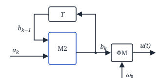
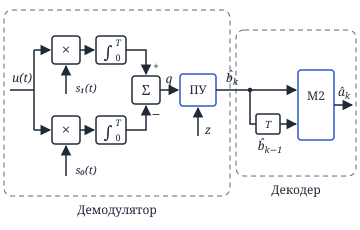
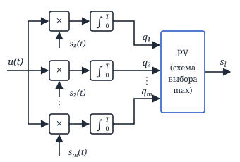
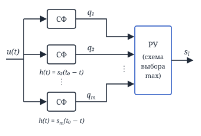
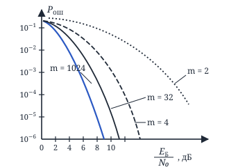
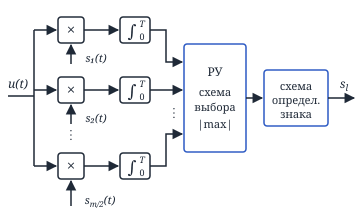

## Лекция 11. Относительная фазовая манипуляция. Различение m сигналов

### Относительная фазовая манипуляция (ОФМ)

ФМ:

| символ | фаза |
|:---:|:---:|
| «0» | $\varphi = 0$ |
| «1» | $\varphi = \pi$ |

ОФМ (два соседних интервала, варианты фаз):

| символ | 1-й интервал | 2-й интервал | $\Delta\varphi$ |
|:---:|:---:|:---:|:---:|
| «0» | $\varphi = 0$ | $\varphi = 0$ | $\Delta\varphi = 0$ |
|  | $\varphi = \pi$ | $\varphi = \pi$ |  |
| «1» | $\varphi = 0$ | $\varphi = \pi$ | $\Delta\varphi = \pi$ |
|  | $\varphi = \pi$ | $\varphi = 0$ |  |

Смысл в том, что если сигнал примет с ошибкой, и последующий сигнал примет с ошибкой, то фаза не меняется, и мы ошибаемся лишь в 2-х символах, а не в целой последовательности. Т. е. ошибки происходят только при начале обратной работы генератора и при выходе из этого режима.

Условие кодирования:

$$
b_k = a_k \oplus b_{k-1},
$$

где $a_k$ — то, что надо передать.

#### Структурная схема формирования ОФМ сигнала

Здесь M2 — сумматор по модулю 2 (XOR), $u(t)$ — в пространство.

#### Структурная схема приёмника ОФМ сигнала

<!-- p086 -->

#### Оценка помехоустойчивости

**1)** $\hat b_k$ — правильно: $1 - P_{\text{ош.фм}}$;
$\hat b_{k-1}$ — ошибка: $P_{\text{ош.фм}}$.

$$
P_{\text{ош}_1} = P_{\text{ош.фм}}\cdot(1 - P_{\text{ош.фм}})
$$

**2)** $\hat b_k$ — ошибка: $P_{\text{ош.фм}}$;
$\hat b_{k-1}$ — правильно: $1 - P_{\text{ош.фм}}$.

$$
P_{\text{ош}_2} = P_{\text{ош.фм}}(1 - P_{\text{ош.фм}})
$$

$$
\begin{aligned}
&P_{\text{ош.офм}} = 2P_{\text{ош.фм}}(1 - P_{\text{ош.фм}}) \approx \\
&\approx 2P_{\text{ош.фм}} = 2\left(1 - \Phi\left(\sqrt{\frac{2E}{N_0}}\right)\right)
\end{aligned}
$$

### Ансамбль $m$ детерминированных сигналов

$$
u(t) = s_i(t) + n(t), \quad i = 1, 2, \ldots, m \ (m > 2)
$$

$n(t)$ — БГШ (белый гауссов шум).

$p_i = \frac{1}{m}$ — вероятность появления сигнала в ансамбле.

Пусть на входе сигнал $s_l$:

$$
\begin{aligned}
&\frac{2}{N_0}\int_0^T u(t)\cdot s_l(t)\, dt - \frac{E_l}{N_0} \overset{s_l}{>} \\
&\overset{s_l}{>} \frac{2}{N_0}\int_0^T u(t)\, s_i(t)\, dt - \frac{E_i}{N_0}, \\
&i = 1, \ldots, m \ (i \ne l)
\end{aligned}
$$

При $E_1 = E_2 = \ldots = E_m = E$:

$$
\begin{aligned}
&\int_0^T u(t)\, s_l(t)\, dt \overset{s_l}{>} \int_0^T u(t)\, s_i(t)\, dt, \\
&i = 1, \ldots, m \ (i \ne l)
\end{aligned}
$$

#### Корреляционная структурная схема оптимального различителя $m$ детерминированных сигналов

Здесь РУ — решающее устройство (схема выбора max).

<!-- p087 -->

#### Фильтровая структурная схема оптимального различителя $m$ детерминированных сигналов

#### Оценка помехоустойчивости

$s_l$:

$$
W(q_1, q_2, \ldots, q_m / s_l)
$$

$$
\begin{aligned}
&P_{\text{пр}}(s_l) = \int_{-\infty}^{\infty} dq_l\, \underbrace{\int_{-\infty}^{q_l}\!\!\ldots\!\int_{-\infty}^{q_l}}_{m-1} \times \\
&\qquad \times W(q_1, q_2, \ldots, q_m / s_l) \times \\
&\qquad \times dq_1 \ldots dq_{l-1}\, dq_{l+1} \ldots dq_m
\end{aligned}
$$

$$
P_{\text{ош}}(s_l) = 1 - P_{\text{пр}}(s_l)
$$

**1. Ортогональные сигналы**

$$
u(t) = s_l(t) + n(t)
$$

$$
\begin{aligned}
&q_l = \int_0^T \big(s_l(t) + n(t)\big)\, s_l(t)\, dt = \\
&= E + \int_0^T n(t)\, s_l(t)\, dt
\end{aligned}
$$

$$
\begin{aligned}
&m_{q_l} = E, \\
&\sigma^2_{q_l} = M\{(q_l - m_{q_l})^2\} = \\
&= M\left\{\iint_0^T n(t_1)\, n(t_2)\, s_l(t_1)\, s_l(t_2)\, dt_1\, dt_2\right\} = \\
&= \iint_0^T \frac{N_0}{2}\,\delta(t_2 - t_1) \times \\
&\qquad \times s_l(t_1)\cdot s_l(t_2)\, dt_1\, dt_2 = \frac{E N_0}{2}
\end{aligned}
$$

<!-- p088 -->

$$
\begin{aligned}
&q_i = \int_0^T \big(s_l(t) + n(t)\big)\, s_i(t)\, dt = \\
&= \underbrace{\int_0^T s_l(t)\cdot s_i(t)\, dt}_{0\ \text{(орт. с.)}} + \int_0^T n(t)\, s_i(t)\, dt
\end{aligned}
$$

$$
m_{q_i} = 0, \quad \sigma^2_{q_i} = \frac{E N_0}{2}
$$

$$
\begin{aligned}
&M\{q_i\cdot q_j\} = \\
&= M\left\{\int_0^T n(t)\, s_i(t)\, dt\cdot\int_0^T n(t)\, s_j(t)\, dt\right\} = \\
&= \iint_0^T \underbrace{M\{n(t_1)\, n(t_2)\}}_{\frac{N_0}{2}\delta(t_2 - t_1)} \times \\
&\qquad \times s_i(t_1)\cdot s_j(t_2)\, dt_1\, dt_2 = \\
&= \frac{N_0}{2}\int_0^T s_i(t_1)\, s_j(t_1)\, dt_1 = 0
\end{aligned}
$$

$$
\begin{aligned}
&W(q_1 \ldots q_m / s_l) = \\
&= W(q_1)\cdot W(q_2)\cdot\ldots\cdot W(q_m) \circledcirc
\end{aligned}
$$

$$
W(q_l) = \frac{1}{\sqrt{2\pi}\sqrt{\frac{N_0 E}{2}}}\, e^{-\frac{(q_l - E)^2}{2\frac{N_0 E}{2}}}
$$

$$
W(q_i) = \frac{1}{\sqrt{2\pi}\sqrt{\frac{N_0 E}{2}}}\, e^{-\frac{q_i^2}{2\cdot\frac{N_0 E}{2}}}
$$

$$
\begin{aligned}
&\circledcirc\ \frac{1}{\sqrt{2\pi}\sqrt{\frac{N_0 E}{2}}}\cdot e^{-\frac{(q_l - E)^2}{2\frac{N_0 E}{2}}} \times \\
&\qquad \times \left[\frac{1}{\sqrt{2\pi}\sqrt{\frac{N_0 E}{2}}}\right]^{m-1} \times \\
&\qquad \times e^{-\frac{q_1^2}{2\cdot\frac{N_0 E}{2}}}\cdot\ldots\cdot e^{-\frac{q_m^2}{2\cdot\frac{N_0 E}{2}}}
\end{aligned}
$$

$$
\begin{aligned}
&P_{\text{пр}}(s_l) = \int_{-\infty}^{\infty} \frac{1}{\sqrt{2\pi}\sqrt{\frac{N_0 E}{2}}}\, e^{-\frac{(q_l - E)^2}{2\cdot\frac{N_0 E}{2}}}\, dq_l \times \\
&\times \Bigg[\underbrace{\int_{-\infty}^{q_l} \frac{1}{\sqrt{2\pi}\sqrt{\frac{E N_0}{2}}}\, e^{-\frac{q_i^2}{2\cdot\frac{N_0 E}{2}}}\, dq_i}_{\Phi\left(\frac{q_l}{\sqrt{N_0 E/2}}\right)}\Bigg]^{m-1} = \\
&= \int_{-\infty}^{\infty} \frac{1}{\sqrt{2\pi}\sqrt{\frac{E N_0}{2}}}\, e^{-\frac{(q_l - E)^2}{2\cdot\frac{N_0 E}{2}}} \times \\
&\qquad \times \Phi^{m-1}\left(\frac{q_l}{\sqrt{\frac{N_0 E}{2}}}\right) dq_l \circledcirc
\end{aligned}
$$

$$
\circledcirc\ \left|\begin{aligned}
&z = \frac{q_l - E}{\sqrt{\frac{N_0 E}{2}}}, \quad dz = \frac{dq_l}{\sqrt{\frac{N_0 E}{2}}} \\
&q_l = z\sqrt{\frac{N_0 E}{2}} + E \\
&\frac{q_l}{\sqrt{\frac{N_0 E}{2}}} = z + \sqrt{\frac{E^2\cdot 2}{N_0 E}} = \\
&= z + \sqrt{\frac{2E}{N_0}}
\end{aligned}\right| \circledcirc
$$

$$
\begin{aligned}
&\circledcirc\ \frac{1}{\sqrt{2\pi}}\int_{-\infty}^{\infty} e^{-\frac{z^2}{2}} \times \\
&\qquad \times \Phi^{m-1}\left(z + \sqrt{\frac{2E}{N_0}}\right) dz
\end{aligned}
$$

$$
\begin{aligned}
&P_{\text{ош}} = 1 - P_{\text{пр}} = \\
&= 1 - \frac{1}{\sqrt{2\pi}}\int_{-\infty}^{\infty} e^{-\frac{z^2}{2}} \times \\
&\qquad \times \Phi^{m-1}\left(z + \sqrt{\frac{2E}{N_0}}\right) dz
\end{aligned}
$$

<!-- p089 -->

$$
E_{\text{Б}} = \frac{E}{\log_2 m}
$$

График из ДЗ (домашнего задания):

### Симплексный сигнал

$$
d_{ij} = \sqrt{\int_0^T [s_i(t) - s_j(t)]^2\, dt}
$$

**Симплексный сигнал** — это сигнал, у которого расстояние между сигналами одинаково для всех сигналов ансамбля.

$P_{\text{ош}}$ — ?

$s_i(t)$ — симплексные сигналы, $i = 1 \ldots m$, длительность каждого сигнала $= T$.

$s_i'(t)$ — новый ансамбль, где длительность сигналов $= T(1 + |r_0|)$, где $r_0 \ge -\frac{1}{m-1}$.

$$
s_i'(t) = \begin{cases}
s_i(t), & 0 \le t \le T \\
\sqrt{\frac{E}{T}}, & T < t \le T(1 + |r_0|)
\end{cases}
$$

$$
\begin{aligned}
&\int_0^{T(1+|r_0|)} s_i'(t)\cdot s_j'(t)\, dt = \\
&= \underbrace{\int_0^T s_i(t)\, s_j(t)\, dt}_{E\cdot r_0} + \int_T^{T(1+|r_0|)} \frac{E}{T}\, dt = \\
&= E\cdot r_0 + \frac{E}{T}\cdot T|r_0| = \\
&= E(r_0 + |r_0|) = 0, \quad i \ne j
\end{aligned}
$$

$$
\begin{aligned}
&E' = \int_0^{T(1+|r_0|)} s_i'^2(t)\, dt = \\
&= \int_0^T s_i^2(t)\, dt + \int_T^{T(1+|r_0|)} \frac{E}{T}\, dt = \\
&= E + \frac{E}{T}\, T|r_0| = E(1 + |r_0|)
\end{aligned}
$$

<!-- p090 -->

Вероятность ошибки ансамбля симплексных сигналов будет соответствовать $P_{\text{ош}}$ детерминированных сигналов с $E' = E(1 + |r_0|)$:

$$
\begin{aligned}
&P_{\text{ош}} = 1 - \frac{1}{\sqrt{2\pi}}\int_{-\infty}^{\infty} e^{-\frac{z^2}{2}} \times \\
&\qquad \times \Phi^{(m-1)}\left(z + \sqrt{\frac{2E}{N_0}(1 + |r_0|)}\right) dz = \\
&= \left| r_0 = -\frac{1}{m-1} \right| = \\
&= 1 - \frac{1}{\sqrt{2\pi}}\int_{-\infty}^{\infty} e^{-\frac{z^2}{2}} \times \\
&\qquad \times \Phi^{(m-1)}\left(z + \sqrt{\frac{2E}{N_0}\cdot\frac{m}{m-1}}\right) dz
\end{aligned}
$$

> У симплексных сигналов помехоустойчивость выше, чем у ортогональных, но с ростом $m$ помехоустойчивость уменьшается, и при больших $m$ она сопоставима с ортогональными.

### Биортогональные сигналы

Ансамбль из $m$ сигналов: $\frac{m}{2}$ — ортогональные, остальные $\frac{m}{2}$ — сигналы, противоположные этим ортогональным.

<!-- p091 -->

Условие правильного приёма:

1) $q_l > 0$
2) $|q_l| > |q_i|$, $i = 1 \ldots m$ $(i \ne l)$

$$
\begin{aligned}
&P_{\text{пр}}(s_l) = \int_0^{\infty} dq_l\, \underbrace{\int_{-q_l}^{q_l}\!\!\ldots\!\int_{-q_l}^{q_l}}_{m/2-1} W(q_1, \ldots, q_{\frac{m}{2}} / s_l) \times \\
&\qquad \times dq_1\, dq_2 \ldots dq_{l-1}\, dq_{l+1} \ldots dq_{\frac{m}{2}}
\end{aligned}
$$

$$
\begin{aligned}
&P_{\text{пр}}(s_l) = \int_0^{\infty} \frac{1}{\sqrt{2\pi}\sqrt{\frac{E N_0}{2}}}\, e^{-\frac{(q_l - E)^2}{2\cdot\frac{E N_0}{2}}}\, dq_l \times \\
&\times \Bigg[\underbrace{\int_{-q_l}^{q_l} \frac{1}{\sqrt{2\pi}\sqrt{\frac{E N_0}{2}}}\, e^{-\frac{q_i^2}{2\cdot\frac{E N_0}{2}}}\, dq_i}_{I}\Bigg]^{\frac{m}{2}-1} \circledcirc
\end{aligned}
$$

$$
\begin{aligned}
&I = \int_{-q_l/\sqrt{\frac{E N_0}{2}}}^{q_l/\sqrt{\frac{E N_0}{2}}} \frac{1}{\sqrt{2\pi}}\, e^{-\frac{z^2}{2}}\, dz = \\
&= 2\Phi\left(\frac{q_l}{\sqrt{\frac{E N_0}{2}}}\right) - 1
\end{aligned}
$$

$$
\begin{aligned}
&\circledcirc\ \int_0^{\infty} \frac{1}{\sqrt{2\pi}\sqrt{\frac{E N_0}{2}}}\, e^{-\frac{(q_l - E)^2}{2\cdot\frac{E N_0}{2}}} \times \\
&\qquad \times \left[2\cdot\Phi\left(\frac{q_l}{\sqrt{\frac{E N_0}{2}}}\right) - 1\right]^{\frac{m}{2}-1} dq_l =
\end{aligned}
$$

$$
= \left|\begin{aligned}
&z = \frac{q_l - E}{\sqrt{\frac{E N_0}{2}}}, \quad dz = \frac{dq_l}{\sqrt{\frac{E N_0}{2}}} \\
&\frac{q_l}{\sqrt{\frac{E N_0}{2}}} = z + \frac{E}{\sqrt{\frac{E N_0}{2}}} = z + \sqrt{\frac{2E}{N_0}}
\end{aligned}\right| =
$$

$$
\begin{aligned}
&= \frac{1}{\sqrt{2\pi}}\int_{-\sqrt{2E/N_0}}^{\infty} e^{-\frac{z^2}{2}} \times \\
&\qquad \times \left[2\Phi\left(z + \sqrt{\frac{2E}{N_0}}\right) - 1\right]^{\frac{m}{2}-1} dz
\end{aligned}
$$

$$
\begin{aligned}
&P_{\text{ош}} = 1 - \frac{1}{\sqrt{2\pi}}\int_{-\sqrt{2E/N_0}}^{\infty} e^{-\frac{z^2}{2}} \times \\
&\qquad \times \left[2\Phi\left(z + \sqrt{\frac{2E}{N_0}}\right) - 1\right]^{\frac{m}{2}-1} dz
\end{aligned}
$$

> Помехоустойчивость биортогональных сигналов выше, чем ортогональных, но только при малых $m$.

1) $P_{\text{ош}}(s_l) \le \sum\limits_{j=1}^{m} P_{\text{ош}}(s_j / s_l)$
2) $P_{\text{ош}} \le (m - 1)\cdot\max\big(P_{\text{ош}}(s_j / s_l)\big)$

<!-- p092 -->

### Различение 2-х сигналов со случайной начальной фазой

$$
\begin{aligned}
&u(t) = \theta\cdot s_1(t, \varphi_1) + \\
&+ (1 - \theta)\, s_0(t, \varphi_0) + n(t),
\end{aligned}
$$

где $\theta = 1$ с вероятностью $p_1$, $\theta = 0$ с вероятностью $p_0$.

$\varphi_1, \varphi_0$ — случайные начальные фазы.

$$
W(\varphi_{1,0}) = \frac{1}{2\pi}, \quad -\pi \le \varphi_{1,0} \le \pi
$$

$$
l(u / \varphi_1, \varphi_0) = \frac{e^{-\frac{E_1}{N_0} + \frac{2}{N_0}\int_0^T u(t)\, s_1(t, \varphi_1)\, dt}}{e^{-\frac{E_0}{N_0} + \frac{2}{N_0}\int_0^T u(t)\, s_0(t, \varphi_0)\, dt}}
$$

$$
\begin{aligned}
&l(u) = \frac{\int_{-\pi}^{\pi} e^{-\frac{E_1}{N_0} + \frac{2}{N_0}\int_0^T u(t)\, s_1(t, \varphi_1)\, dt}\cdot\frac{1}{2\pi}\, d\varphi_1}{\int_{-\pi}^{\pi} e^{-\frac{E_0}{N_0} + \frac{2}{N_0}\int_0^T u(t)\, s_0(t, \varphi_0)\, dt}\cdot\frac{1}{2\pi}\, d\varphi_0} = \\
&= \frac{e^{-\frac{E_1}{N_0}}\, I_0\left(\frac{2z_1}{N_0}\right)}{e^{-\frac{E_0}{N_0}}\, I_0\left(\frac{2z_0}{N_0}\right)}
\end{aligned}
$$

$$
\frac{e^{-\frac{E_1}{N_0}}\, I_0\left(\frac{2z_1}{N_0}\right)}{e^{-\frac{E_0}{N_0}}\, I_0\left(\frac{2z_0}{N_0}\right)} \gtrless \frac{p_0}{p_1}
$$

$$
\ln l(u) = \ln\frac{e^{-\frac{E_1}{N_0}}\, I_0\left(\frac{2z_1}{N_0}\right)}{e^{-\frac{E_0}{N_0}}\, I_0\left(\frac{2z_0}{N_0}\right)} \gtrless \ln\frac{p_0}{p_1}
$$

$$
\begin{aligned}
&-\frac{E_1 - E_0}{N_0} + \ln I_0\left(\frac{2z_1}{N_0}\right) - \\
&- \ln I_0\left(\frac{2z_0}{N_0}\right) \gtrless \ln\frac{p_0}{p_1}
\end{aligned}
$$

$$
\begin{aligned}
&\ln I_0\left(\frac{2z_1}{N_0}\right) - \ln I_0\left(\frac{2z_0}{N_0}\right) \gtrless \\
&\gtrless \ln\frac{p_0}{p_1} + \frac{E_1 - E_0}{N_0} = C
\end{aligned}
$$

$p_0 = p_1 = \frac{1}{2}$, $E_1 = E_0 = E$:

$$
\ln I_0\left(\frac{2z_1}{N_0}\right) \gtrless \ln I_0\left(\frac{2z_0}{N_0}\right)
$$

$$
\boxed{z_1 \underset{s_0}{\overset{s_1}{\gtrless}} z_0}
$$

<!-- p093 -->
