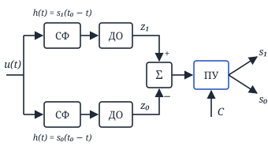
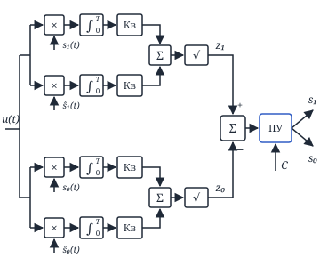
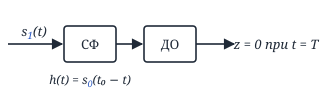
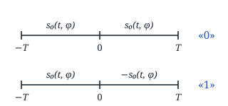
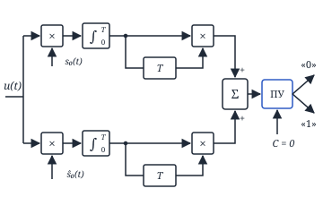
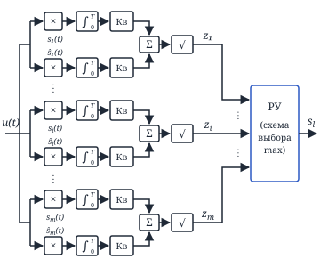
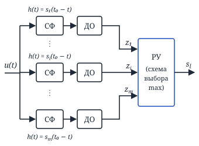
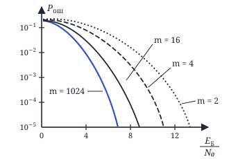

## Лекция 12. Различение сигналов со случайной начальной фазой

#### Фильтровая схема оптимального различителя сигналов со случайными начальными фазами

Здесь ДО — детектор огибающей.

#### Корреляционная структурная схема оптимального различителя сигналов со случайной начальной фазой

Здесь Кв — квадратор.

<!-- p094 -->

#### Оценка помехоустойчивости

Используем ортогональные в усиленном смысле сигналы, т. е.

$$
\int_0^T s_1(t)\, s_0(t)\, dt = 0 \ \text{ и } \int_0^T s_1(t)\, \hat s_0(t)\, dt = 0.
$$

$$
s_0(t) = S_0\cos(\omega_0 t + \varphi), \quad \omega_0 = \frac{2\pi k_0}{T}
$$

$$
s_1(t) = S_1\cos(\omega_1 t + \varphi), \quad \omega_1 = \frac{2\pi k_1}{T},
$$

$k_1, k_0 \in \mathbb{N}$.

$$
p_0 = p_1 = \frac{1}{2}, \quad E_1 = E_0 = E,
$$

$$
v_1 \underset{s_0}{\overset{s_1}{\gtrless}} v_0, \quad \text{где } v_1 = \frac{z_1}{\sigma} \text{ и } v_0 = \frac{z_0}{\sigma},
$$

$v$ — нормированная огибающая.

$s_1$: $v_0 > v_1$ — ошибка.

$$
P_{\text{ош}}(s_1) = \int_0^{\infty} dv_1 \int_{v_1}^{\infty} W_2(v_1, v_0)\, dv_0
$$

$v_1$ и $v_0$ — независимы $\Rightarrow W_2(v_1, v_0) = W(v_1)\cdot W(v_0) \Rightarrow$

$$
\Rightarrow P_{\text{ош}}(s_1) = \int_0^{\infty} W(v_1) \int_{v_1}^{\infty} W(v_0)\, dv_0\, dv_1
$$

$$
v_0:\ W(v_0) = v_0\, e^{-\frac{v_0^2}{2}}
$$

$$
v_1:\ W(v_1) = v_1\, e^{-\frac{v_1^2 + \frac{2E}{N_0}}{2}}\, I_0\left(\sqrt{\frac{2E}{N_0}}\, v_1\right)
$$

$$
\begin{aligned}
&P_{\text{ош}}(s_1) = \int_0^{\infty} v_1\cdot e^{-\frac{v_1^2 + \frac{2E}{N_0}}{2}}\, I_0\left(\sqrt{\frac{2E}{N_0}}\, v_1\right) \times \\
&\qquad \times \int_{v_1}^{\infty} v_0\, e^{-\frac{v_0^2}{2}}\, dv_0\, dv_1 = \\
&= \int_0^{\infty} v_1\cdot e^{-\frac{v_1^2 + \frac{2E}{N_0}}{2}}\, I_0\left(\sqrt{\frac{2E}{N_0}}\, v_1\right) e^{-\frac{v_1^2}{2}}\, dv_1 = \\
&= \int_0^{\infty} v_1\cdot e^{-\frac{2v_1^2 + \frac{2E}{N_0}}{2}}\, I_0\left(\sqrt{\frac{2E}{N_0}}\, v_1\right) dv_1 = \\
&= \left\{\begin{aligned}
&v' = \sqrt{2}\, v_1 \\
&\sqrt{\tfrac{2E}{N_0}}\, v_1 = \sqrt{\tfrac{E}{N_0}}\, v'
\end{aligned}\right\} = \\
&= \int_0^{\infty} \frac{v'}{\sqrt{2}}\, e^{-\frac{\left(v'^2 + \frac{E}{N_0}\right) + \frac{E}{N_0}}{2}}\, I_0\left(\sqrt{\frac{E}{N_0}}\, v'\right) \frac{dv'}{\sqrt{2}} = \\
&= \frac{1}{2}\, e^{-\frac{E}{2N_0}} \int_0^{\infty} v'\, e^{-\frac{v'^2 + \frac{E}{N_0}}{2}} \times \\
&\qquad \times I_0\left(\sqrt{\frac{E}{N_0}}\, v'\right) dv' = \frac{1}{2}\, e^{-\frac{E}{2N_0}}
\end{aligned}
$$

$$
P_{\text{ош}}(s_0) = P_{\text{ош}}(s_1) = \frac{1}{2}\, e^{-\frac{E}{2N_0}}
$$

$$
\boxed{P_{\text{ош}} = \frac{1}{2}\, e^{-\frac{E}{2N_0}}}
$$

<!-- p095 -->

Рассмотрим АМ сигналы:

$$
\begin{aligned}
&s_1(t) = S_0\cos(\omega_0 t + \varphi) \\
&s_0(t) = 0 \\
&p_0 = p_1 = \frac{1}{2}
\end{aligned}
$$

$$
z_1 \underset{s_0}{\overset{s_1}{\gtrless}} C_0', \quad v_1 \underset{s_0}{\overset{s_1}{\gtrless}} \frac{C_0'}{\sigma} = C_0
$$

$$
\begin{aligned}
&P_{\text{ош}} = \frac{1}{2}\big(P_{\text{ош}}(s_1) + P_{\text{ош}}(s_0)\big) = \\
&= \frac{1}{2}\Big(\int_0^{C_0} W(v_1 / s_1)\, dv_1 + \\
&\qquad + \int_{C_0}^{\infty} W(v_0 / s_0)\, dv_0\Big) = \\
&= \frac{1}{2}\Bigg(\int_0^{C_0} v_1\, e^{-\frac{v_1^2 + \frac{2E}{N_0}}{2}} \times \\
&\qquad \times I_0\left(\sqrt{\frac{2E}{N_0}}\, v_1\right) dv_1 + \\
&\qquad + \int_{C_0}^{\infty} v_0\, e^{-\frac{v_0^2}{2}}\, dv_0\Bigg) = \\
&= \frac{1}{2}\Bigg(\int_0^{C_0} v_1\, e^{-\frac{v_1^2 + \frac{2E}{N_0}}{2}} \times \\
&\qquad \times I_0\left(\sqrt{\frac{2E}{N_0}}\, v_1\right) dv_1 + e^{-\frac{C_0^2}{2}}\Bigg)
\end{aligned}
$$

$I_0$ — функция Бесселя:

$$
\ln I_0(x) = \begin{cases}
x, & x \gg 1 \\
\dfrac{x^2}{4}, & x \ll 1
\end{cases}
$$

Для оптимального приёма: $C_0 \to P_{\text{ош}} \to \min$: $\dfrac{dP_{\text{ош}}}{dC_0} = 0$

$$
\begin{aligned}
&C_0\cdot e^{-\frac{C_0^2 + \frac{2E}{N_0}}{2}}\cdot I_0\left(\sqrt{\frac{2E}{N_0}}\, C_0\right) - \\
&- C_0\, e^{-\frac{C_0^2}{2}} = 0 \Rightarrow
\end{aligned}
$$

$$
\Rightarrow I_0\left(\sqrt{\frac{2E}{N_0}}\, C_0\right) = e^{\frac{E}{N_0}}
$$

$$
\ln I_0\left(\sqrt{\frac{2E}{N_0}}\, C_0\right) = \frac{E}{N_0}
$$

$x \gg 1$ (для больших сигнал/шум):

$$
\sqrt{\frac{2E}{N_0}}\, C_0 \cong \frac{E}{N_0} \Rightarrow C_0 \cong \sqrt{\frac{E}{2N_0}}
$$

$$
\begin{aligned}
&P_{\text{ош}} = \frac{1}{2}\Bigg(\int_0^{\sqrt{\frac{E}{2N_0}}} v_1\cdot e^{-\frac{v_1^2 + \frac{2E}{N_0}}{2}} \times \\
&\qquad \times I_0\left(\sqrt{\frac{2E}{N_0}}\, v_1\right) dv_1 + e^{-\frac{E}{4N_0}}\Bigg)
\end{aligned}
$$

При $\frac{E}{N_0} > 10$:

$$
P_{\text{ош}} \approx \frac{1}{2}\, e^{-\frac{E}{4N_0}}
$$

<!-- p096 -->

Рассмотрим ОФМ сигналы:

$$
s_{0\text{экв}}(t) = \begin{cases}
s_0(t, \varphi), & -T \le t \le 0 \\
s_0(t, \varphi), & 0 < t \le T
\end{cases}
$$

$$
s_{1\text{экв}}(t) = \begin{cases}
s_0(t, \varphi), & -T \le t \le 0 \\
-s_0(t, \varphi), & 0 < t \le T
\end{cases}
$$

$$
\begin{aligned}
&\int_{-T}^{T} s_{0\text{экв}}(t)\, s_{1\text{экв}}(t)\, dt = \\
&= \int_{-T}^{0} s_0^2(t, \varphi)\, dt - \int_0^T s_0^2(t, \varphi)\, dt = 0
\end{aligned}
$$

$$
z_{1\text{экв}} \underset{\text{``0''}}{\overset{\text{``1''}}{\gtrless}} z_{0\text{экв}}
$$

$$
\begin{aligned}
&\Bigg(\left[\int_{-T}^{0} u(t)\, s_0(t)\, dt - \int_0^T u(t)\, s_0(t)\, dt\right]^2 + \\
&+ \left[\int_{-T}^{0} u(t)\, \hat s_0(t)\, dt - \int_0^T u(t)\, \hat s_0(t)\, dt\right]^2\Bigg)^{1/2} \\
&\underset{\text{``0''}}{\overset{\text{``1''}}{\gtrless}} \Bigg(\left[\int_{-T}^{0} u(t)\, s_0(t)\, dt + \int_0^T u(t)\, s_0(t)\, dt\right]^2 + \\
&+ \left[\int_{-T}^{0} u(t)\, \hat s_0(t)\, dt + \int_0^T u(t)\, \hat s_0(t)\, dt\right]^2\Bigg)^{1/2}
\end{aligned}
$$

$$
\begin{aligned}
&-2\int_{-T}^{0} u(t)\, s_0(t)\, dt\cdot\int_0^T u(t)\, s_0(t)\, dt - \\
&- 2\int_{-T}^{0} u(t)\, \hat s_0(t)\, dt\cdot\int_0^T u(t)\, \hat s_0(t)\, dt \gtrless \\
&\gtrless 2\int_{-T}^{0} u(t)\, s_0(t)\, dt\cdot\int_0^T u(t)\, s_0(t)\, dt + \\
&+ 2\int_{-T}^{0} u(t)\, \hat s_0(t)\, dt\cdot\int_0^T u(t)\, \hat s_0(t)\, dt
\end{aligned}
$$

$$
\begin{aligned}
&\int_{-T}^{0} u(t)\, s_0(t)\, dt\cdot\int_0^T u(t)\, s_0(t)\, dt + \\
&+ \int_{-T}^{0} u(t)\, \hat s_0(t)\, dt\cdot\int_0^T u(t)\, \hat s_0(t)\, dt \underset{\text{``1''}}{\overset{\text{``0''}}{\gtrless}} 0
\end{aligned}
$$

$$
P_{\text{ош.офм}} = \frac{1}{2}\, e^{-\frac{E_{\text{экв}}}{2N_0}} = \frac{1}{2}\, e^{-\frac{E}{N_0}} \quad (E_{\text{экв}} = 2E)
$$

<!-- p097 -->

#### Корреляционная структурная схема оптимального различителя ОФМ сигналов при некогерентной обработке

$$
P_{\text{ош.офм}} = \frac{1}{2}\, e^{-\frac{E_{\text{экв}}}{2N_0}} = \frac{1}{2}\, e^{-\frac{E}{N_0}} \quad (E_{\text{экв}} = 2E)
$$

### Задача различения $m$ сигналов со случайной начальной фазой

Принятый сигнал:

$$
u(t) = s_i(t, \varphi_i) + n(t), \quad i = 1, 2, \ldots, m
$$

$$
W(\varphi_i) = \frac{1}{2\pi}, \quad -\pi \le \varphi_i \le \pi,
$$

$n(t)$ — БГШ.

$$
p_1 = p_2 = \ldots = p_m = \frac{1}{m}
$$

$$
E_1 = E_2 = \ldots = E_m = E
$$

$$
z_l > z_i, \quad i = 1, 2, \ldots, m \ (i \ne l)
$$

$$
(v_l > v_i)
$$

<!-- p098 -->

#### Корреляционная структурная схема оптимального различителя $m$ сигналов со случайными начальными фазами

#### Фильтровая структурная схема оптимального различителя $m$ сигналов со случайными начальными фазами

<!-- p099 -->

#### Оценка помехоустойчивости

Будем рассматривать только ортогональные в усиленном смысле сигналы.

$$
\begin{aligned}
&P_{\text{пр}} = \int_0^{\infty} dv_l\, \underbrace{\int_0^{v_l}\!\!\ldots\!\int_0^{v_l}}_{m-1} W(v_1, v_2, \ldots, v_m) \times \\
&\qquad \times dv_1 \ldots dv_{l-1}\, dv_{l+1} \ldots dv_m
\end{aligned}
$$

$v_1 \ldots v_m$ — независимы $\Rightarrow$

$$
W(v_1 \ldots v_m) = \prod_{i=1}^{m} W(v_i)
$$

$$
v_l:\ W(v_l) = v_l\, e^{-\frac{v_l^2 + \frac{2E}{N_0}}{2}}\cdot I_0\left(\sqrt{\frac{2E}{N_0}}\, v_l\right)
$$

$$
v_i:\ W(v_i) = v_i\, e^{-\frac{v_i^2}{2}}, \quad i \ne l.
$$

$$
\begin{aligned}
&P_{\text{пр}} = \int_0^{\infty} v_l\, e^{-\frac{v_l^2 + \frac{2E}{N_0}}{2}}\cdot I_0\left(\sqrt{\frac{2E}{N_0}}\, v_l\right) \times \\
&\qquad \times \Bigg[\underbrace{\int_0^{v_l} v_i\, e^{-\frac{v_i^2}{2}}\, dv_i}_{1 - e^{-\frac{v_l^2}{2}}}\Bigg]^{m-1} dv_l = \\
&= \int_0^{\infty} v_l\, e^{-\frac{v_l^2 + \frac{2E}{N_0}}{2}}\cdot I_0\left(\sqrt{\frac{2E}{N_0}}\, v_l\right) \times \\
&\qquad \times \left[1 - e^{-\frac{v_l^2}{2}}\right]^{m-1} dv_l =
\end{aligned}
$$

$$
\begin{aligned}
&= \left\{\left[1 - e^{-\frac{v_l^2}{2}}\right]^{m-1} = \right. \\
&\left. = \sum_{n=0}^{m-1} (-1)^n C_{m-1}^n\, e^{-\frac{n v_l^2}{2}}\right\} =
\end{aligned}
$$

где $C_{m-1}^n$ — число сочетаний из $m-1$ по $n$;

$$
\begin{aligned}
&= \int_0^{\infty} v_l\, e^{-\frac{v_l^2 + \frac{2E}{N_0}}{2}}\cdot I_0\left(\sqrt{\frac{2E}{N_0}}\, v_l\right) \times \\
&\qquad \times \sum_{n=0}^{m-1} (-1)^n C_{m-1}^n\, e^{-\frac{n v_l^2}{2}}\, dv_l = \\
&= e^{-\frac{E}{N_0}} \sum_{n=0}^{m-1} (-1)^n C_{m-1}^n \int_0^{\infty} v_l\cdot e^{-\frac{(n+1) v_l^2}{2}} \times \\
&\qquad \times I_0\left(\sqrt{\frac{2E}{N_0}}\, v_l\right) dv_l =
\end{aligned}
$$

$$
= \left\{\begin{aligned}
&v' = \sqrt{n+1}\, v_l;\ I_0\left(\sqrt{\frac{2E}{N_0(n+1)}}\, v'\right) \\
&dv_l = \frac{dv'}{\sqrt{n+1}}
\end{aligned}\right\} =
$$

$$
\begin{aligned}
&= e^{-\frac{E}{N_0}}\cdot\sum_{n=0}^{m-1} (-1)^n C_{m-1}^n\, \frac{1}{n+1} \times \\
&\times \underbrace{\int_0^{\infty} v'\, e^{-\frac{v'^2 + \frac{2E}{N_0(n+1)}}{2}}\, I_0\left(\sqrt{\frac{2E}{N_0(n+1)}}\, v'\right) dv'}_{1} \times \\
&\qquad \times e^{\frac{E}{N_0(n+1)}} = \\
&= \sum_{n=0}^{m-1} (-1)^n C_{m-1}^n\, e^{-\frac{E}{N_0} + \frac{E}{N_0(n+1)}}\cdot\frac{1}{n+1} = \\
&= \sum_{n=0}^{m-1} (-1)^n C_{m-1}^n\cdot\frac{1}{n+1}\cdot e^{-\frac{nE}{N_0(n+1)}}
\end{aligned}
$$

$$
\begin{aligned}
&P_{\text{ош}} = 1 - P_{\text{пр}} = \\
&= 1 - \sum_{n=0}^{m-1} (-1)^n\cdot C_{m-1}^n\cdot\frac{1}{n+1}\cdot e^{-\frac{E}{N_0}\cdot\frac{n}{n+1}}
\end{aligned}
$$

$$
P_{\text{ош}} \ll 1, \quad P_{\text{ош}} < (m - 1)\, e^{-\frac{E}{N_0}}
$$

<!-- p100 -->

<!-- p101 -->
