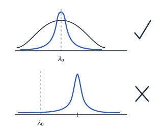
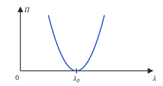
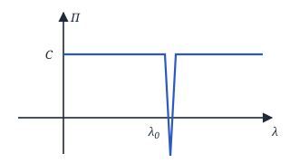
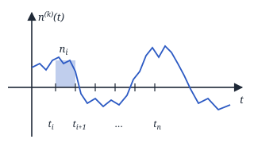

## Лекция 13. Задача измерения параметров сигнала. Критерии оценки

### Задача измерения параметров сигнала

$$
u(t) = s(t, \lambda) + n(t)
$$

$\lambda = \text{const}$, $0 \le t \le T$, $n(t)$ — БГШ.

$\hat\lambda$ — оценка.

$$
u(t) \to \hat\lambda, \quad \hat\lambda = f[u(t)]
$$

$W(\hat\lambda / \lambda_0)$, где $\lambda_0$ — истинное значение.

**1)** Смещение:

$$
m(\hat\lambda / \lambda_0) = \int_L (\hat\lambda - \lambda_0)\, W(\hat\lambda / \lambda_0)\, d\hat\lambda
$$

$L$ — пространство оценки.

**2)** Рассеяние:

$$
\sigma^2(\hat\lambda / \lambda_0) = \int_L (\hat\lambda - \lambda_0)^2\, W(\hat\lambda / \lambda_0)\, d\hat\lambda
$$

**3)** Среднее смещение:

$$
\begin{aligned}
&\langle m(\hat\lambda / \lambda_0)\rangle = M\{m(\hat\lambda / \lambda_0)\} = \\
&= \int_{L_0} m(\hat\lambda / \lambda_0)\, W(\lambda_0)\, d\lambda_0
\end{aligned}
$$

**4)** Среднее рассеяние:

$$
\begin{aligned}
&\langle \sigma^2(\hat\lambda / \lambda_0)\rangle = M\{\sigma^2(\hat\lambda / \lambda_0)\} = \\
&= \int_{L_0} \sigma^2(\hat\lambda / \lambda_0)\, W(\lambda_0)\, d\lambda_0
\end{aligned}
$$

<!-- p102 -->

В идеальном случае $\langle m(\hat\lambda/\lambda)\rangle = 0$, а $\langle \sigma^2(\hat\lambda/\lambda)\rangle \to \min$.

Оценка, у которой среднее смещение $=0$, называется **несмещённой**, а оценка, которая обеспечивает минимальное значение среднего рассеяния, называется **эффективной**.

$$
\begin{aligned}
&R = \iint\limits_{\hat L\,L} \Pi(\lambda,\hat\lambda)\, W(\lambda,\hat\lambda)\, d\lambda\, d\hat\lambda = \\
&= \iint\limits_{u\,L} \Pi(\lambda,\hat\lambda)\, W(\lambda,u)\, d\lambda\, du =
\end{aligned}
$$

— значение среднего риска для нашей задачи.

$$
\begin{aligned}
&= \iint\limits_{u\,L} \Pi(\lambda,\hat\lambda_u) \underbrace{W(u/\lambda)\,W(\lambda)}_{W(\lambda,u)}\, d\lambda\, du
\end{aligned}
$$

Рассмотрим функции потерь:

**1)** Квадратичная функция потерь: $\Pi(\lambda,\hat\lambda) = C\cdot(\lambda-\hat\lambda)^2$

**2)** Простая функция потерь: $\Pi(\lambda,\hat\lambda) = C\cdot[1-\delta(\lambda-\hat\lambda)]$

**1.1**

$$
\begin{aligned}
&R = \iint\limits_{u\,L} C(\lambda-\hat\lambda_u)^2 \times \\
&\qquad \times W(u/\lambda)\,W(\lambda)\, d\lambda\, du \to \min
\end{aligned}
$$

— критерий Байеса.

$$
\begin{aligned}
&I = \int\limits_L C(\lambda-\hat\lambda_u)^2 \times \\
&\qquad \times W(u/\lambda)\,W(\lambda)\, d\lambda \to \min
\end{aligned}
$$

<!-- p103 -->

$$
\begin{aligned}
&\frac{dI}{d\hat\lambda_u} = 0 \Rightarrow \\
&\Rightarrow 2C\int\limits_L (\lambda-\hat\lambda_u)\, W(u/\lambda)\, W(\lambda)\, d\lambda = 0 \Rightarrow \\
&\Rightarrow \int\limits_L \lambda\, W(u/\lambda)\, W(\lambda)\, d\lambda = \\
&= \int\limits_L \hat\lambda_u\, W(u/\lambda)\, W(\lambda)\, d\lambda \Rightarrow
\end{aligned}
$$

($\hat\lambda_u$ не зависит от $\lambda$ и выносится из-под интеграла.)

$$
\begin{aligned}
&\Rightarrow \hat\lambda_u = \frac{\int_L \lambda\, W(u/\lambda)\, W(\lambda)\, d\lambda}{\int_L W(u/\lambda)\, W(\lambda)\, d\lambda} = \\
&= \int\limits_L \frac{\lambda\cdot W(u/\lambda)\, W(\lambda)}{W(u)}\, d\lambda = \\
&= \int\limits_L \lambda\cdot W(\lambda/u)\, d\lambda
\end{aligned}
$$

— оценка — координата центра тяжести апостериорной плотности вероятности — **критерий минимума средней квадратической ошибки**.

**2.1**

$$
\begin{aligned}
&R = \iint\limits_{u\,L} C\cdot[1-\delta(\lambda-\hat\lambda)] \times \\
&\qquad \times W(u/\lambda)\,W(\lambda)\, d\lambda\, du = \\
&= C\cdot \underbrace{\iint\limits_{u\,L} W(u,\lambda)\, d\lambda\, du}_{1} - \\
&- C\iint\limits_{u\,L} \delta(\lambda-\hat\lambda_u) \times \\
&\qquad \times W(u/\lambda)\,W(\lambda)\, d\lambda\, du = \\
&= C - C\cdot W(u) \int\limits_u \frac{W(u/\hat\lambda_u)\, W(\hat\lambda_u)}{W(u)}\, du = \\
&= \{C' = C\cdot W(u)\} = \\
&= C - C'\int\limits_u \frac{W(u/\hat\lambda_u)\, W(\hat\lambda_u)}{W(u)}\, du \to \min
\end{aligned}
$$

— оценка — координата точки максимума апостериорной плотности вероятности — **критерий максимума апостериорной плотности вероятности**.

**3.** Если распределение оценки является равномерным, то $W(\hat\lambda_u) = \mathrm{const}$,

$$
R = C - C''\int\limits_u W(u/\hat\lambda_u)\, du \to \min
$$

$C'' = C\cdot W(\hat\lambda_u)$. Чтобы минимизировать $R$, мы берём координату точки максимума функции правдоподобия как оценку — **критерий максимума функции правдоподобия**.

<!-- p104 -->

Дальнейшая работа будет проводиться по критерию максимума функционала правдоподобия (3).

$$
u(t) = s(t,\lambda) + n(t)
$$

$$
\begin{aligned}
&u_i = s_i + n_i \\
&W(u_i, s_i) = W(n_i) = W(u_i - s_i) \\
&n_i = u_i - s_i \\
&W(u_i) = W(n_i)\left|\frac{dn_i}{du_i}\right| \\
&W_n(u_1\ldots u_n/\bar s) = W_n(n_1,\ldots,n_n)
\end{aligned}
$$

$$
\begin{aligned}
&\lim_{\substack{n\to\infty\\ \Delta t\to 0}} W_n(u_1\ldots u_n/\bar s) = k(\Delta t)\cdot F(\lambda) = \\
&= \lim_{\substack{n\to\infty\\ \Delta t\to 0}} W_n(n_1,n_2,\ldots,n_n) = \\
&= k(\Delta t)\cdot F_n(n(t)),
\end{aligned}
$$

где $F(\lambda)$ — функционал плотности вероятности, $F_n(n(t))$ — функционал БГШ (белого гауссовского шума).

$$
F(\lambda) = \mathrm{const}\cdot F_n(n(t))
$$

$$
n_i = \frac{1}{\Delta t}\int\limits_{t_i}^{t_{i+1}} n(t)\, dt
$$

— они распределены по Гауссу.

$$
m_{n_i} = M\left\{\frac{1}{\Delta t}\int\limits_{t_i}^{t_{i+1}} n(t)\,dt\right\} = 0
$$

$$
\begin{aligned}
&\sigma_{n_i}^2 = M\left\{\frac{1}{\Delta t^2}\left(\int\limits_{t_i}^{t_{i+1}} n(t)\,dt\right)^2\right\} = \\
&= \frac{1}{\Delta t^2} M\Bigl\{\iint\limits_{t_i\,t_i}^{t_{i+1}\,t_{i+1}} n(t_1)\,n(t_2)\,dt_1\,dt_2\Bigr\} = \\
&= \frac{1}{\Delta t^2}\iint\limits_{t_i\,t_i}^{t_{i+1}\,t_{i+1}} M\{n(t_1)\,n(t_2)\}\,dt_1\,dt_2 = \\
&= \frac{1}{\Delta t^2}\iint\limits_{t_i\,t_i}^{t_{i+1}\,t_{i+1}} \frac{N_0}{2}\,\delta(t_2-t_1)\,dt_1\,dt_2 = \\
&= \frac{N_0}{2\Delta t^2}\int\limits_{t_i}^{t_{i+1}} dt_1 = \frac{N_0}{2\Delta t}
\end{aligned}
$$

<!-- p105 -->

$$
W(n_i) = \frac{1}{\sqrt{2\pi}\sqrt{\frac{N_0}{2\Delta t}}}\, e^{-\frac{n_i^2}{2\cdot\frac{N_0}{2\Delta t}}}
$$

$$
\begin{aligned}
&W_n(n_1,\ldots,n_n) = \prod_{i=1}^n W(n_i) = \\
&= \left(\frac{1}{\sqrt{2\pi}\sqrt{\frac{N_0}{2\Delta t}}}\right)^n e^{-\sum\limits_{i=1}^n \frac{n_i^2}{2\cdot\frac{N_0}{2\Delta t}}}
\end{aligned}
$$

$$
\begin{aligned}
&F_n(n(t)) = \lim_{\substack{n\to\infty\\ \Delta t\to 0}} W_n(n_1,\ldots,n_n) = \\
&= \lim_{\substack{n\to\infty\\ \Delta t\to 0}} \mathrm{const}\cdot e^{-\sum\limits_{i=1}^n \frac{n_i^2}{2\cdot\frac{N_0}{2\Delta t}}}
\end{aligned}
$$

$n_i = u_i - s_i$, равенство Котельникова — переходим от дискретной обработки к непрерывной:

$$
F_n(n(t)) = \mathrm{const}\cdot e^{-\frac{1}{N_0}\int_0^T (u(t)-s(t))^2 dt} \Rightarrow
$$

$$
\Rightarrow F(\lambda) = \mathrm{const}\cdot e^{-\frac{1}{N_0}\int_0^T (u(t)-s(t))^2 dt}
$$

<!-- p106 -->
