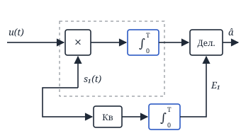
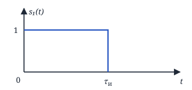
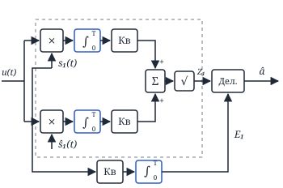
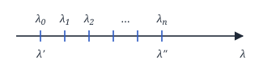
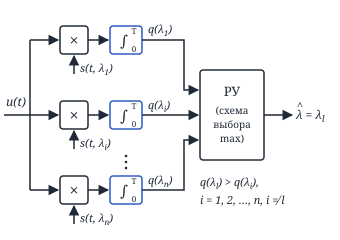
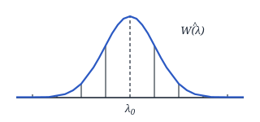
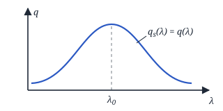
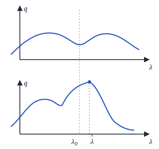

## Лекция 14. Измерение амплитуды и неэнергетического параметра сигнала

### Задача измерения энергетических параметров сигнала

#### 1) Задача измерения амплитуды детерминированного сигнала

$$
u(t) = s(t,a) + n(t) = a\cdot s_1(t) + n(t),
$$

где $s_1(t)$ — полезный сигнал с единичной амплитудой, $n(t)$ — БГШ.

$$
F(a) = \mathrm{const}\cdot e^{-\frac{1}{N_0}\int_0^T [u(t)-a\cdot s_1(t)]^2 dt}
$$

$$
\ln F(a) = \mathrm{const} - \frac{1}{N_0}\int\limits_0^T [u(t)-a\cdot s_1(t)]^2\, dt.
$$

Нужно найти такое $a$, при котором $\ln F(a)$ будет максимальным, т. е.

$$
\frac{d\ln F(a)}{da} = 0
$$

$$
\begin{aligned}
&\frac{d\ln F(a)}{da} = \\
&= 0 - \frac{1}{N_0}\cdot 2\int\limits_0^T [u(t)-a s_1(t)]\,[-s_1(t)]\,dt = \\
&= \frac{2}{N_0}\int\limits_0^T [u(t)-a\cdot s_1(t)]\,s_1(t)\,dt = \\
&= \int\limits_0^T [u(t)\,s_1(t) - a\cdot s_1^2(t)]\,dt = 0
\end{aligned}
$$

$$
a\underbrace{\int\limits_0^T s_1^2(t)\,dt}_{E_1} = \int\limits_0^T u(t)\,s_1(t)\,dt
$$

$$
\boxed{\hat a = \frac{\int_0^T u(t)\,s_1(t)\,dt}{E_1}}
$$

— алгоритм оптимального измерителя амплитуды детерминированного сигнала по критерию максимума функционала правдоподобия.

<!-- p107 -->

Оценим помехоустойчивость измерителя: $a_0$ — истинное значение, $u(t) = a_0\cdot s_1(t) + n(t)$.

$$
\begin{aligned}
&m_{\hat a} = M\{\hat a\} = \\
&= M\Bigl\{\frac{1}{E_1}\int\limits_0^T [a_0\cdot s_1(t) + n(t)]\,s_1(t)\,dt\Bigr\} = \\
&= \frac{1}{E_1}\Bigl[\int\limits_0^T a_0\cdot s_1^2(t)\,dt\, + \\
&\qquad + \int\limits_0^T \underbrace{M\{n(t)\}}_{0}\, s_1(t)\,dt\Bigr] = \\
&= \frac{1}{E_1}\cdot a_0\cdot E_1 = a_0 \Rightarrow
\end{aligned}
$$

$\Rightarrow$ оценка несмещённая.

$$
\begin{aligned}
&\sigma_{\hat a}^2 = M\{(a_0-\hat a)^2\} = \\
&= M\Bigl\{\Bigl(a_0 - a_0 - \frac{1}{E_1}\int\limits_0^T n(t)\,s_1(t)\,dt\Bigr)^2\Bigr\} = \\
&= \Bigl|\,\hat a = a_0 + \frac{1}{E_1}\int\limits_0^T n(t)\,s_1(t)\,dt\,\Bigr| = \\
&= M\Bigl\{\frac{1}{E_1^2}\Bigl[\int\limits_0^T n(t)\,s_1(t)\,dt\Bigr]^2\Bigr\} = \\
&= \frac{1}{E_1^2} M\Bigl\{\iint\limits_{0\,0}^{T\,T} n(t_1)\,n(t_2) \times \\
&\qquad \times s_1(t_1)\,s_1(t_2)\,dt_1\,dt_2\Bigr\} = \\
&= \frac{1}{E_1^2}\iint\limits_{0\,0}^{T\,T} \frac{N_0}{2}\,\delta(t_2-t_1) \times \\
&\qquad \times s_1(t_1)\,s_1(t_2)\,dt_1\,dt_2 = \\
&= \frac{N_0 E_1}{E_1^2\cdot 2} = \frac{N_0}{2E_1}
\end{aligned}
$$

Пример:

$$
\sigma_{\hat a}^2 = \frac{N_0}{2\cdot\int_0^{\tau_\text{и}} 1\cdot dt} = \frac{N_0}{2\tau_\text{и}},
$$

т. е. чем больше длительность, тем меньше $\sigma_{\hat a}^2$ и тем эффективнее определяется амплитуда.

<!-- p108 -->

#### Задача измерения амплитуды сигнала со случайной начальной фазой

$$
\begin{aligned}
&u(t) = a\cdot s_1(t,\varphi) + n(t) \\
&W(\varphi) = \frac{1}{2\pi},\quad -\pi\le\varphi\le\pi
\end{aligned}
$$

$$
\begin{aligned}
&F(a,\varphi) = \mathrm{const}\cdot e^{-\frac{1}{N_0}\int_0^T [u(t)-a\cdot s_1(t,\varphi)]^2 dt} = \\
&= \mathrm{const}\cdot \underbrace{e^{-\frac{1}{N_0}\int_0^T u^2(t)\,dt}}_{\mathrm{const}} \times \\
&\qquad \times e^{\frac{2}{N_0}\int_0^T a\cdot u(t)\cdot s_1(t,\varphi)\,dt} \times \\
&\qquad \times e^{-\frac{1}{N_0}\int_0^T a^2\cdot s_1^2(t,\varphi)\,dt} = \\
&= \mathrm{const}\cdot e^{-\frac{a^2E_1}{N_0}}\cdot e^{\frac{2}{N_0}\int_0^T a\cdot u(t)\cdot s_1(t,\varphi)\,dt}
\end{aligned}
$$

Усредним:

$$
\begin{aligned}
&F(a) = \int\limits_{-\pi}^{\pi} F(a/\varphi)\,W(\varphi)\,d\varphi = \\
&= \mathrm{const}\cdot e^{-\frac{a^2E_1}{N_0}} \times \\
&\qquad \times \underbrace{\int\limits_{-\pi}^{\pi} e^{\frac{2}{N_0}\int_0^T a\cdot u(t)\cdot s_1(t,\varphi)\,dt}\cdot\frac{1}{2\pi}\,d\varphi}_{I_0\left(\frac{2a}{N_0}\cdot Z_1\right)} = \\
&= \mathrm{const}\cdot e^{-\frac{a^2E_1}{N_0}}\cdot I_0\Bigl(\frac{2a}{N_0}\cdot Z_1\Bigr)
\end{aligned}
$$

Избавимся от exp:

$$
\ln F(a) = \mathrm{const} - \frac{a^2E_1}{N_0} + \ln I_0\Bigl(\frac{2aZ_1}{N_0}\Bigr)
$$

$$
\frac{d\ln F(a)}{da} = 0
$$

Учитывая, что $\dfrac{dI_0(x)}{dx} = I_1(x)$:

$$
\begin{aligned}
&\frac{d\ln F(a)}{da} = -\frac{2aE_1}{N_0} + \\
&\quad + \frac{I_1\bigl(\frac{2aZ_1}{N_0}\bigr)}{I_0\bigl(\frac{2aZ_1}{N_0}\bigr)}\cdot\frac{2Z_1}{N_0} = 0
\end{aligned}
$$

При большом отношении сигнал/шум $\dfrac{I_1(x)}{I_0(x)} \approx 1$, тогда:

$$
-aE_1 + Z_1 = 0 \Rightarrow \boxed{\hat a \approx \frac{Z_1}{E_1}}
$$

— алгоритм оптимального измерителя амплитуды сигнала со случайной начальной фазой.

<!-- p109 -->

Оценим помехоустойчивость:

$$
\begin{aligned}
&m_{\hat a} = a_0 \\
&\sigma_{\hat a}^2 \approx \frac{N_0}{2E_1}
\end{aligned}
$$

— без доказательства.

Случайность фазы практически не влияет на измерение амплитуды.

<!-- p110 -->

### Задача измерения неэнергетического параметра сигнала

$$
u(t) = s(t,\lambda) + n(t)
$$

$$
\begin{aligned}
&F(\lambda) = \mathrm{const}\cdot e^{-\frac{1}{N_0}\int_0^T [u(t)-s(t,\lambda)]^2 dt} = \\
&= \mathrm{const}\cdot e^{-\frac{1}{N_0}\int_0^T u^2(t)\,dt} \times \\
&\qquad \times e^{\frac{2}{N_0}\int_0^T u(t)\cdot s(t,\lambda)\,dt} \times \\
&\qquad \times e^{-\frac{1}{N_0}\int_0^T s^2(t,\lambda)\,dt} = \\
&= \mathrm{const}\cdot e^{\frac{2}{N_0}\int_0^T u(t)\cdot s(t,\lambda)\,dt}
\end{aligned}
$$

(Первый и третий множители не зависят от принятой реализации и уходят в const.)

$$
\begin{aligned}
&F(\lambda) \to \max \Rightarrow \\
&\Rightarrow q = \frac{2}{N_0}\int\limits_0^T u(t)\,s(t,\lambda)\,dt \to \max
\end{aligned}
$$

**Алгоритм: вычисляем значение $q$ для всех $\lambda$ и определяем максимум.**

РУ — решающее устройство (схема выбора максимума): $\hat\lambda = \lambda_l$, если $q(\lambda_l) > q(\lambda_i)$, $i = 1, 2, \ldots, n$, $i \ne l$.

Чем больше интервалов мы возьмём, тем ближе мы будем к $\lambda_0$, но тем больше каналов нужно в измерителе и его стоимость будет выше.

<!-- p111 -->

Оценим помехоустойчивость:

$$
\begin{aligned}
&q(\lambda) = \frac{2}{N_0}\int\limits_0^T u(t)\cdot s(t,\lambda)\,dt = \\
&= \frac{2}{N_0}\int\limits_0^T [s(t,\lambda_0)+n(t)]\,s(t,\lambda)\,dt = \\
&= \underbrace{\frac{2}{N_0}\int\limits_0^T s(t,\lambda_0)\cdot s(t,\lambda)\,dt}_{q_s(\lambda)} + \\
&+ \underbrace{\frac{2}{N_0}\int\limits_0^T n(t)\cdot s(t,\lambda)\,dt}_{q_n(\lambda)},
\end{aligned}
$$

где $q_s(\lambda)$ — сигнальная функция, а $q_n(\lambda)$ — шумовая функция.

В идеальном случае $q(\lambda) = q_s(\lambda)$ (нет помех).

$\Delta\lambda = \lambda_0 - \hat\lambda$. Для оценки будем использовать статистические характеристики $\Delta\lambda$.

$$
\varepsilon = \sqrt{\frac{N_0}{2E}}
$$

$$
\begin{aligned}
&q(\lambda) = \frac{2E}{N_0}\cdot\frac{\int_0^T s(t,\lambda_0)\cdot s(t,\lambda)\,dt}{E} + \\
&+ \frac{2E}{N_0}\cdot\frac{\int_0^T n(t)\cdot s(t,\lambda)\,dt}{\sqrt{\frac{N_0E}{2}}}\cdot\sqrt{\frac{N_0}{2E}} =
\end{aligned}
$$

$$
S(\lambda-\lambda_0) = \frac{\int_0^T s(t,\lambda_0)\,s(t,\lambda)\,dt}{\int_0^T s^2(t)\,dt}
$$

— нормированная сигнальная функция, т. е. при $\lambda = \lambda_0$ $S(\lambda-\lambda_0) = 1$ — симметрична относительно $\lambda_0$.

$$
N(\lambda) = \frac{\int_0^T n(t)\cdot s(t,\lambda)\,dt}{\underbrace{\sqrt{\frac{N_0}{2}\int_0^T s^2(t)\,dt}}_{\sqrt{\frac{N_0E}{2}}\,=\,E\varepsilon}}
$$

— нормированная шумовая функция.

$$
= \frac{1}{\varepsilon^2}\bigl[S(\lambda-\lambda_0) + \varepsilon\cdot N(\lambda)\bigr]
$$

$$
M\{N(\lambda)\} = \frac{M\bigl\{\int_0^T n(t)\,s(t,\lambda)\,dt\bigr\}}{\sqrt{\frac{N_0}{2}\int_0^T s^2(t)\,dt}} = 0
$$

<!-- p112 -->

$$
\begin{aligned}
&M\{N(\lambda_1)\cdot N(\lambda_2)\} = M\Bigl\{ \\
&\frac{\int_0^T n(t_1)\,s(t_1,\lambda_1)\,dt_1\cdot\int_0^T n(t_2)\,s(t_2,\lambda_2)\,dt_2}{\frac{N_0}{2}\sqrt{\int_0^T s^2(t)\,dt\cdot\int_0^T s^2(t)\,dt}}\Bigr\} = \\
&= \frac{2}{N_0E}\iint\limits_{0\,0}^{T\,T}\underbrace{M\{n(t_1)\,n(t_2)\}}_{\frac{N_0}{2}\delta(t_2-t_1)} \times \\
&\qquad \times s(t_1,\lambda_1)\,s(t_2,\lambda_2)\,dt_1\,dt_2 = \\
&= \frac{2N_0}{N_0E\cdot 2}\iint\limits_{0\,0}^{T\,T}\delta(t_2-t_1) \times \\
&\qquad \times s(t_1,\lambda_1)\,s(t_2,\lambda_2)\,dt_1\,dt_2 = \\
&= \frac{1}{E}\int\limits_0^T s(t_1,\lambda_1)\,s(t_1,\lambda_2)\,dt_1 = \\
&= S(\lambda_1-\lambda_2)
\end{aligned}
$$

$$
q(\lambda) = \frac{1}{\varepsilon^2}\bigl(S(\lambda-\lambda_0) + \varepsilon\cdot N(\lambda)\bigr)
$$

$$
S(\lambda-\lambda_0) = \frac{\int_0^T s(t,\lambda_0)\,s(t,\lambda)\,dt}{\int_0^T s^2(t)\,dt}
$$

$\varepsilon = \sqrt{\dfrac{N_0}{2E}}$. При большом отношении сигнал/шум $\varepsilon \ll 1$.

$$
\hat\lambda = \lambda_m = \lambda_0 + \varepsilon\lambda_{10}\;\Big|\; + \varepsilon^2\lambda_{20} + \ldots
$$

$\lambda_0$ — нулевое приближение, $\lambda_{10}, \lambda_{20}$ — поправки.

$$
\left.\frac{dq(\lambda)}{d\lambda}\right|_{\lambda=\lambda_m} = 0
$$

$$
\begin{aligned}
&\frac{dq(\lambda)}{d\lambda} = \\
&= \frac{1}{\varepsilon^2}\,\frac{d}{d\lambda}\bigl(S(\lambda-\lambda_0)+\varepsilon\cdot N(\lambda)\bigr)\Big|_{\lambda=\lambda_m} = 0
\end{aligned}
$$

Разложив в ряд Тейлора в окрестности $\lambda_0$:

$$
\begin{aligned}
&\Bigl(\frac{dS(\lambda)}{d\lambda} + \varepsilon\,\frac{dN(\lambda)}{d\lambda}\Bigr)\Big|_{\lambda_0} + \\
&+ \Bigl[\frac{d^2S(\lambda)}{d\lambda^2} + \varepsilon\,\frac{d^2N(\lambda)}{d\lambda^2}\Bigr]\Big|_{\lambda_0} \times \\
&\qquad \times \overbrace{(\lambda_m-\lambda_0)}^{\varepsilon\cdot\lambda_{10} = \Delta\lambda} + \ldots = 0
\end{aligned}
$$

$$
\Delta\lambda = \varepsilon\cdot\lambda_{10} = -\varepsilon\cdot\left.\frac{\frac{dN(\lambda)}{d\lambda}}{\frac{d^2S(\lambda)}{d\lambda^2}}\right|_{\lambda=\lambda_0}
$$

<!-- p113 -->

$$
\begin{aligned}
&M\{\Delta\lambda\} = -\varepsilon\cdot\frac{M\bigl\{\frac{dN(\lambda)}{d\lambda}\bigr\}}{\frac{d^2S(\lambda)}{d\lambda^2}} = \\
&= -\frac{\varepsilon}{\frac{d^2S(\lambda)}{d\lambda^2}}\,\frac{d}{d\lambda}M\{N(\lambda)\} = 0
\end{aligned}
$$

$$
\begin{aligned}
&\sigma^2 = M\{\Delta\lambda^2\} - 0 = \\
&= \frac{\varepsilon^2}{\Bigl(\left.\frac{d^2S(\lambda)}{d\lambda^2}\right|_{\lambda=\lambda_0}\Bigr)^2} \times \\
&\qquad \times M\Bigl\{\frac{dN(\lambda_1)}{d\lambda_1}\cdot\frac{dN(\lambda_2)}{d\lambda_2}\Bigr\}\Big|_{\lambda=\lambda_0} = \\
&= \frac{\varepsilon^2}{\Bigl(\left.\frac{d^2S(\lambda)}{d\lambda^2}\right|_{\lambda=\lambda_0}\Bigr)^2} \times \\
&\qquad \times \frac{\partial^2}{\partial\lambda_1\partial\lambda_2}\underbrace{M\{N(\lambda_1)N(\lambda_2)\}}_{S(\lambda_1-\lambda_2)}\Big|_{\lambda=\lambda_0} = \\
&= \varepsilon^2\,\frac{\left.\frac{\partial^2}{\partial\lambda_1\partial\lambda_2}S(\lambda_1-\lambda_2)\right|_{\lambda=\lambda_0}}{\Bigl(\left.\frac{d^2S(\lambda)}{d\lambda^2}\right|_{\lambda=\lambda_0}\Bigr)^2} = \\
&= -\varepsilon^2\,\frac{1}{\left.\frac{d^2S(\lambda)}{d\lambda^2}\right|_{\lambda=\lambda_0}} = -\frac{1}{q_s''(\lambda_0)}
\end{aligned}
$$

(Числитель сокращается с одной степенью знаменателя, так как $\frac{\partial^2}{\partial\lambda_1\partial\lambda_2}S(\lambda_1-\lambda_2) = -\frac{d^2S(\lambda)}{d\lambda^2}$.)

$$
\boxed{\sigma^2 = -\frac{1}{q_s''(\lambda_0)}}
$$

— дисперсия оценки неэнергетического параметра сигнала в случае, когда все остальные параметры известны.

<!-- p114 -->
