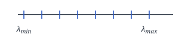
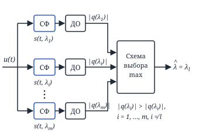
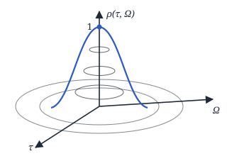
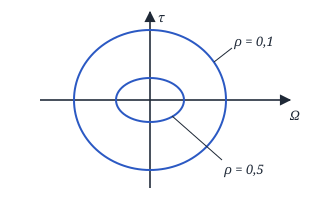

## Лекция 15. Измерение временного положения и частоты. Функция неопределённости

### Задача измерения неэнергетического параметра сигнала со случайной начальной фазой

$$
u(t) = s(t,\lambda,\varphi) + n(t)
$$

$W(\varphi) = \dfrac{1}{2\pi}$, $-\pi\le\varphi\le\pi$, $n(t)$ — БГШ.

$$
\begin{aligned}
&F(\lambda/\varphi) = \mathrm{const}\cdot e^{-\frac{1}{N_0}\int_0^T [u(t)-s(t,\lambda,\varphi)]^2 dt} = \\
&= \mathrm{const}\cdot\underbrace{e^{-\frac{1}{N_0}\int_0^T u^2(t)\,dt}}_{\mathrm{const}} \times \\
&\qquad \times e^{\frac{2}{N_0}\int_0^T u(t)\,s(t,\lambda,\varphi)\,dt} \times \\
&\qquad \times \underbrace{e^{-\frac{1}{N_0}\int_0^T s^2(t,\lambda,\varphi)\,dt}}_{\mathrm{const}} = \\
&= \mathrm{const}\cdot e^{\frac{2}{N_0}\int_0^T u(t)\,s(t,\lambda,\varphi)\,dt}
\end{aligned}
$$

$$
\begin{aligned}
&F(\lambda) = \int\limits_{-\pi}^{\pi} F(\lambda/\varphi)\,W(\varphi)\,d\varphi = \\
&= \mathrm{const}\int\limits_{-\pi}^{\pi}\frac{1}{2\pi}\,e^{\frac{2}{N_0}\int_0^T u(t)\,s(t,\lambda,\varphi)\,dt}\,d\varphi = \\
&= \mathrm{const}\cdot I_0(|q(\lambda)|),
\end{aligned}
$$

где $|q(\lambda)|$ — огибающая.

$$
\frac{dF(\lambda)}{d\lambda} = 0
$$

$$
\ln F(\lambda) = \mathrm{const} + \ln I_0(|q(\lambda)|)
$$

$$
\frac{d\ln F(\lambda)}{d\lambda} = \underbrace{\frac{I_1(|q(\lambda)|)}{I_0(|q(\lambda)|)}}_{\approx 1}\cdot\frac{d|q(\lambda)|}{d\lambda} = 0
$$

$$
\frac{d|q(\lambda)|}{d\lambda} = 0
$$

— т. е. чтобы найти $\lambda$, нужно найти экстремумы огибающей.

Структурная схема оптимального измерителя неэнергетического параметра сигнала со случайной начальной фазой. СФ — согласованный фильтр, ДО — детектор огибающей.

<!-- p115 -->

**Оценка будет несмещённая и эффективная.** Без доказательства.

$$
\boxed{\sigma^2 = -\frac{1}{|q(\lambda)|''\big|_{\lambda_0}}}
$$

### Оценка временного положения радиоимпульса со случайной начальной фазой

**Алгоритм и схема приведены выше.**

$$
\sigma_\tau^2 = -\frac{1}{|q_s|''\big|_{\lambda=\lambda_0}}
$$

$$
q_s(\tau) = \frac{a^2}{N_0}\left|\int\limits_0^T Z^*(t-\tau_0)\,Z(t-\tau)\,dt\right|
$$

$a = \sqrt{2E}$

$V$ — нормированная огибающая

$$
Z(t-\tau) = \sqrt{2E}\,V(t-\tau)
$$

$$
\int\limits_0^T |V(t)|^2\,dt = \int\limits_0^T |V(t-\tau_0)|^2\,dt = 1
$$

$$
q_s(\tau) = \frac{2E}{N_0}\,|\chi(\tau)|
$$

$$
\begin{aligned}
&\chi(\tau) = \int\limits_0^T V^*(t-\tau_0)\,V(t-\tau)\,dt \\
&\chi(\tau_0) = 1 \\
&\chi'(\tau) = \frac{d\chi(\tau)}{d\tau} \\
&\chi'(\tau_0) = \left.\frac{d\chi(\tau)}{d\tau}\right|_{\tau=\tau_0} \\
&|\chi(\tau)| = \sqrt{\chi(\tau)\,\chi^*(\tau)}
\end{aligned}
$$

$$
\begin{aligned}
&\frac{d|\chi(\tau)|}{d\tau} = \\
&= \frac{1}{2|\chi(\tau)|}\bigl[\chi(\tau)\,\chi^{*\prime}(\tau) + \chi^*(\tau)\cdot\chi'(\tau)\bigr]
\end{aligned}
$$

$$
\begin{aligned}
&\frac{d^2|\chi(\tau)|}{d\tau^2} = \frac{1}{|\chi(\tau)|}\,\mathrm{Re}\bigl[\chi(\tau)\,\chi^{*\prime\prime}(\tau) + \\
&\qquad + \chi'(\tau)\,\chi^{*\prime}(\tau)\bigr] - \\
&- \frac{1}{|\chi(\tau)|^3}\bigl[\mathrm{Re}\,\chi^*(\tau)\,\chi'(\tau)\bigr]^2
\end{aligned}
$$

<!-- p116 -->

$\chi(\tau_0) = 1$

$$
\begin{aligned}
&\left.\frac{d^2|\chi(\tau)|}{d\tau^2}\right|_{\tau=\tau_0} = \mathrm{Re}\bigl(\chi''(\tau_0)\bigr) + \\
&+ |\chi'(\tau_0)|^2 - [\mathrm{Re}\,\chi'(\tau_0)]^2
\end{aligned}
$$

$$
\chi'(\tau_0) = -\int\limits_0^T V^*(t-\tau_0)\,V'(t-\tau_0)\,dt
$$

$$
\begin{aligned}
&\chi''(\tau_0) = \int\limits_0^T V^*(t-\tau_0)\,V''(t-\tau_0)\,dt = \\
&= -\int\limits_0^T |V'(t-\tau_0)|^2\,dt
\end{aligned}
$$

$S(j\omega)$ — комплексный спектр $V(t)$:

$$
S(j\omega) = \int\limits_0^T V(t)\,e^{-j\omega t}\,dt
$$

$$
V(t-\tau_0) = \frac{1}{2\pi}\int\limits_{-\infty}^{\infty} S(j\omega)\,e^{j\omega(t-\tau_0)}\,d\omega
$$

$$
V'(t-\tau_0) = \frac{1}{2\pi}\int\limits_{-\infty}^{\infty} S(j\omega)\,e^{j\omega(t-\tau_0)}\,j\omega\,d\omega
$$

$$
\chi'(\tau_0) = -\frac{j}{2\pi}\int\limits_{-\infty}^{\infty} \omega\,|S(j\omega)|^2\,d\omega
$$

$$
\chi''(\tau_0) = -\frac{1}{2\pi}\int\limits_{-\infty}^{\infty} \omega^2\,|S(j\omega)|^2\,d\omega
$$

$\mathrm{Re}\bigl(\chi'(\tau_0)\bigr) = 0 \Rightarrow$

$$
\begin{aligned}
&\Rightarrow \left.\frac{d^2|\chi(\tau)|}{d\tau^2}\right|_{\tau=\tau_0} = \\
&= \Bigl[\frac{1}{2\pi}\int\limits_{-\infty}^{\infty}\omega\,|S(j\omega)|^2\,d\omega\Bigr]^2 - \\
&- \frac{1}{2\pi}\int\limits_{-\infty}^{\infty}\omega^2\,|S(j\omega)|^2\,d\omega
\end{aligned}
$$

$$
\begin{aligned}
&\left.\frac{d^2q_s(\tau)}{d\tau^2}\right|_{\tau=\tau_0} = \\
&= \frac{2E}{N_0}\Bigl[\Bigl[\frac{1}{2\pi}\int\limits_{-\infty}^{\infty}\omega\,|S(j\omega)|^2\,d\omega\Bigr]^2 - \\
&- \frac{1}{2\pi}\int\limits_{-\infty}^{\infty}\omega^2\,|S(j\omega)|^2\,d\omega\Bigr] = -\frac{2E\beta^2}{N_0}
\end{aligned}
$$

$$
\begin{aligned}
&\beta^2 = \Bigl(\frac{1}{2\pi}\int\limits_{-\infty}^{\infty}\omega^2\,|S(j\omega)|^2\,d\omega - \\
&- \Bigl[\frac{1}{2\pi}\int\limits_{-\infty}^{\infty}\omega\,|S(j\omega)|^2\,d\omega\Bigr]^2\Bigr) \Big/ \\
&\Big/\ \underbrace{\frac{1}{2\pi}\int\limits_{-\infty}^{\infty}|S(j\omega)|^2\,d\omega}_{=1}
\end{aligned}
$$

— ширина спектра нормированной огибающей $V(t)$.

$$
\boxed{\sigma_\tau^2 = \frac{N_0}{2E}\cdot\frac{1}{\beta^2} = \Bigl(\frac{2E}{N_0}\,\beta^2\Bigr)^{-1}}
$$

<!-- p117 -->

> **При измерении дальности до цели необходимо выбирать сигналы с наибольшей шириной $\beta$ и наибольшим отношением сигнал/шум.**

### Оценка смещения частоты радиоимпульса со случайной начальной фазой

$$
s(t,\Omega) = a\cdot f(t)\cdot\cos\bigl((\omega_0-\Omega)t + \psi(t) + \varphi\bigr)
$$

$$
Z(t,\Omega) = f(t)\cdot e^{j\psi(t)}\cdot e^{-j\Omega t}
$$

— комплексная огибающая.

$$
q_s(\Omega) = \frac{2E}{N_0}\,|\chi(\Omega)|^2
$$

$$
\chi(\Omega) = \int\limits_0^T |V(t)|^2\,e^{j(\Omega_0-\Omega)t}\,dt
$$

$$
\begin{aligned}
&\left.\frac{d^2|\chi(\Omega)|}{d\Omega^2}\right|_{\Omega=\Omega_0} = \mathrm{Re}[\chi''(\Omega_0)] + \\
&+ |\chi'(\Omega_0)|^2 - [\mathrm{Re}\,\chi'(\Omega_0)]^2
\end{aligned}
$$

$$
\begin{aligned}
&\chi'(\Omega_0) = j\int\limits_0^T t\,|V(t)|^2\,dt \\
&\chi''(\Omega_0) = -\int\limits_0^T t^2\,|V(t)|^2\,dt
\end{aligned}
$$

$$
\left.\frac{d^2q_s(\Omega)}{d\Omega^2}\right|_{\Omega=\Omega_0} = -\frac{2E}{N_0}\cdot\alpha^2
$$

$$
\alpha^2 = \int\limits_0^T t^2\,|V(t)|^2\,dt - \Bigl[\int\limits_0^T t\,|V(t)|^2\,dt\Bigr]^2
$$

— характеризует протяжённость сигнала во временной области.

$$
\boxed{\sigma_\Omega^2 = \Bigl(\frac{2E}{N_0}\,\alpha^2\Bigr)^{-1}}
$$

— дисперсия оценки смещения частоты сигнала со случайной начальной фазой.

> **Для измерения радиальной скорости цели необходимо выбирать сигналы с наибольшей длительностью.**

<!-- p118 -->

### Функция неопределённости и выбор формы сигнала

$$
s(t) = f(t)\cdot e^{j(\omega_0 t + \psi(t) + \varphi)}
$$

— излучаемый сигнал.

$$
\begin{aligned}
&u(t,\tau,\Omega) = f(t-\tau) \times \\
&\qquad \times e^{j((\omega_0-\Omega)t + \psi(t-\tau) + \varphi)}
\end{aligned}
$$

— принимаемый сигнал; $\tau$ — время прихода, $\Omega$ — частота смещения.

$$
\rho(\tau,\Omega) = \frac{\left|\int_{-\infty}^{\infty} Z(t)\,Z^*(t-\tau)\,e^{-j\Omega t}\,dt\right|}{\int_{-\infty}^{\infty} |Z(t)|^2\,dt}
$$

— **функция неопределённости**.

$Z(t) = f(t)\cdot e^{j\psi(t)}$ — комплексная огибающая.

Свойства $\rho(\tau,\Omega)$:

**1)** $\rho(\tau,\Omega) \le \rho(0,0) = 1$

$$
\begin{aligned}
&\rho^2(\tau,\Omega) = \frac{\left|\int_{-\infty}^{\infty} Z(t)\,Z^*(t-\tau)\,e^{-j\Omega t}\,dt\right|^2}{\left[\int_{-\infty}^{\infty} Z(t)\,Z^*(t)\,dt\right]^2} \le \\
&\le \frac{\int_{-\infty}^{\infty} |Z(t)|^2\,dt\int_{-\infty}^{\infty} |Z^*(t-\tau)|^2\,dt}{\left[\int_{-\infty}^{\infty} |Z(t)|^2\,dt\right]^2} = \\
&= 1\ (\text{при } \tau = 0,\ \Omega = 0)
\end{aligned}
$$

**2)** $\displaystyle\iint\limits_{-\infty\,-\infty}^{\infty\ \ \infty} \rho^2(\tau,\Omega)\,d\tau\,d\Omega = 2\pi$

$$
\begin{aligned}
&\iint\limits_{-\infty\,-\infty}^{\infty\ \ \infty} \frac{\left|\int_{-\infty}^{\infty} Z(t)\,Z^*(t-\tau)\,e^{-j\Omega t}\,dt\right|^2}{\left[\int_{-\infty}^{\infty} |Z(t)|^2\,dt\right]^2}\,d\tau\,d\Omega = \\
&= \iint\limits_{-\infty\,-\infty}^{\infty\ \ \infty} \frac{1}{\left[\int_{-\infty}^{\infty} |Z(t)|^2\,dt\right]^2} \times \\
&\qquad \times \int_{-\infty}^{\infty} Z(t_1)\,Z^*(t_1-\tau)\,e^{-j\Omega t_1}\,dt_1 \times \\
&\qquad \times \int_{-\infty}^{\infty} Z^*(t_2)\,Z(t_2-\tau)\,e^{j\Omega t_2}\,dt_2\;d\tau\,d\Omega =
\end{aligned}
$$

<!-- p119 -->

$$
\begin{aligned}
&= \iint\limits_{-\infty\,-\infty}^{\infty\ \ \infty} \frac{1}{\left[\int_{-\infty}^{\infty} |Z(t)|^2\,dt\right]^2}\iint\limits_{-\infty}^{\infty} Z(t_1)\,Z^*(t_2) \times \\
&\qquad \times Z^*(t_1-\tau)\,Z(t_2-\tau) \times \\
&\qquad \times e^{j\Omega(t_2-t_1)}\,dt_1\,dt_2\;d\tau\,d\Omega = \\
&= \int\limits_{-\infty}^{\infty} \frac{1}{\left[\int_{-\infty}^{\infty} |Z(t)|^2\,dt\right]^2}\iint\limits_{-\infty}^{\infty} Z(t_1)\,Z^*(t_2) \times \\
&\qquad \times Z^*(t_1-\tau)\,Z(t_2-\tau) \times \\
&\qquad \times \overbrace{\int_{-\infty}^{\infty} e^{j\Omega(t_2-t_1)}\,d\Omega}^{2\pi\delta(t_2-t_1)}\cdot dt_1\,dt_2\;d\tau = \\
&= \int\limits_{-\infty}^{\infty} \frac{\int_{-\infty}^{\infty} |Z(t_1)|^2\cdot|Z(t_1-\tau)|^2\,dt_1}{\left[\int_{-\infty}^{\infty} |Z(t)|^2\,dt\right]^2}\cdot 2\pi\,d\tau = \\
&= \frac{\int_{-\infty}^{\infty} |Z(t_1)|^2\int_{-\infty}^{\infty} |Z(t_1-\tau)|^2\,d\tau\,dt_1}{\left[\int_{-\infty}^{\infty} |Z(t)|^2\,dt\right]^2}\cdot 2\pi = \\
&= 2\pi
\end{aligned}
$$
