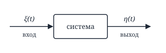
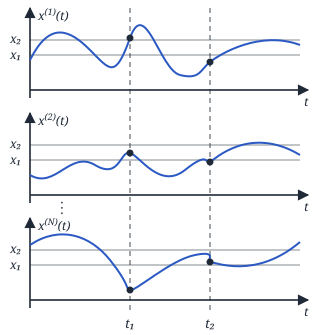
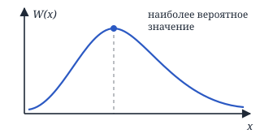
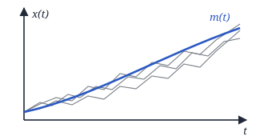
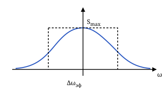
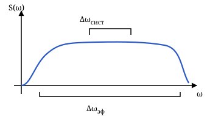
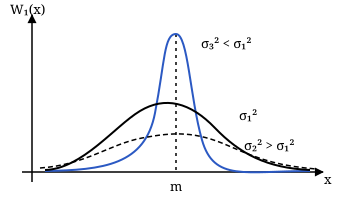
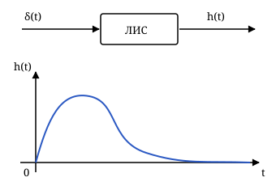
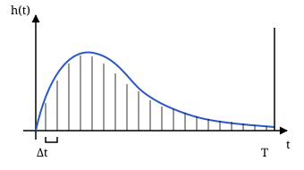

# Статистическая радиотехника: понятия и смысл

Лекции 1–4 курса «Основы статистической теории обнаружения сигналов и распознавания образов в искусственном интеллекте». Лектор — Нефёдова Юлия Сергеевна.

Случайный сигнал нельзя заранее нарисовать одной точной кривой. Зато можно описать его вероятности, среднее, разброс, связь значений во времени и распределение мощности по частотам. Эти характеристики позволяют понять, что система сделает с сигналом и шумом.

## Лекция 1 Случайный процесс и его характеристики

### Сигнал шум и задача анализа

**Статистическая радиотехника** изучает сигналы и системы в условиях случайности. **Помеха** — случайная величина или процесс, мешающий получить полезную информацию. Она может приходить извне или возникать внутри аппаратуры, как тепловой шум.

В **задаче анализа** известны входной процесс и система; нужно найти характеристики выхода. В **задаче синтеза** систему выбирают так, чтобы она решала нужную задачу, а затем оценивают её работу.

### Процесс реализация и сечение

**Случайный процесс** — физическая величина, которая случайным образом изменяется во времени. Его математическая модель — **случайная функция**: при каждом фиксированном времени её значение является случайной величиной.

Обозначения $x(t)$ и $\xi(t)$ относятся к процессу в целом. **Реализация** $x^{(k)}(t)$ — одна конкретная кривая, полученная в отдельном опыте. Все возможные реализации образуют **ансамбль**. Если зафиксировать время $t_1$ и посмотреть на значения разных реализаций, получим **сечение** процесса: случайную величину $x(t_1)$.

У случайной функции могут быть и пространственные аргументы, например $\xi(t,x,y)$. Тогда случайная величина зависит от времени и положения.

### Виды случайных процессов

Нужно различать два вопроса: в какие моменты задан процесс и какие значения он может принимать.

- **Дискретная случайная последовательность:** время дискретно и значения дискретны. Например, в моменты $t_k$ наблюдаем один из нескольких уровней.
- **Случайная последовательность:** время дискретно, но значения непрерывны. В моменты $t_k$ измеряем произвольную амплитуду.
- **Дискретный случайный процесс:** время непрерывно, значения дискретны. Между переключениями процесс остаётся на одном из уровней.
- **Непрерывный случайный процесс:** время и значения непрерывны, реализации непрерывны.
- **Непрерывнозначный процесс с разрывами:** время и значения непрерывны, но реализации могут иметь скачки первого рода. Непрерывный набор возможных амплитуд сам по себе не означает непрерывность кривой.

У **квазидетерминированного процесса** форма функции известна, а случайны отдельные параметры. Например,

$$
\xi(t)=A(t)\cos[\omega_0t+\varphi],
$$

где $A(t)$ — огибающая, $\omega_0$ — заданная частота, а $\varphi$ — случайная фаза. В каждом опыте получается обычное колебание, но его положение относительно начала отсчёта случайно.

### Распределение плотность и характеристическая функция

**Одномерная функция распределения** отвечает на вопрос, с какой вероятностью значение в момент $t$ меньше порога $x$:

$$
F_1(x;t)=P\{x(t)<x\}.
$$

В серии опытов эту вероятность оценивают долей реализаций, оказавшихся ниже порога. При статистической устойчивости частота события приближается к его вероятности.

Если распределение имеет **плотность вероятности**, то

$$
W_1(x;t)=\frac{\partial F_1(x;t)}{\partial x}.
$$

Вероятность попасть в интервал — площадь под плотностью на этом интервале. Для малого $dx$ она приблизительно равна $W_1(x;t)\,dx$. Сама высота плотности не является вероятностью: для непрерывного распределения вероятность одного точного значения равна нулю. Максимум плотности указывает, где малые интервалы одинаковой ширины наиболее вероятны.

**Характеристическая функция** — другой способ записать то же распределение:

$$
\begin{aligned}
Q(ju;t)&=M\{e^{ju x(t)}\},\\
&=\int_{-\infty}^{+\infty}
e^{ju x}W_1(x;t)\,dx.
\end{aligned}
$$

Здесь $M\{\cdot\}$ — математическое ожидание, $j=\sqrt{-1}$, а $u$ — аргумент преобразования. Связь $Q$ и $W$ похожа на преобразование Фурье; она удобна для вычислений с распределениями.

### Совместное распределение и зависимость отсчётов

Одномерная плотность описывает одно сечение. Чтобы узнать, как связаны значения в разные моменты, нужны совместные характеристики.

**Двумерная функция распределения** задаёт вероятность двух событий одновременно:

$$
\begin{aligned}
F_2(x_1,x_2;t_1,t_2)
&=P\{x(t_1)<x_1,\\
&\qquad x(t_2)<x_2\}.
\end{aligned}
$$

Её смешанная производная по $x_1,x_2$ — **двумерная плотность** $W_2$. Она описывает не только возможные амплитуды, но и их совместное появление.

Для $n$ моментов аналогично определяют $F_n$, $W_n$ и

$$
Q_n=M\left\{\exp\left(j\sum_{k=1}^n u_kx(t_k)\right)\right\}.
$$

Набор совместных распределений для любых моментов описывает случайную функцию целиком. В отличие от одной реализации, он задаёт вероятностные свойства всех возможных траекторий. Совместные характеристики можно вводить и для нескольких процессов: например, одновременно для $n$ отсчётов входа и $m$ отсчётов выхода, взятых в своих моментах времени.

**Условная плотность** описывает значение одного отсчёта, когда другой уже известен:

$$
\begin{aligned}
&W_1(x_1;t_1\mid x_2;t_2)\\
&\quad=\frac{W_2(x_1,x_2;t_1,t_2)}{W_1(x_2;t_2)}.
\end{aligned}
$$

Формула применяется при ненулевом знаменателе. Если отсчёты независимы, знание второго не меняет распределение первого: условная плотность совпадает с безусловной.

Основные свойства плотностей:

- Они неотрицательны, а интеграл по всем значениям равен единице.
- Перестановка пар «значение — момент времени» не меняет совместную вероятность.
- Интегрирование по ненужному отсчёту даёт плотность оставшихся отсчётов. Так из $W_2$ получают $W_1$.

### Моменты среднее и разброс

Полные распределения содержат много информации. **Моментные функции** выделяют из неё отдельные числовые характеристики.

**Начальный момент** — среднее произведения степеней отсчётов:

$$
\begin{aligned}
M_{i_1\ldots i_n}(t_1,\ldots,t_n)
&=M\left\{\prod_{k=1}^n x^{i_k}(t_k)\right\},\\
\nu&=i_1+\cdots+i_n.
\end{aligned}
$$

Число $n$ — количество отсчётов, а $\nu$ — порядок момента. Например, $M_{23}$ использует два отсчёта, но имеет пятый порядок.

Первый момент — **математическое ожидание**:

$$
m_x(t)=M_1(t)=M\{x(t)\}.
$$

Это среднее по ансамблю в каждом сечении. Оно показывает, вокруг какого уровня расположены реализации. Второй одномерный момент $M_2(t)=M\{x^2(t)\}$ — средний квадрат значения.

**Центральные моменты** определяют после вычитания среднего:

$$
\mu_{i_1\ldots i_n}
=M\left\{\prod_{k=1}^n
[x(t_k)-m_x(t_k)]^{i_k}\right\}.
$$

Второй центральный одномерный момент — **дисперсия**:

$$
D_x(t)=\mu_2(t)=M\{[x(t)-m_x(t)]^2\}.
$$

Дисперсия измеряет разброс вокруг среднего, а $\sqrt{D_x(t)}$ — среднеквадратическое отклонение в единицах самого сигнала.

### Связь двух сечений

Две основные моментные функции второго порядка:

$$
\begin{aligned}
K_x(t_1,t_2)&=M_{11}(t_1,t_2)\\
&=M\{x(t_1)x(t_2)\},\\
R_x(t_1,t_2)&=\mu_{11}(t_1,t_2)\\
&=M\{[x(t_1)-m_x(t_1)]\\
&\qquad\cdot[x(t_2)-m_x(t_2)]\}.
\end{aligned}
$$

> В обозначениях курса $K_x$ называется ковариационной функцией, а $R_x$ — корреляционной. $K_x$ включает средний уровень, $R_x$ описывает совместные отклонения от среднего. В других источниках названия могут отличаться; ориентируйтесь на формулу.

Положительное $R_x$ означает, что отклонения двух отсчётов в среднем направлены одинаково; отрицательное — в противоположные стороны. Нулевое значение означает отсутствие линейной корреляции, но само по себе не гарантирует независимость.

## Лекция 2 Стационарность эргодичность и корреляция

### Связь начальных и центральных моментов

Математическое ожидание **линейно**: при постоянных $a,b$

$$
M\{ax+by\}=aM\{x\}+bM\{y\}.
$$

Для этого свойства независимость $x$ и $y$ не нужна. Из линейности получаются две полезные связи:

$$
\begin{aligned}
R_x(t_1,t_2)&=K_x(t_1,t_2)\\
&\quad-m_x(t_1)m_x(t_2),\\
D_x(t)&=M_2(t)-m_x^2(t).
\end{aligned}
$$

У **центрированного процесса**, то есть при $m_x(t)=0$, начальные и центральные моменты второго порядка совпадают.

### Стационарность

**Строгая стационарность** означает, что все совместные распределения остаются прежними при одинаковом сдвиге всех моментов времени. Можно перенести начало наблюдения, и вероятностная картина не изменится. Это не означает, что отдельная реализация постоянна или повторяется.

**Стационарность в широком смысле** требует только постоянного среднего и зависимости корреляции от временного сдвига:

$$
\begin{aligned}
m_x(t)&=m_x=\mathrm{const},\\
R_x(t_1,t_2)&=R_x(\tau),\qquad \tau=t_2-t_1.
\end{aligned}
$$

Рассматриваются процессы с конечными вторыми моментами. Тогда $D_x=R_x(0)$ тоже постоянна, а $K_x$ зависит только от $\tau$.

Теперь существенно, насколько далеко друг от друга взяты отсчёты, а не в какое время начался опыт. Строгая стационарность при существовании вторых моментов влечёт широкую; обратное верно для гауссовского процесса, но не для произвольного.

### Эргодичность и измерение по одной записи

В определениях характеристик мы усредняли множество реализаций. На практике часто есть одна длинная запись. **Эргодичность** позволяет заменить усреднение по ансамблю усреднением по времени: при увеличении длительности записи оценка приближается к соответствующей характеристике процесса.

Например, для эргодического по среднему стационарного процесса:

$$
m_x=\lim_{T\to\infty}\frac1{2T}
\int_{-T}^{T}x^{(k)}(t)\,dt.
$$

Дисперсию оценивают временным средним квадрата отклонения от $m_x$. Корреляцию при сдвиге $\tau$ — временным средним произведения двух отклонений, взятых с этим сдвигом. Сходимость этих оценок — эргодичность по соответствующей характеристике.

Стационарность сама по себе не разрешает такую замену. Например, процесс $x(t)=A$, где случайная величина $A$ выбирается один раз на весь опыт, стационарен. Но среднее по одной реализации всегда равно её собственному $A$, а среднее по ансамблю — $M\{A\}$.

Для стационарного процесса с конечной дисперсией условие эргодичности по среднему в среднеквадратическом смысле записывают как

$$
\lim_{T\to\infty}\frac1T\int_0^T
\left(1-\frac{\tau}{T}\right)R_x(\tau)\,d\tau=0.
$$

Смысл условия: разброс оценки среднего должен исчезать при увеличении времени наблюдения. Эргодичность по среднему не заменяет проверку эргодичности по дисперсии или корреляции.

### Свойства корреляции

Для действительного стационарного процесса:

- $R_x(0)=D_x$: отсчёт максимально связан с самим собой.
- $R_x(\tau)=R_x(-\tau)$: направление временного сдвига не меняет автокорреляцию.
- $|R_x(\tau)|\le R_x(0)$: модуль связи двух отсчётов не превышает дисперсию.
- Преобразование Фурье $R_x$ неотрицательно: оно описывает спектральную плотность мощности случайных отклонений.
- $R_x$ неотрицательно определена: любая взвешенная сумма отсчётов имеет неотрицательный средний квадрат. Это ограничение на всю функцию, а не требование $R_x(\tau)\ge0$ при каждом сдвиге.

Последнее свойство имеет запись

$$
\sum_{i=1}^n\sum_{j=1}^n
R_x(t_i,t_j)z_i z_j^*\ge0.
$$

Корреляция может затухать с увеличением $|\tau|$, но стационарность не гарантирует затухание. У колебания со случайной равномерной фазой

$$
\begin{aligned}
x(t)&=A\cos(\omega_0t+\varphi),\\
R_x(\tau)&=\frac{A^2}{2}\cos(\omega_0\tau).
\end{aligned}
$$

Связь периодически возвращается, сколько бы времени ни прошло.

**Нормированная корреляционная функция** при $D_x>0$:

$$
r_x(\tau)=\frac{R_x(\tau)}{R_x(0)}.
$$

У неё $r_x(0)=1$ и $|r_x(\tau)|\le1$. Нормирование убирает масштаб амплитуды и позволяет сравнивать форму корреляции разных процессов.

### Интервал корреляции

**Интервал корреляции** $\tau_{\text{к}}$ — характерное время, после которого связью отсчётов можно пренебречь. Быстрое затухание означает короткую память процесса, медленное — длительную.

Один из способов оценки — заменить площадь под модулем огибающей $f(\tau)$ равновеликим прямоугольником высоты $R_x(0)$ и ширины $2\tau_{\text{к}}$:

$$
\tau_{\text{к}}=\frac1{2R_x(0)}
\int_{-\infty}^{+\infty}|f(\tau)|\,d\tau.
$$

Корреляционная функция может быть треугольной, колоколообразной или колебательной. Предельная дельта-образная корреляция соответствует идеальному белому шуму, который рассмотрим в следующей лекции.

### Взаимная корреляция и комплексные процессы

**Взаимная корреляция** измеряет линейную связь отклонений двух разных процессов:

$$
\begin{aligned}
R_{xy}(t_1,t_2)
&=M\{[x(t_1)-m_x(t_1)]\\
&\qquad\cdot[y(t_2)-m_y(t_2)]\}.
\end{aligned}
$$

Для совместно стационарных действительных процессов $R_{xy}(\tau)=R_{yx}(-\tau)$. Собственная корреляция чётна, а взаимная может быть несимметричной: один процесс может быть связан с задержанной версией другого.

Для комплексных процессов второй множитель сопрягают. Если $z=a+jb$, то $z^*=a-jb$ и $|z|^2=zz^*=a^2+b^2$. В частности,

$$
\begin{aligned}
R_x(t_1,t_2)&=M\{[x_1-m_1][x_2^*-m_2^*]\},\\
R_{xy}(t_1,t_2)&=R_{yx}^*(t_2,t_1).
\end{aligned}
$$

Дисперсия комплексного процесса — средний квадрат модуля отклонения. Сопряжение обеспечивает её действительность и неотрицательность.

При ненулевых дисперсиях **нормированная взаимная корреляция** равна

$$
r_{xy}(t_1,t_2)=\frac{R_{xy}(t_1,t_2)}
{\sqrt{D_x(t_1)D_y(t_2)}},
$$

причём $|r_{xy}|\le1$. Значение около нуля означает слабую линейную связь; модуль около единицы — сильную. Независимость влечёт отсутствие корреляции, но обратный вывод в общем случае неверен.

## Лекция 3 Спектр мощности и белый шум

### Полная линейная связь и сумма процессов

Для двух действительных случайных величин с ненулевыми дисперсиями $|r_{xy}|=1$ означает точную линейную связь с вероятностью единица:

$$
y(t_2)=a x(t_1)+b.
$$

При $a>0$ корреляция равна $1$, при $a<0$ — $-1$. Сдвиг $b$ меняет среднее, а масштаб $a$ меняет разброс:

$$
m_y=a m_x+b,\qquad D_y=a^2D_x.
$$

Часто наблюдаемый процесс — сумма сигнала и шума $\xi(t)=s(t)+n(t)$. Для центрированных совместно стационарных процессов

$$
\begin{aligned}
R_\xi(\tau)&=R_s(\tau)+R_n(\tau)\\
&\quad+R_{sn}(\tau)+R_{ns}(\tau).
\end{aligned}
$$

Если сигнал и шум некоррелированы при всех сдвигах, взаимные слагаемые исчезают. Тогда корреляции складываются, а при $\tau=0$ складываются дисперсии.

### Спектральная плотность мощности

Корреляция описывает связь во времени. **Спектральная плотность мощности** (СПМ) описывает, как средний квадрат процесса распределён по частотам. Для действительного стационарного процесса она связана с $K_x$ парой преобразований Фурье:

$$
\begin{aligned}
S(\omega)&=\int_{-\infty}^{+\infty}
K_x(\tau)e^{-j\omega\tau}\,d\tau,\\
K_x(\tau)&=\frac1{2\pi}\int_{-\infty}^{+\infty}
S(\omega)e^{j\omega\tau}\,d\omega.
\end{aligned}
$$

Здесь $\omega$ — угловая частота. Для центрированного процесса $K_x=R_x$. Спектральная плотность действительна, неотрицательна и чётна: $S(\omega)=S(-\omega)$.

Площадь под спектром даёт средний квадрат, а для центрированного процесса — дисперсию:

$$
D_x=\frac1{2\pi}\int_{-\infty}^{+\infty}S(\omega)\,d\omega.
$$

Соответственно, размерность СПМ — квадрат единицы сигнала, делённый на единицу угловой частоты. Под мощностью здесь понимается средний квадрат сигнала; связь с мощностью в ваттах зависит от физической модели.

Если $m_x\ne0$, постоянный средний уровень даёт отдельную линию на нулевой частоте: к спектру отклонений добавляется $2\pi m_x^2\delta(\omega)$. В таком случае полная площадь спектра соответствует $M_2$, а не только дисперсии.

### Ширина спектра

**Эффективная ширина спектра** — ширина прямоугольника, который имеет высоту $S_{\max}$ и ту же площадь, что спектр:

$$
\Delta\omega_{\text{эф}}=
\frac1{S_{\max}}\int_{-\infty}^{+\infty}S(\omega)\,d\omega.
$$

Это определение для спектра с конечными площадью и максимумом. Здесь используется двухсторонний спектр: интеграл включает положительные и отрицательные частоты.

**Узкополосный процесс** имеет спектр, сосредоточенный около несущей частоты $\omega_0$, причём $\Delta\omega_{\text{эф}}\ll\omega_0$. Для **широкополосного процесса** это условие не выполняется.

### Белый шум и дельта-функция

**Идеальный белый шум** имеет одинаковую СПМ на всех частотах:

$$
S_n(\omega)=\frac{N_0}{2},\qquad
R_n(\tau)=\frac{N_0}{2}\delta(\tau).
$$

$N_0$ задаёт интенсивность шума. **Дельта-функция** — идеализированный единичный импульс с площадью $1$. Её фильтрующее свойство:

$$
\int_{-\infty}^{+\infty}f(x)\delta(x-x_0)\,dx=f(x_0).
$$

Дельта-образная корреляция означает отсутствие корреляции при ненулевом временном сдвиге. Это предельная модель: постоянная плотность на бесконечной полосе даёт бесконечную суммарную мощность. Поэтому к идеальному белому шуму нельзя напрямую применять формулы, требующие конечной дисперсии $R_n(0)$.

В аппаратуре существенна конечная полоса. Если спектр шума почти постоянен в полосе системы, его можно считать белым для этой системы. Практический ориентир из лекции — полоса шума примерно в $5\ldots10$ раз шире полосы полезного сигнала.

### Взаимный спектр и когерентность

**Взаимная спектральная плотность** — преобразование Фурье взаимной моментной функции:

$$
S_{xy}(\omega)=\int_{-\infty}^{+\infty}
K_{xy}(\tau)e^{-j\omega\tau}\,d\tau.
$$

Здесь $K_{xy}(\tau)=M\{x(t)y(t+\tau)\}$. Для центрированных процессов $K_{xy}=R_{xy}$. Взаимный спектр показывает связь процессов по частотам. В отличие от собственной СПМ, он обычно комплексный. Для действительных процессов

$$
\begin{aligned}
S_{xy}(\omega)&=S_{yx}^*(\omega),\\
|S_{xy}(\omega)|^2&\le S_x(\omega)S_y(\omega).
\end{aligned}
$$

**Квадрат частотной когерентности** нормирует эту связь:

$$
\gamma^2(\omega)=\frac{|S_{xy}(\omega)|^2}
{S_x(\omega)S_y(\omega)},\qquad
0\le\gamma^2\le1.
$$

Он определён там, где знаменатель ненулевой. Ноль означает отсутствие линейной связи на данной частоте, единица — полную линейную связь.

Для суммы сигнала и шума складываются собственные и взаимные спектры:

$$
\begin{aligned}
S_\xi(\omega)&=S_s(\omega)+S_n(\omega)\\
&\quad+S_{sn}(\omega)+S_{ns}(\omega).
\end{aligned}
$$

Если центрированные сигнал и шум некоррелированы, остаётся $S_\xi=S_s+S_n$: их мощности складываются на каждой частоте.

## Лекция 4 Гауссовский процесс и линейные системы

### Гауссовский процесс

**Гауссовский случайный процесс** — процесс, у которого любой конечный набор отсчётов имеет совместное гауссовское распределение. Нормального распределения каждого отсчёта по отдельности для этого определения недостаточно: важен совместный закон.

Одномерная плотность имеет вид

$$
W_1(x;t)=\frac1{\sqrt{2\pi}\,\sigma}
\exp\left[-\frac{(x-m)^2}{2\sigma^2}\right],
$$

где $m=m_x(t)$, $\sigma^2=D_x(t)$. Среднее задаёт положение центра, а дисперсия — ширину распределения.

Для совместного гауссовского распределения достаточно знать средние всех отсчётов и их корреляционные моменты. Матрица нормированных моментов состоит из элементов

$$
r_{ij}=\frac{R_x(t_i,t_j)}{\sigma_i\sigma_j},
\qquad r_{ii}=1.
$$

Поэтому весь гауссовский процесс определяется функциями $m_x(t)$ и $R_x(t_1,t_2)$. Его высшие моменты не требуют отдельного задания.

**Интеграл вероятности** — функция распределения стандартной нормальной величины:

$$
\Phi(z)=\frac1{\sqrt{2\pi}}\int_{-\infty}^{z}e^{-v^2/2}\,dv.
$$

Для произвольных $m,\sigma>0$ вероятность оказаться ниже порога $x$ равна $\Phi((x-m)/\sigma)$. Это площадь под плотностью слева от порога; интеграл вычисляют численно, через элементарные функции он не выражается.

### Свойства гауссовского процесса

- Стационарность в широком смысле равносильна строгой: среднее и корреляция уже задают все совместные распределения.
- Линейное преобразование сохраняет гауссовский вид. Нелинейное преобразование в общем случае меняет вид распределения.
- Некоррелированные совместно гауссовские отсчёты независимы. Именно условие совместной гауссовости позволяет сделать вывод, который неверен для произвольных процессов.
- Линейным преобразованием можно получить некоррелированные отсчёты из коррелированных и, наоборот, создать корреляцию.
- Условное распределение остаётся гауссовским: известные отсчёты меняют параметры распределения остальных.

### Линейность и память системы

На вход подаётся $\xi(t)$, на выходе получается $\eta(t)$. Задача анализа — определить распределение, моменты и другие характеристики $\eta$ по характеристикам входа и описанию системы.

**Линейная система** подчиняется суперпозиции: если входы $\xi_1,\xi_2$ дают выходы $\eta_1,\eta_2$, то вход $a\xi_1+b\xi_2$ даёт выход $a\eta_1+b\eta_2$.

**Безынерционная система** связывает выход с входом в тот же момент:

$$
\eta(t)=\varphi[\xi(t)].
$$

**Инерционная система** имеет память: выход зависит и от предыдущих значений входа. Линейность и наличие памяти — разные свойства; их рассматривают отдельно.

Линейную инерционную систему описывают дифференциальным уравнением, импульсной или комплексной частотной характеристикой. Уравнение позволяет учитывать начальные условия; импульсная характеристика описывает отклик при нулевых начальных условиях, а частотная удобна для установившегося режима.

### Импульсная характеристика и свёртка

Далее рассматривается линейная система с неизменными во времени параметрами. Её **импульсная характеристика** $h(t)$ — отклик на единичный импульс $\delta(t)$.

Для причинной системы $h(t)=0$ при $t<0$: выход не предшествует воздействию. Затухающий отклик описывает уход влияния прошлых воздействий; одно лишь условие $h(t)\to0$ не служит полной проверкой устойчивости.

При нулевых начальных условиях и начале воздействия в момент $0$ выход задаёт **интеграл Дюамеля**, то есть свёртка входа с откликом:

$$
\eta(t)=\int_0^t\xi(t-\tau)h(\tau)\,d\tau.
$$

Каждый прошлый отсчёт входа вносит вклад в текущий выход. Вес этого вклада — $h(\tau)$, где $\tau$ — сколько времени прошло после воздействия. Интеграл собирает все такие вклады.

### Частотная характеристика

В установившемся режиме гармоника на входе линейной системы остаётся гармоникой той же частоты на выходе. Меняются амплитуда и фаза. Их изменение описывает **комплексная частотная характеристика**:

$$
\begin{aligned}
K(j\omega)&=\frac{U_2(t)}{U_1(t)}\\
&=|K(j\omega)|e^{j\psi(\omega)}.
\end{aligned}
$$

$|K(j\omega)|$ — **амплитудно-частотная характеристика** (АЧХ): во сколько раз меняется амплитуда на данной частоте. $\psi(\omega)$ — **фазочастотная характеристика** (ФЧХ): какой фазовый сдвиг вносит система.

Импульсная и частотная характеристики — два описания одной системы:

$$
\begin{aligned}
K(j\omega)&=\int_0^{+\infty}h(t)e^{-j\omega t}\,dt,\\
h(t)&=\frac1{2\pi}\int_{-\infty}^{+\infty}
K(j\omega)e^{j\omega t}\,d\omega.
\end{aligned}
$$

Для детерминированного входного сигнала спектр выхода равен $S_2(j\omega)=S_1(j\omega)K(j\omega)$. Здесь $S_1,S_2$ — комплексные спектры сигналов; это другой объект, чем СПМ случайного процесса из лекции 3.

Не путайте $K(j\omega)$ системы с $K_x(\tau)$ процесса: первая функция описывает преобразование, вторая — статистическую связь отсчётов.

### Распределение на выходе

Для гауссовского входа линейность сохраняет гауссовский вид выхода. Поэтому достаточно найти его среднее и корреляцию.

В общем случае в лекции предложен путь: моменты входа → моменты выхода → характеристическая функция выхода → плотность. При допустимости разложения по моментам

$$
\begin{aligned}
Q_\eta(ju;t)&=M\{e^{ju\eta(t)}\}\\
&=\sum_{k=0}^{\infty}\frac{(ju)^k}{k!}M_{\eta k}(t),
\end{aligned}
$$

где $M_{\eta k}(t)=M\{\eta^k(t)\}$ и $M_{\eta0}=1$. Плотность восстанавливается обратным преобразованием:

$$
W(\eta;t)=\frac1{2\pi}\int_{-\infty}^{+\infty}
Q_\eta(ju;t)e^{-ju\eta}\,du.
$$

Нескольких первых моментов обычно недостаточно, чтобы восстановить произвольное распределение. Для гауссовского закона достаточно первых двух благодаря его особой структуре.

### Нормализация

**Нормализация случайного процесса** — приближение распределения на выходе линейной инерционной системы к гауссовскому, даже если вход негауссовский.

Основная ситуация из лекции: вход значительно шире по спектру, чем полоса системы,

$$
\Delta\omega_{\text{эф}}\gg\Delta\omega_{\text{сист}}.
$$

У входа короткий интервал корреляции, а система реагирует сравнительно долго. За время её памяти в выход складываются вклады многих отсчётов:

$$
\begin{aligned}
\tau_{\text{сист}}&\sim\frac1{\Delta\omega_{\text{сист}}},\\
\tau_{\text{к}}&\sim\frac1{\Delta\omega_{\text{эф}}},\\
N&\sim\frac{\tau_{\text{сист}}}{\tau_{\text{к}}}\gg1.
\end{aligned}
$$

Такое суммирование объясняет связь с центральной предельной теоремой. Для гауссовского приближения нужны подходящие условия на зависимость и относительный вклад слагаемых; одного сравнения полос недостаточно. Линейность сама по себе также не превращает любой вход в гауссовский.

### Среднее на выходе

Благодаря линейности среднее преобразуется той же свёрткой, что и вход:

$$
m_\eta(t)=\int_0^t m_\xi(t-\tau)h(\tau)\,d\tau.
$$

Даже если вход стационарен и $m_\xi$ постоянно, во время переходного процесса среднее выхода зависит от времени. После установления режима, когда интеграл отклика сходится,

$$
m_\eta=m_\xi\int_0^{+\infty}h(\tau)\,d\tau
=m_\xi K(0).
$$

$K(0)$ — коэффициент передачи постоянной составляющей. Система умножает постоянный средний уровень входа на этот коэффициент; при нулевом среднем входа среднее выхода также нулевое.
